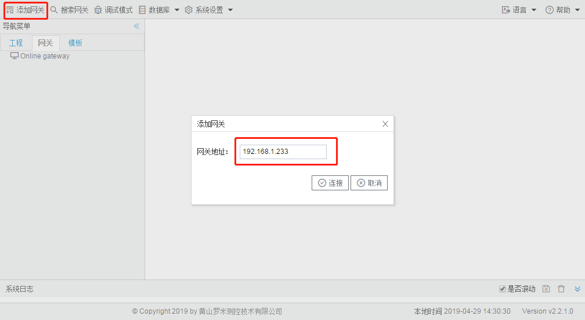
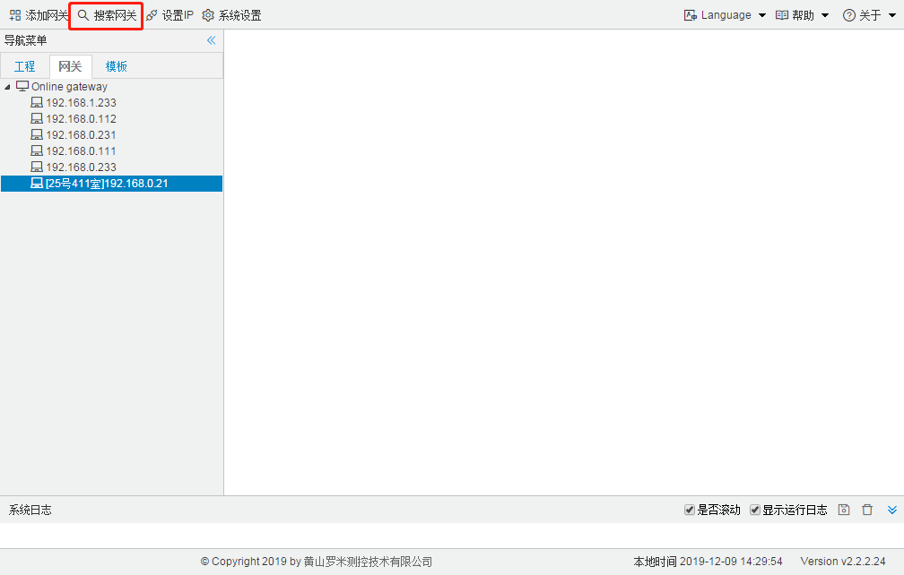
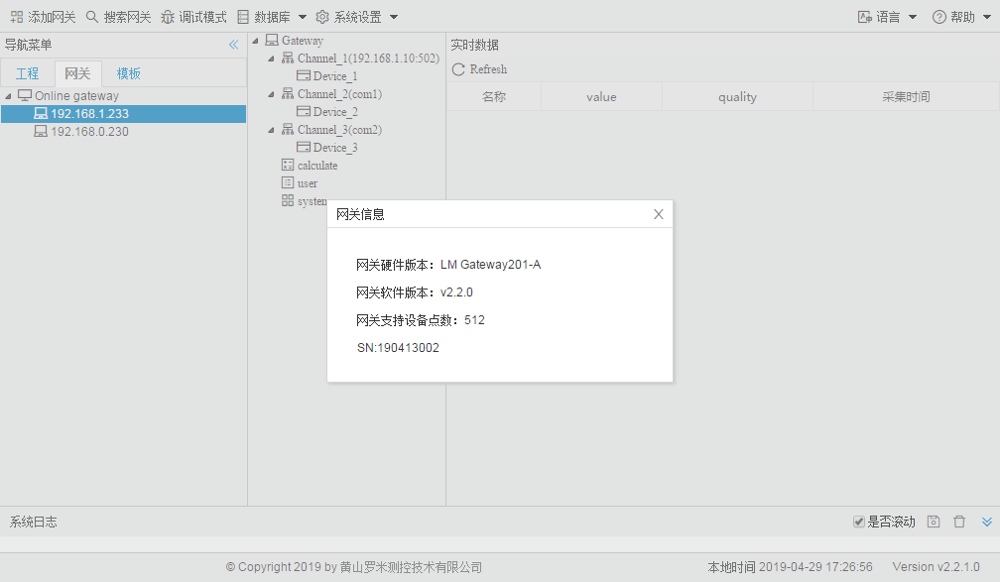

# 2.1 添加、搜索、查看网关

**添加网关** 

已知LMGateway的IP地址，点击“添加设备”将网关添加到在线网关列表中。 

图2-3 添加网关

**搜索网关** 

将网络中的LMGateway全部搜索并列到在线网关列表中。

图2-4 搜索网关

**查看网关信息** 

双击网关IP，弹出窗口中包含网关的硬件版本、软件版本、支持点数和SN号，其中支持点数是指网关中的数据点低于支持点数时可以保证网关的运行效率。

图2-5 查看网关信息

