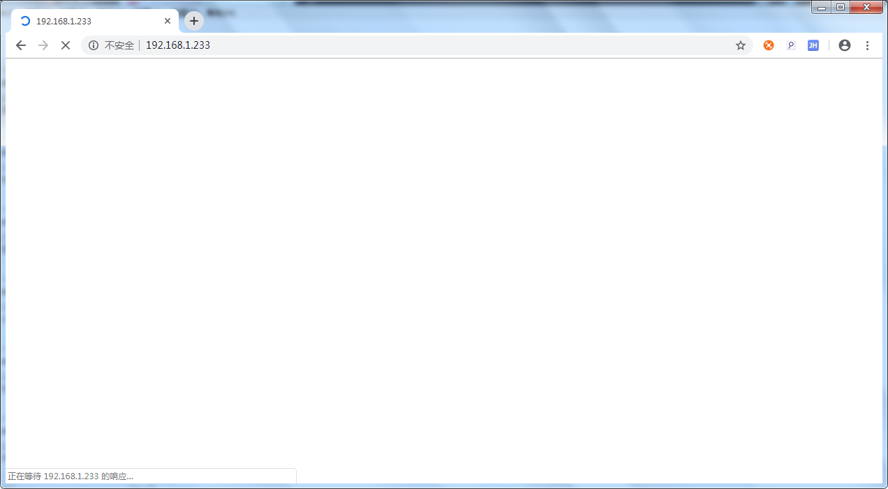
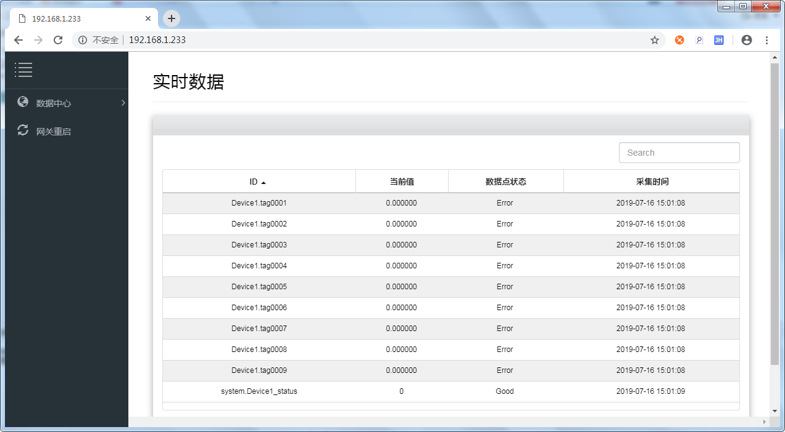
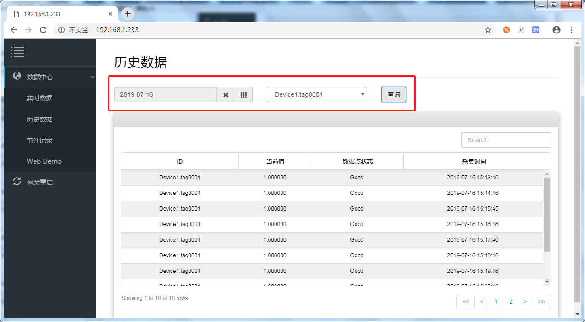
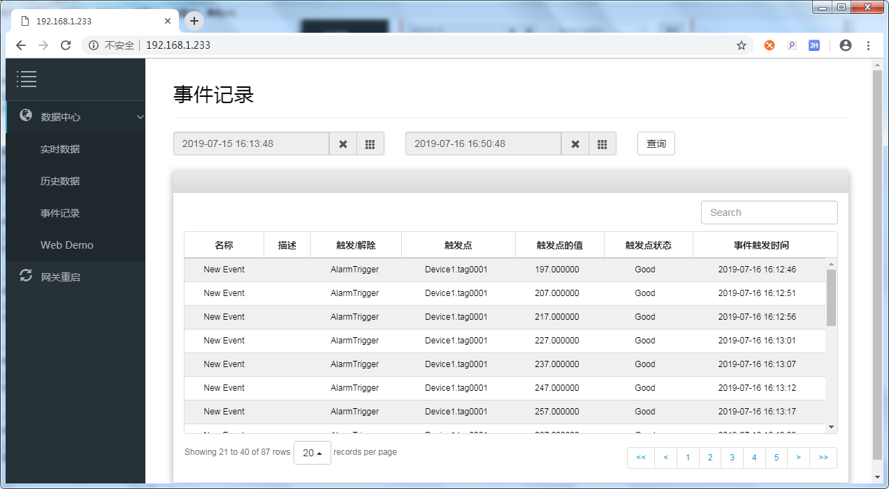
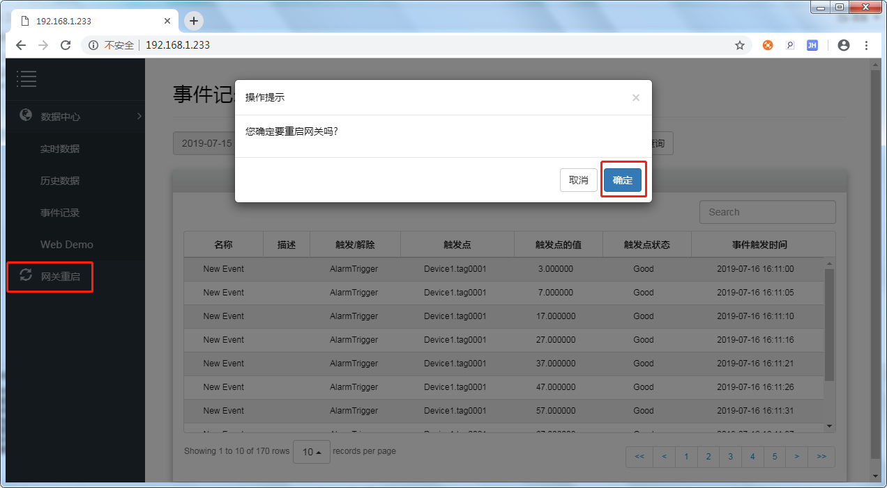

# 2.6 WEB服务器

网关自带 WEB 服务器，端口固定为 80。用户可以通过浏览器就登录到 WEB页面，在网页里可以修改查看实时数据、历史存储、事件记录和重启网关。 （推荐使用谷歌浏览器）

## 2.6.1 网页登录

在浏览器中输入网关的 IP 地址，如图 2-17 所示。

图2-17 网页登录

## 2.6.2 实时数据

在浏览器网页登录成功之后，会自动显示当前网关的实时数据。如图2-18所示。

图2-18 实时数据

## 2.6.3 历史数据

用户可在历史数据页面每次查询一天的历史信息。在查询时需要当前网关开启了历史存储的功能。

用户先选择需要查询的日期和存储点，点击“查询”按钮。

图2-19 历史数据

## 2.6.4 事件记录

用户可在事件记录页面查询事件信息。

用户选择需要查询的时间段，点击“查询”按钮。

图2-20 事件记录

## 2.6.5 网关重启

点击左侧“网关重启”菜单，在弹出的对话框中点击“确定”按钮，即可对当前网关进行重启操作。

图2-21 网关重启

