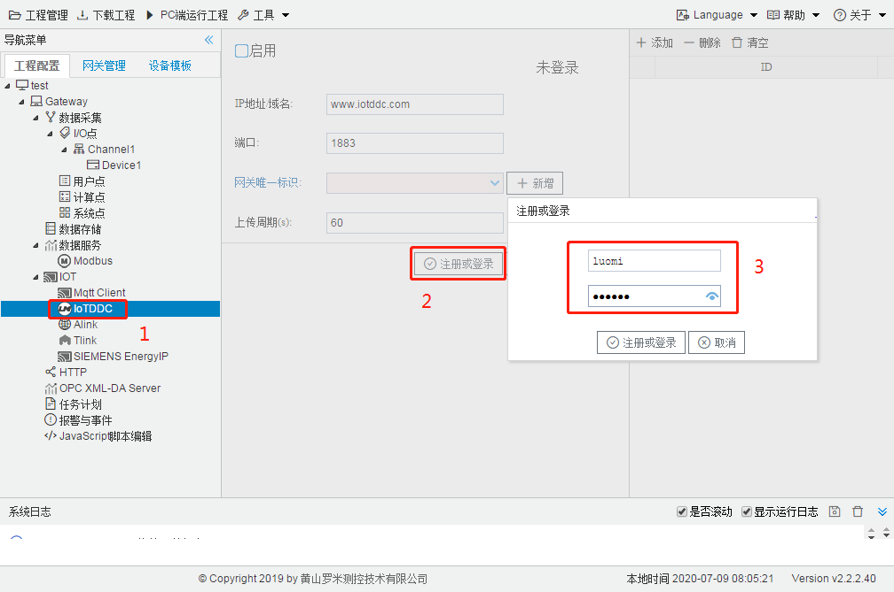
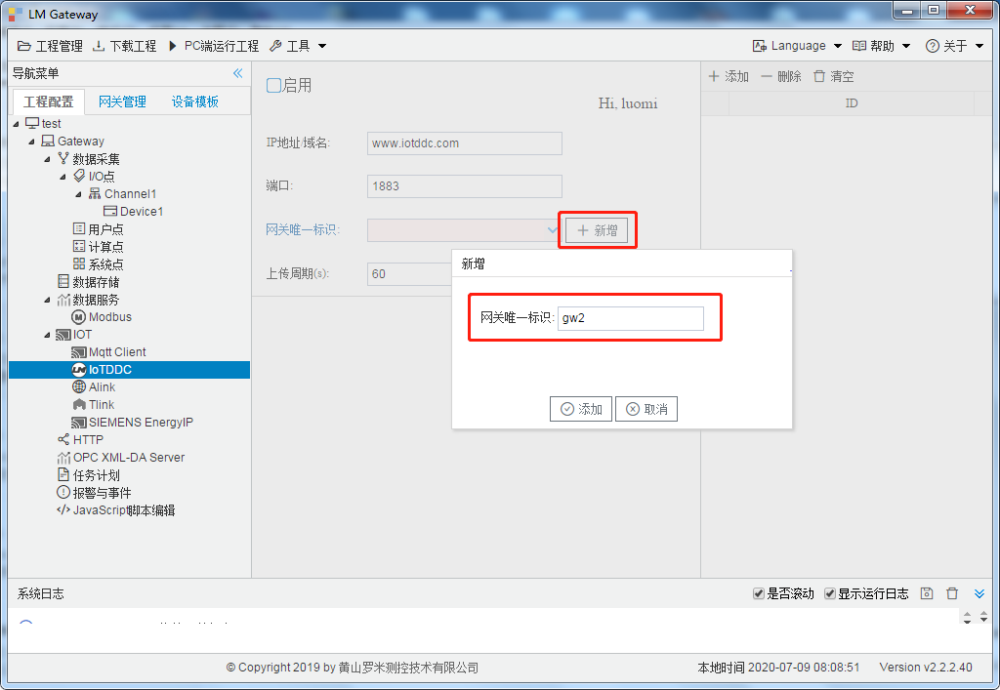
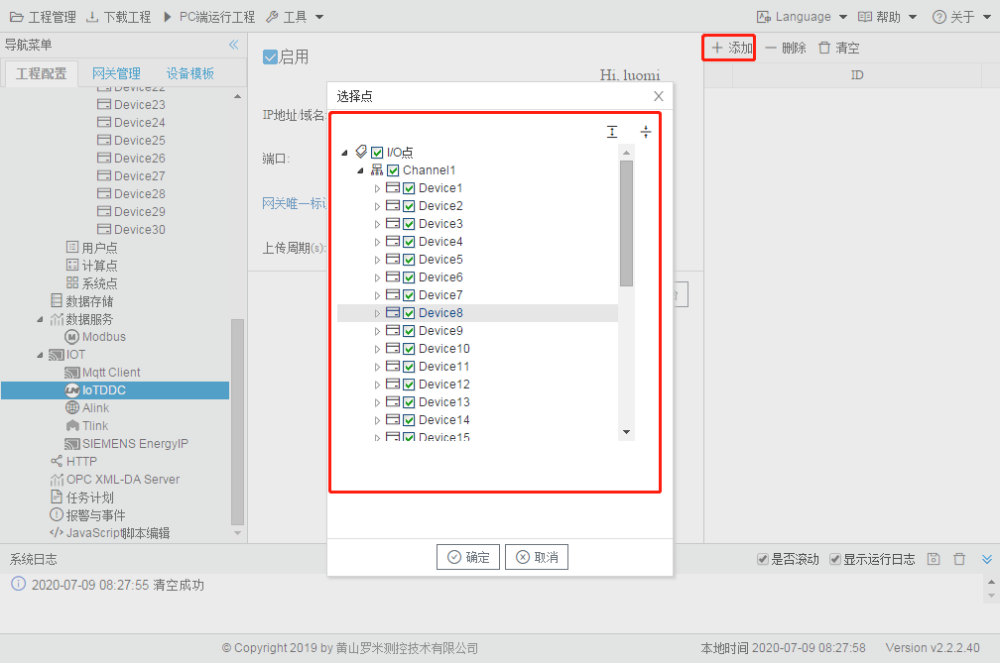
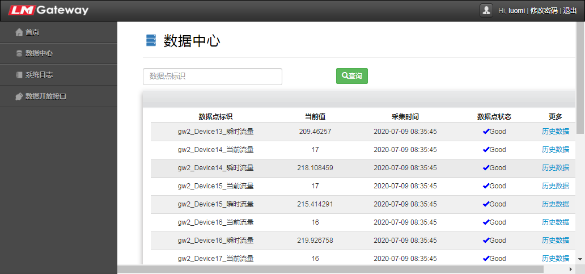
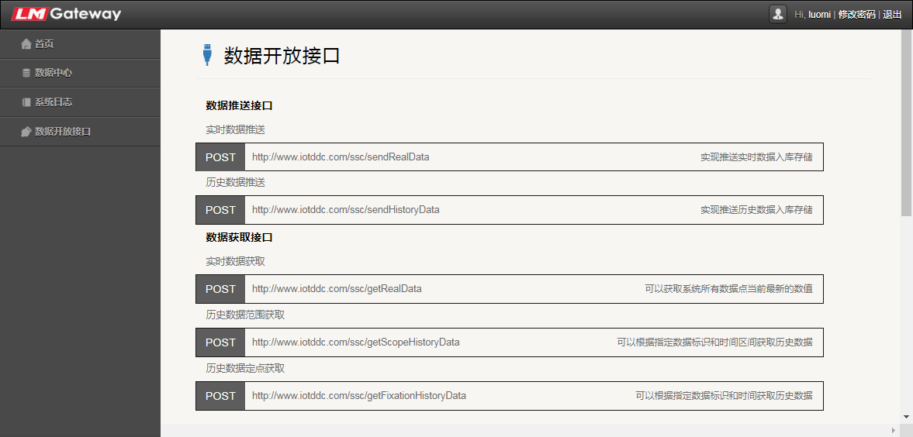

# 6.2 IoTDDC

应用于快速连接罗米测控IoT数据中心。 

1. 注册或登录云平台，未注册的用户可通过“注册或登录”的按钮进行注册；

   

2. 新增网关标识，之前已经新增过标识的用户，可通过下拉框选择相应的标识，但不同的网关不能同时使用相同的标识；

   

3. 添加需要上传的数据点；

   

4. 点击“保存并上传平台”，保存当前页面的配置，并将当前工程上传到云平台；
5. 点击“PC端运行工程”或将工程下载到网关中运行，进行数据采集，将数据根据设定的上传周期上传到云平台；

6. 在浏览器中输入www.iotddc.com，使用在GC中注册的用户，登录云平台的数据中心，查看实时数据和历史数据

   

7. 客户可根据数据开放接口，推送数据进行存储和获取云平台中的数据

   

   

