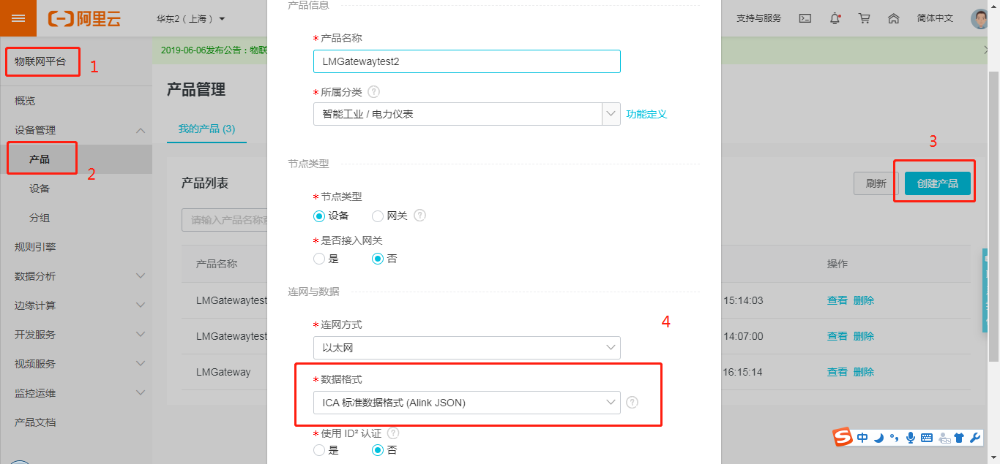
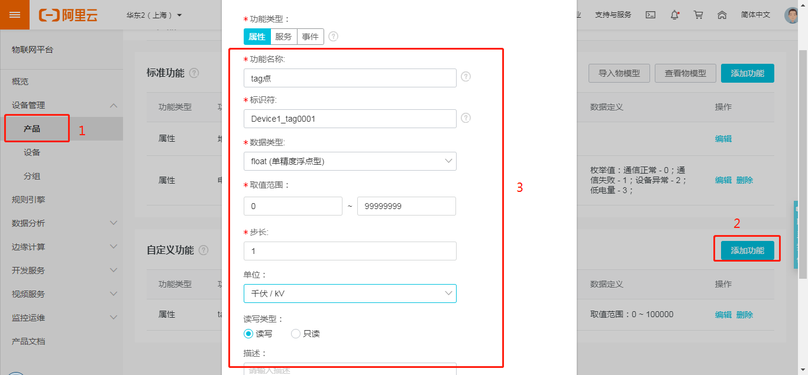
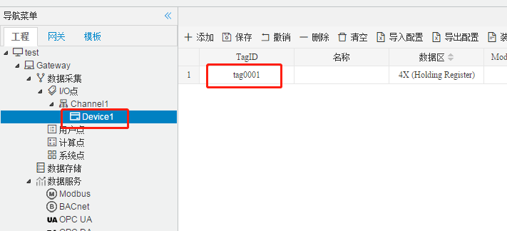
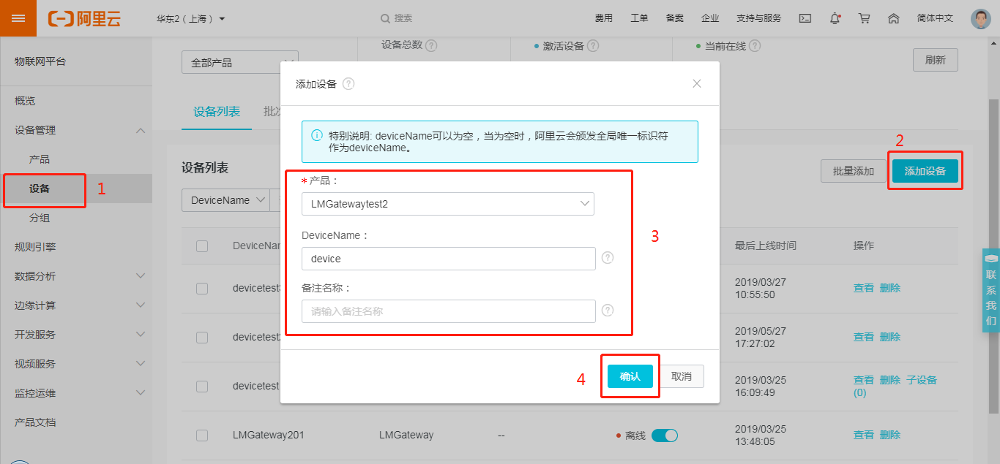
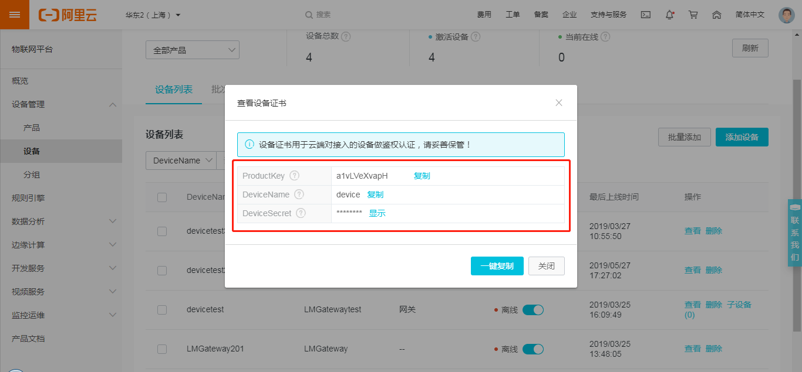
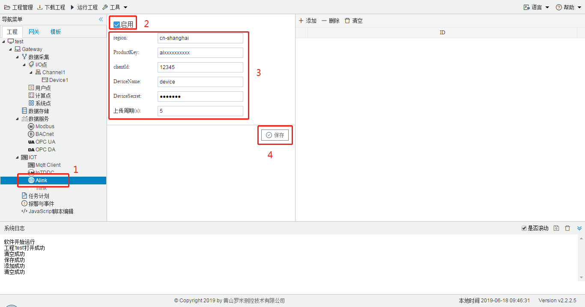

# 6.3 Alink

Alink是阿里云定义的设备与云端之间的通信协议。Alink协议是针对物联网开发领域设计的一种数据交换规范，数据格式是JSON，用于设备端和物联网平台的双向通信，更便捷地实现和规范了设备端和物联网平台之间的业务数据交互。

在配置GC中Alink页面之前，需要在阿里云的物联网平台中进行以下步骤：

1.先在阿里云的物联网平台中创建产品。

图6-11 创建产品

“创建产品”时，数据格式需要选择“ICA 标准数据格式 (Alink JSON)”。

2.在产品页面的“功能定义”中添加“自定义功能”。

图6-12 功能定义

功能名称：可以选择下拉框中的内容，也可自定义。

标识符：属性唯一标识符，在产品中具有唯一性。需要设置为：“设备名称” + “_” + "tagID",如下图中设备名称为Device1，TagID为tag0001,所以该点的标识符为Device1_tag0001。

数据类型、取值范围、步长、单位和读写类型根据实际情况填写。

3.创建产品下属的设备。

图6-13 添加设备

4.点击上图中的“确认”按钮，会生成该设备的“三元组”：ProductKey、DeviceName和DeviceSecret，三元组和实际的一个物理设备(网关)一一对应。 万一现实中出现几个三元组一样的设备，那么后上网的设备，会让前一个设备下线。同时仅有一个这样的设备在线。

图6-14 三元组

可以点击“一键复制”按钮将三元组自定义保存，也可点击设备列表中相应的设备查看三元组。

在阿里云中进行了上述步骤之后，在GC中进行Alink页面的配置，具体步骤如下：

1.勾选“启用”按钮，填写地域（[地域和可用区](https://help.aliyun.com/document_detail/40654.html?spm=a2c4g.11186623.2.19.2e949ff5r8r1N8)）和三元组；clientid可默认为12345，不需要修改；上传周期自定义。点击“保存”按钮即可完成Alink的连接配置；

2.点击“添加”按钮，完成需要上传的数据点的添加。 

图6-15 Alink连接配置

 

