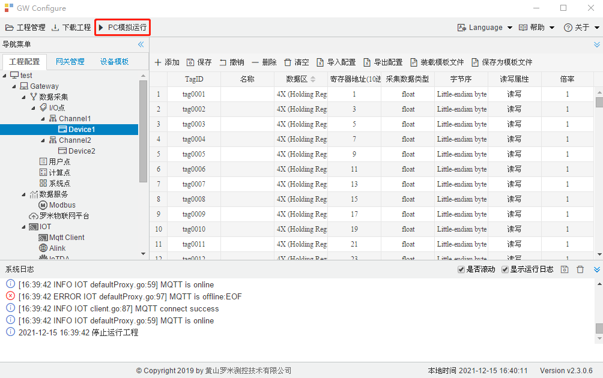

# 第十章 运行工程

**GC运行**

工程配置完成之后，用户进行数据采集调试时使用"PC模拟运行"（PC端模拟网关运行工程，主要用途是方便用户调试工程，调试完毕后，需要把工程下载到网关中，下载成功后网关会自动运行工程）：点击工具栏当中的“PC模拟运行”按钮，以PC为载体，使用PC的串口和网口进行数据采集和数据服务。在系统日志栏中会打印程序运行时输出的日志和报文，便于用户在PC环境中调试项目。 

在GC运行工程时，可以通过点击通道下的设备，查看该设备的实时数据。

 

图10-1 PC模拟运行
