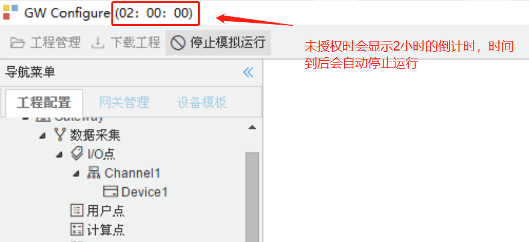
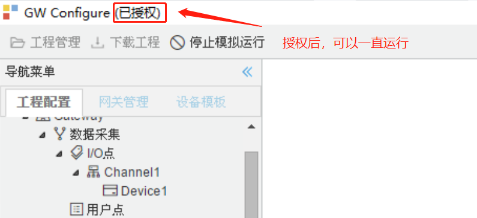
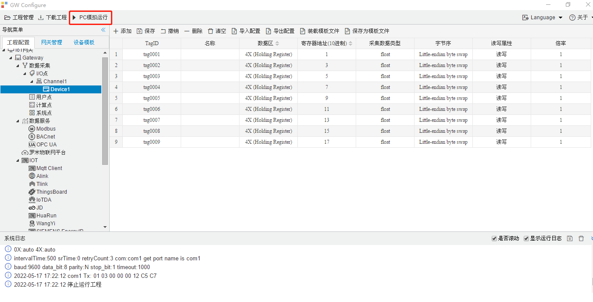
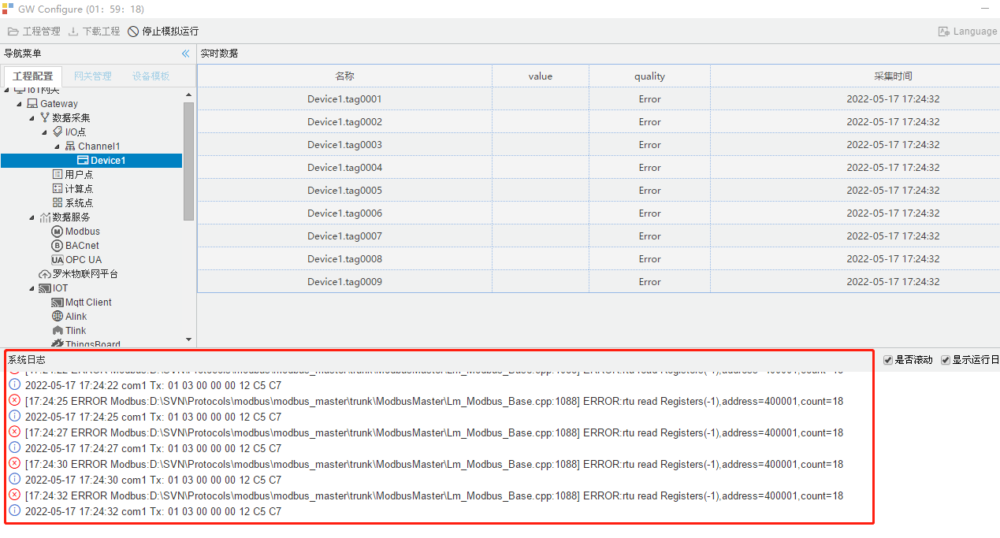
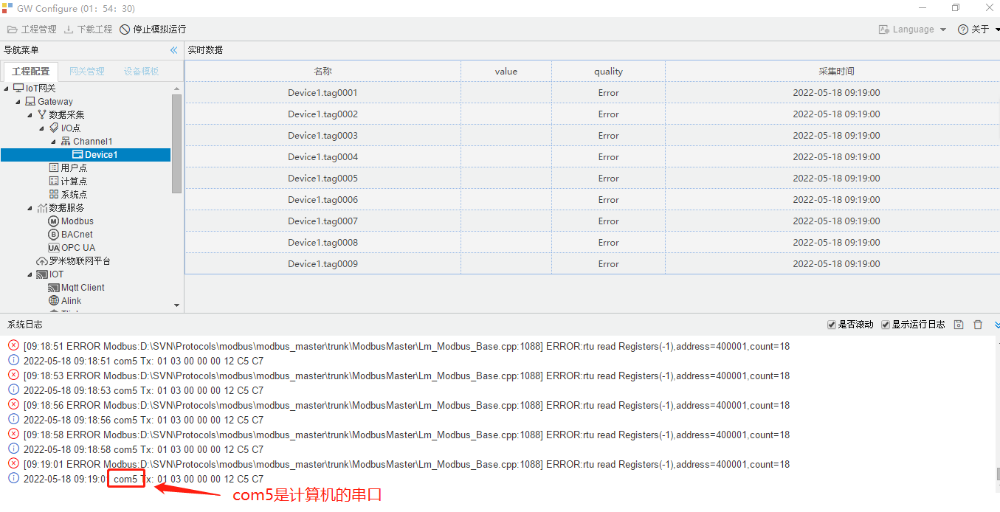
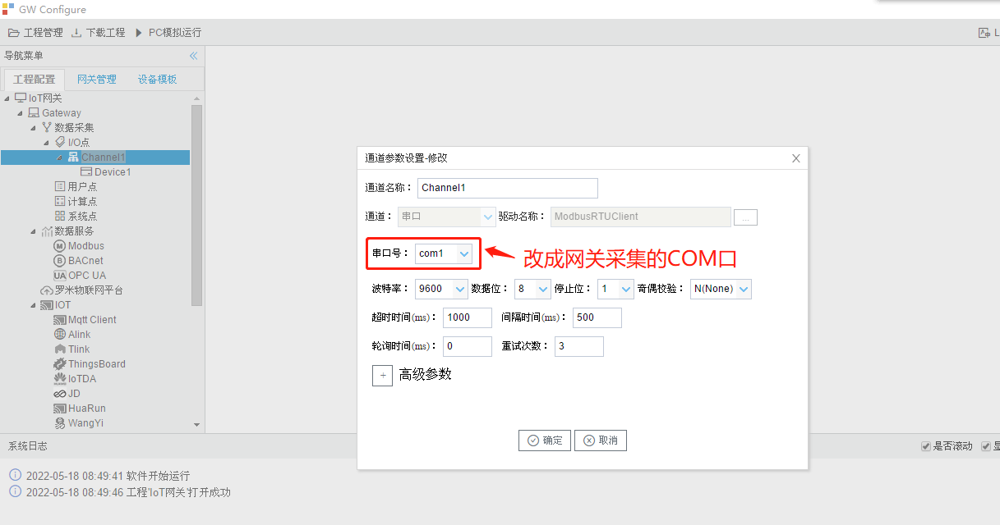
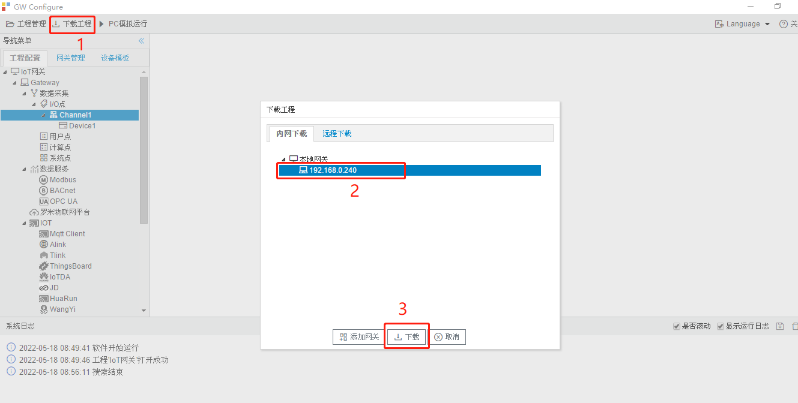
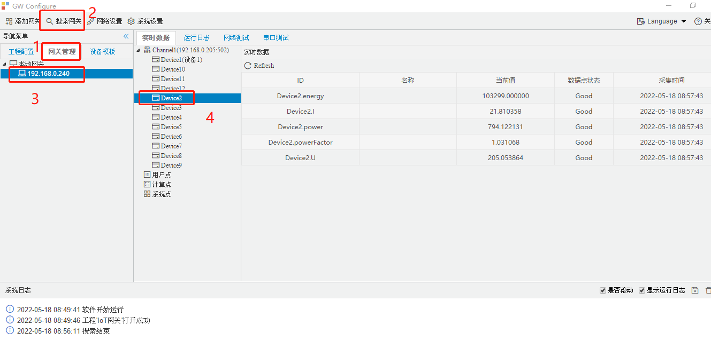
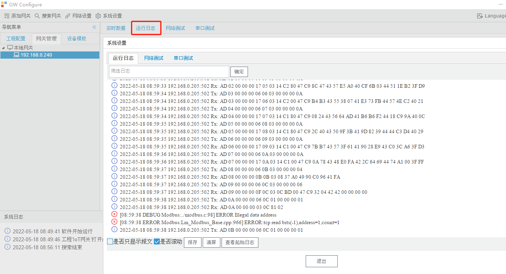

# 11.1 PC模拟运行

　　PC端模拟网关运行工程，主要用途是方便用户调试工程，使用计算机的串口和网口工作，调试完毕后，需要把工程下载到网关中，下载成功后网关会自动运行工程。

​		没有授权时只能运行2小时，如需使用计算机来当网关进行采集则需要购买授权。

PC模拟运行　未授权

PC模拟运行　已授权

### 调试工程示例

　　下面以modbus 串口采集协议为例，配置好工程后，点PC模拟运行。

观察日志，分析采集问题。

　　采集正常后，需要把工程下载到网关，让网关运行工程实现采集，下载之前需要修改通道的COM口（改为网关实际采集的COM口）。

　　点“下载工程”，在弹出的对话框中选中网关的IP，然后点“下载”按钮。

### 查看网关采集

　　点“网关管理”-->“搜索网关”，在“本地网关”列表中点击需要查看的网关，然后点击一个设备，就可以看到这个设备采集到的数据点及采集状态。

　　单击“运行日志”可以查看到网关的运行日志。

