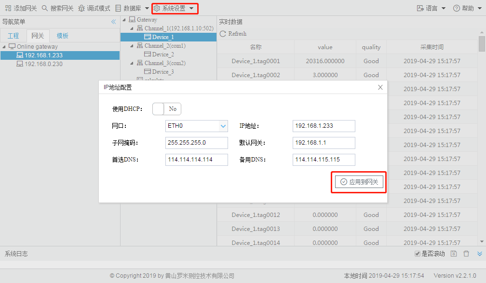
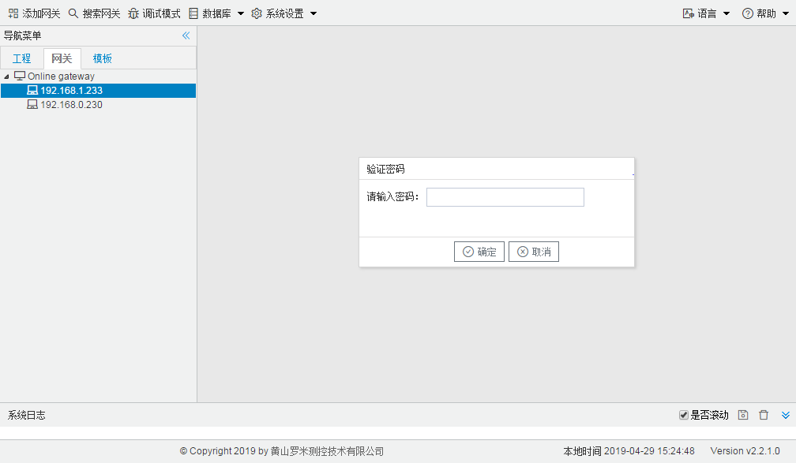
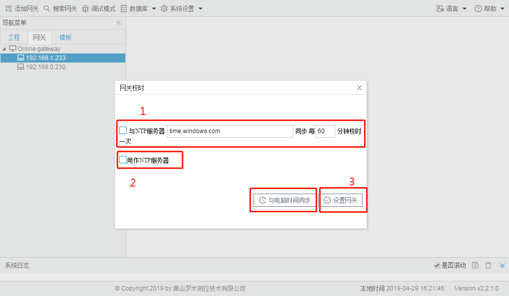
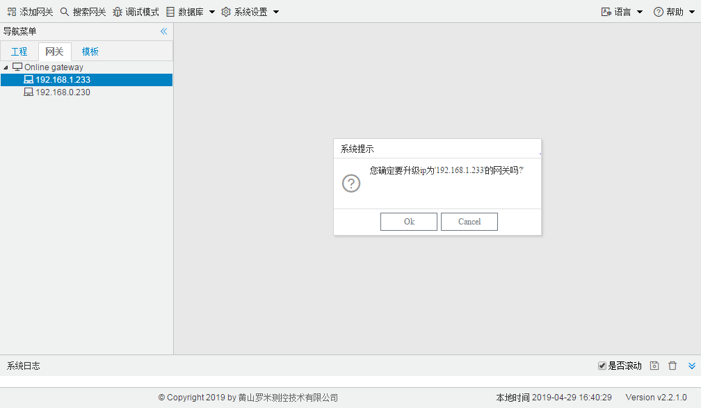

# 10.3 系统设置

## 10.3.1 设置IP

用户可以通过Gateway Confifiguration修改在线LMGateway网口的IP地址和DNS，也可以设置网口为DHCP。 

点击“应用到网关”按钮之后，网关会马上应用当前配置的IP。

图10-6 设置IP
图10-7 上载工程
图10-8 密码设定
图10-9 网关校时
图10-10 重启网关
图10-11 网关升级</center

