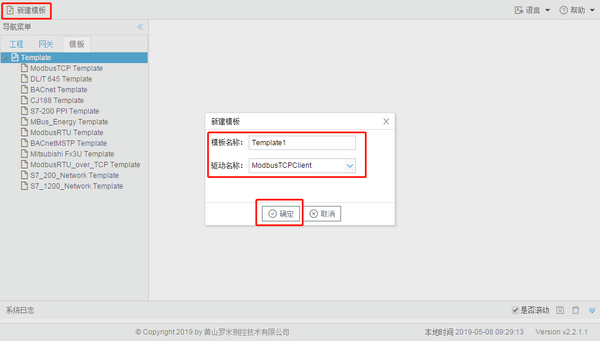
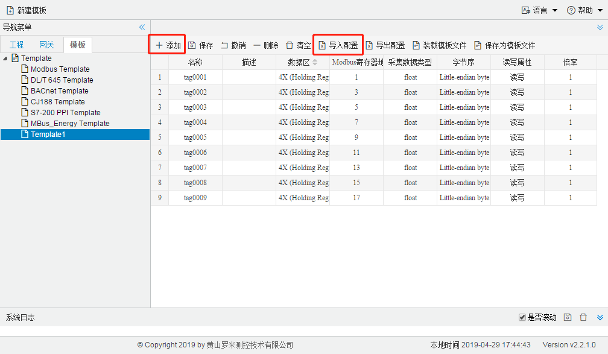
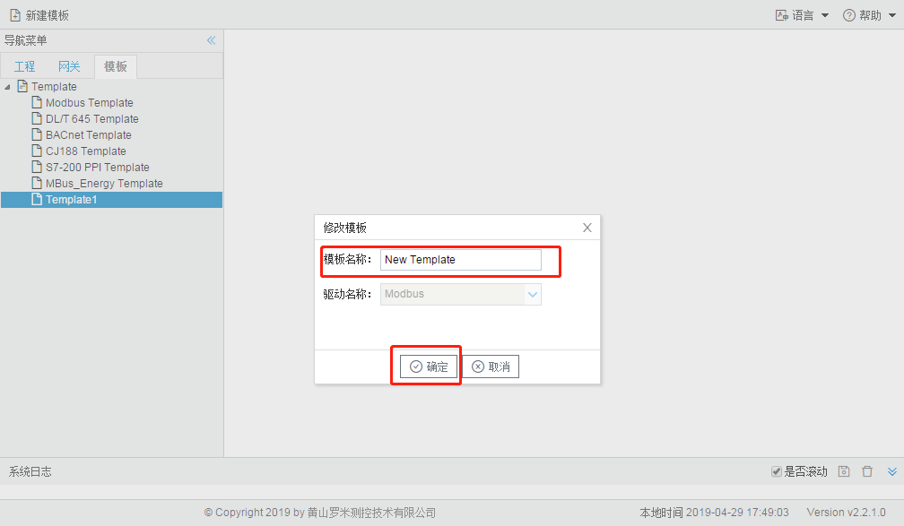
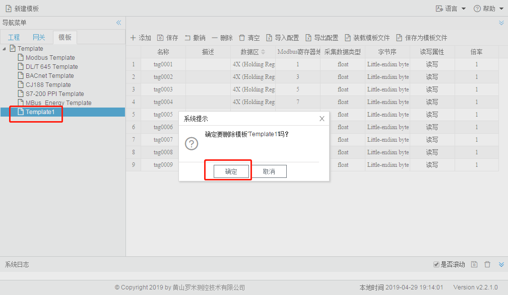
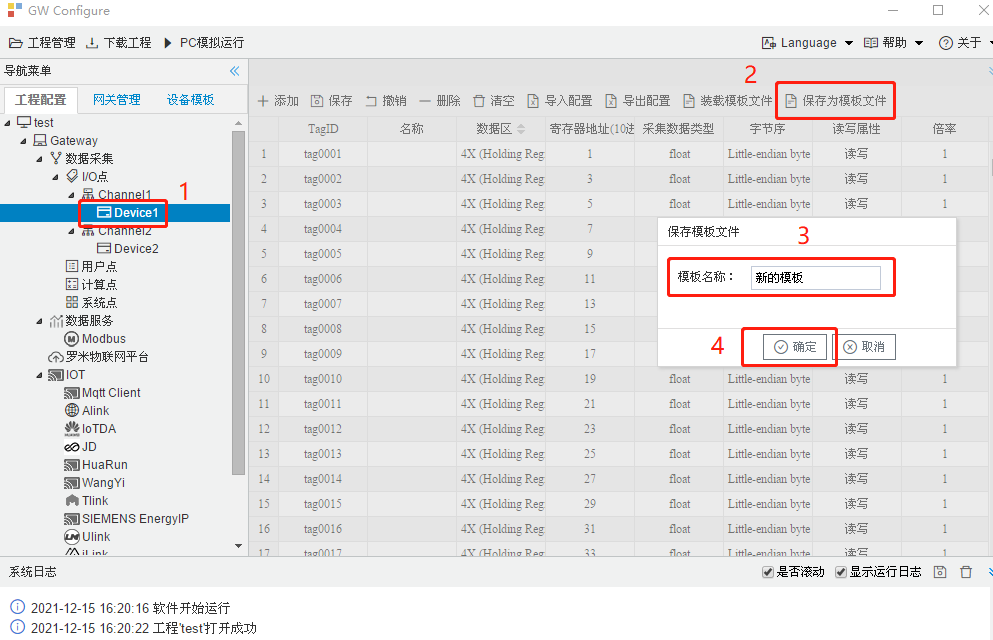

# 第十一章 模板

GC具有保存模板和装载模板的功能，用户可选择驱动新建自己的设备模板。

## 11.1 新建模板

点击工具栏中的“新建模板”按钮，在弹出框中填写唯一的模板名称，选择模板的驱动协议。

图11-1 新建模板

单击选中左侧模板，编辑模板电表，具体操作详见“驱动通讯说明文档”。

图11-2 编辑模板

## 11.2 修改模板名称

双击需要修改名称的模板，在弹出框中修改模板名称，点击“确定”按钮。

图11-3 修改模板名称

## 11.3 删除模板

单击选中需要删除的模板，右键选择“删除模板”。

图11-4 删除模板

## 11.4 当前配置保存为模板

单击某个设备，在右边的配置窗口中点“保存为模板文件”按钮，在弹出的对话框中输入模板的名称，点“确定”。

图11-5 保存模板
