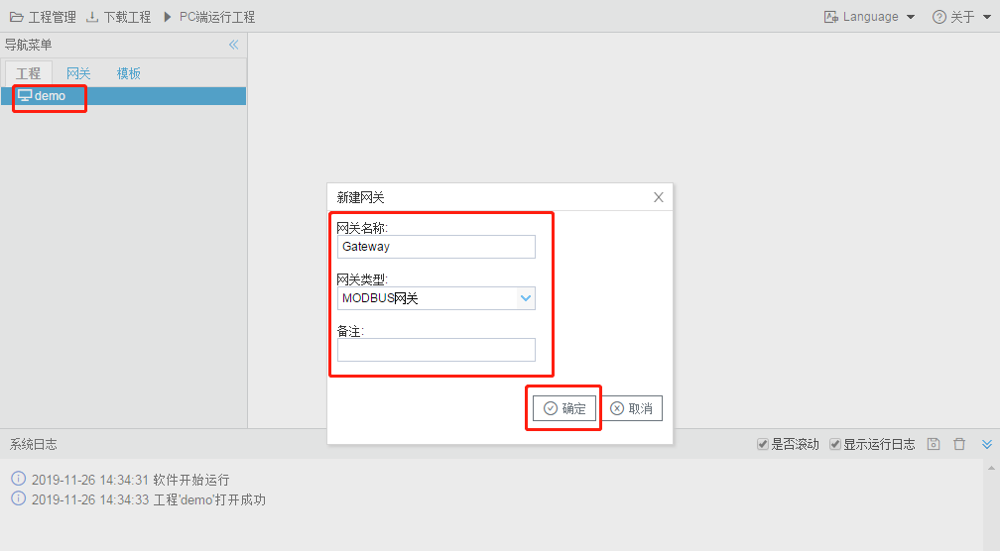
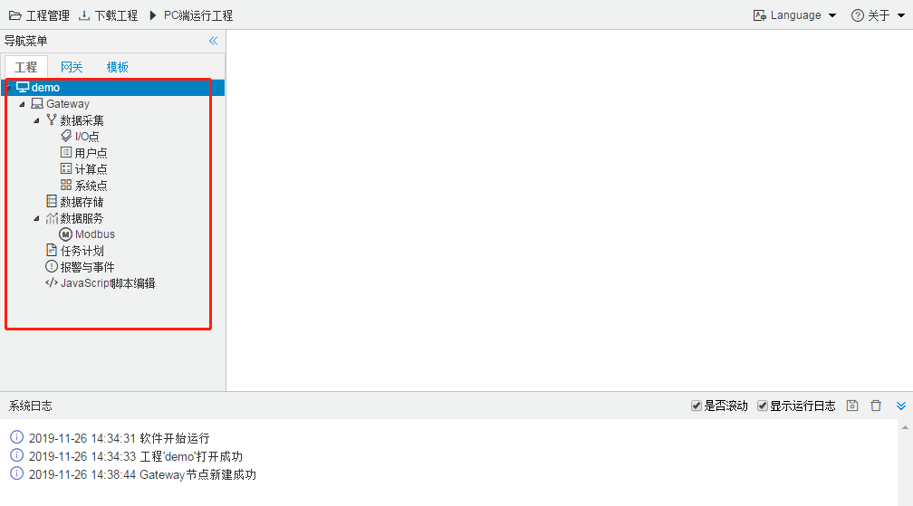

# 13.2 新建网关设备

右键单击“demo”根节点，选择“添加网关”，输入网关名称，选择需要配置的网关类型，单击“确定”按钮，如图12-2所示。

新建网关设备

此时我们就可以在“demo”根节点下，看到该网关类型所有的可供配置项。

其中“数据采集”为数据来源，分为I/O点（采集驱动）、用户点、计算点和系统点；

“数据存储”是将需要存储的数据点，按照设定周期存储到TF卡当中；

“数据服务”是该网关类型提供的服务类型：例如上图选择“MODBUS网关”，此处就会显示“Modbus”服务。

“任务计划”、“报警与事件”和“JavaScript脚本编辑”的说明，详见第七、八、九章节。

工程树

