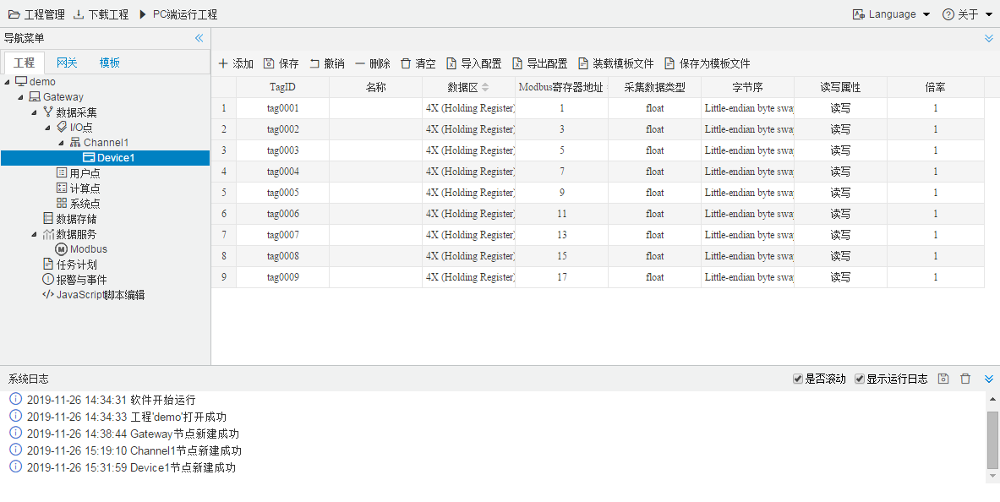

# 12.6 添加数据点

左键单击选择需要新建数据点的设备，右侧会显示该设备下已编辑的数据点，可以在表格当中进行增删改。

可通过“导出配置”和“导入配置”将当前配置导出成Excel，用Excel软件配置完成后导入到配置工具当中；

可通过“保存为模板文件”和“装载模板文件”将当前配置保存成模板文件，在当前工程或者其他工程中可直接导入保存的模板，方便批量配置。

图12-6 添加数据点

协议表格的参数说明详见《罗米测控网关通讯协议说明》。