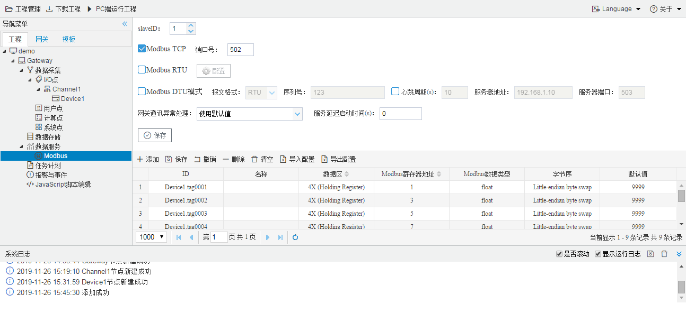

# 12.7 数据服务

单击选择“数据服务”下的“Modbus”，在右侧弹出页面中进行Modbus服务的配置。

图12-7 Modbus服务

在Modbus服务中，上方是Modbus服务的协议配置，下方为映射到Modbus服务上的数据点，映射的数据区、寄存器地址、数据类型以及字节序。

本示例为Modbus网关，在12-2章节“新建网关设备”时选择其他类型的网关，数据服务会有所区别，但是配置思路都是一致的，需要先进行协议方面的配置，然后进行数据点的映射（需要上传的数据点、数据点映射到的地址等）。