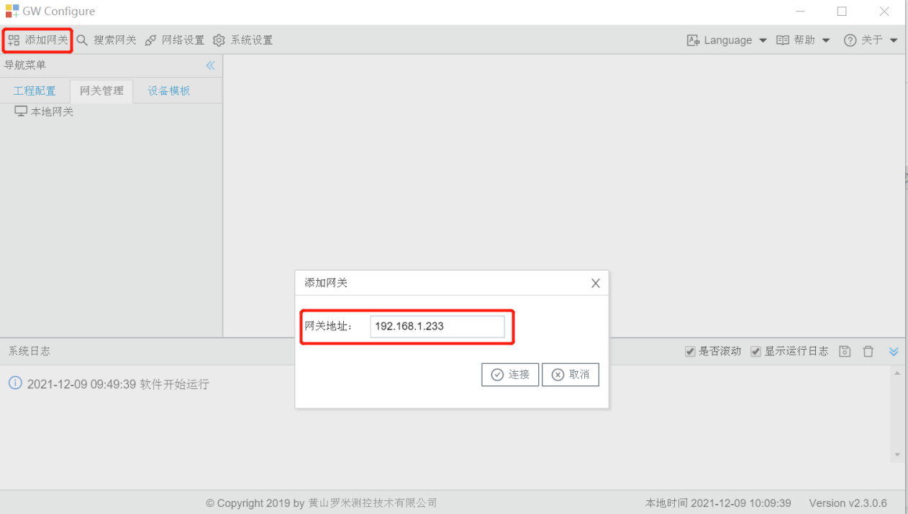
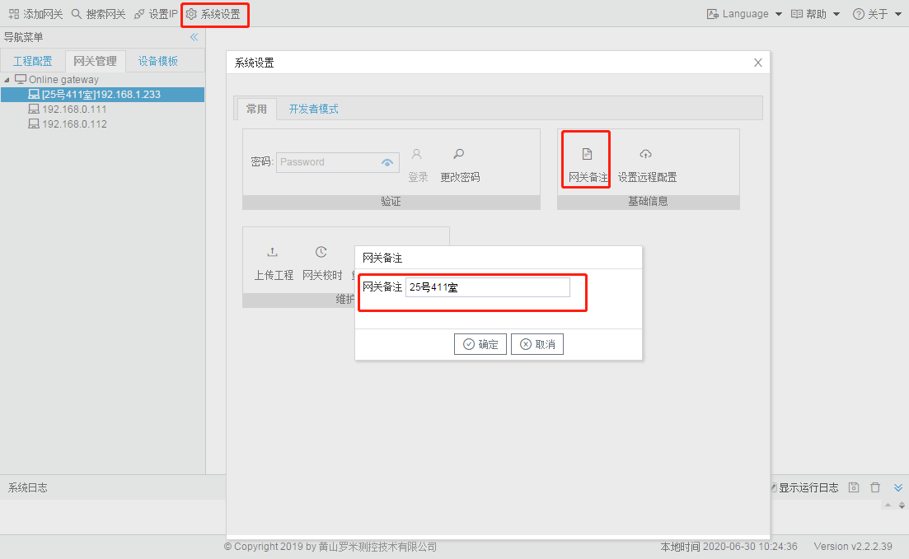
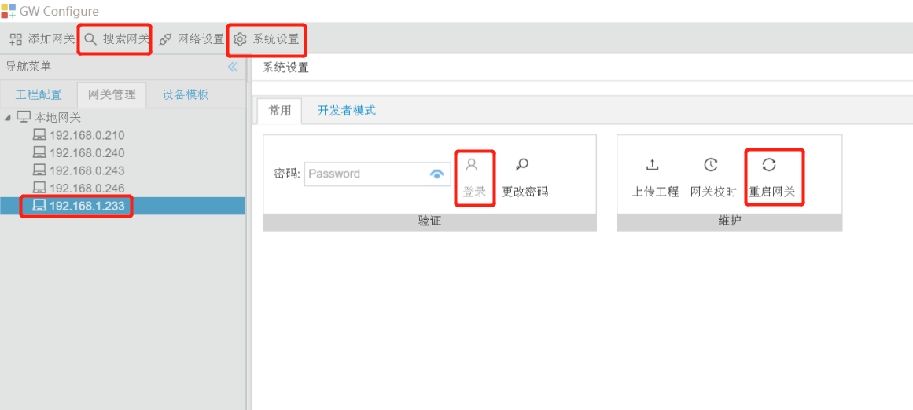
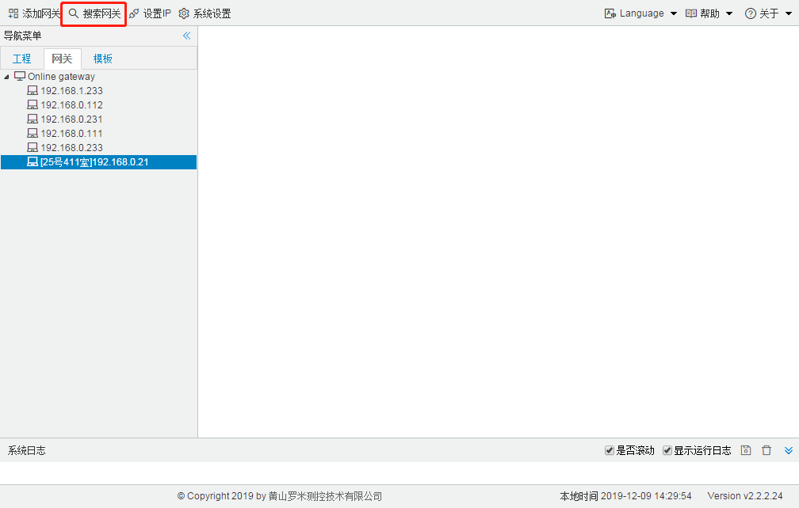

# 2.1 添加、搜索、查看、备注网关

**添加网关** 

已知LMGateway的IP地址，点击“添加设备”将网关添加到在线网关列表中。 

图2-3 添加网关

**搜索网关** 

首先确保网关和当前电脑的IP在同网段内，并可以PING通的情况下，单击“搜索网关”开始搜索。

本地网关中会列出已搜索到的网关IP，双击网关IP，弹出“网关信息”窗口中包含网关类型、软件版本、支持点数、网关备注、SN号，其中支持点数是指网关中的数据点低于支持点数时可以保证网关的运行效率。

可以修改网关的备注，完成后需要重启关网生效。“搜索网关”时会将备注内容显示在IP之前。

图2-4 设置网关备注

重启网关操作：单击搜索到的网关IP，然后点“系统设置”，在系统设置框内点登录（默认密码为空），再点“重启网关”即可。

重启网关

图2-4 搜索网关

