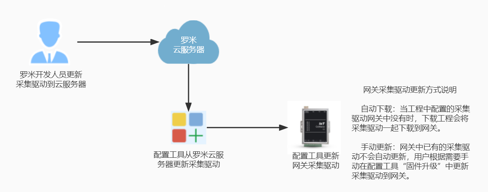
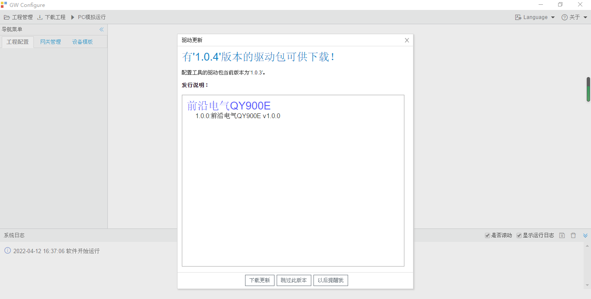
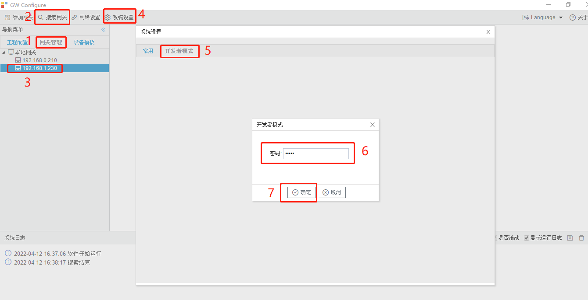
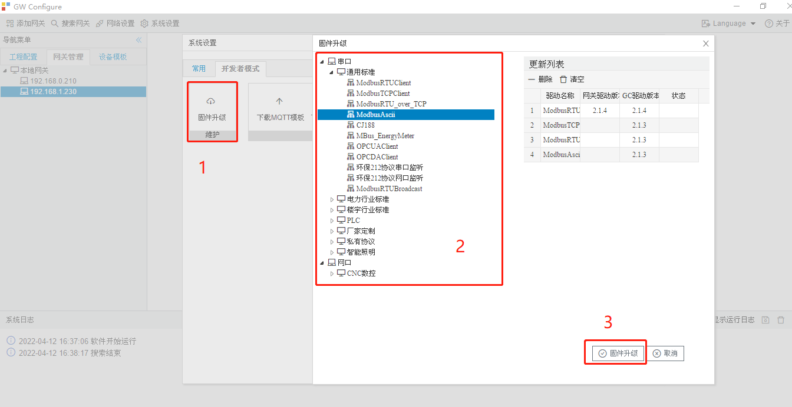
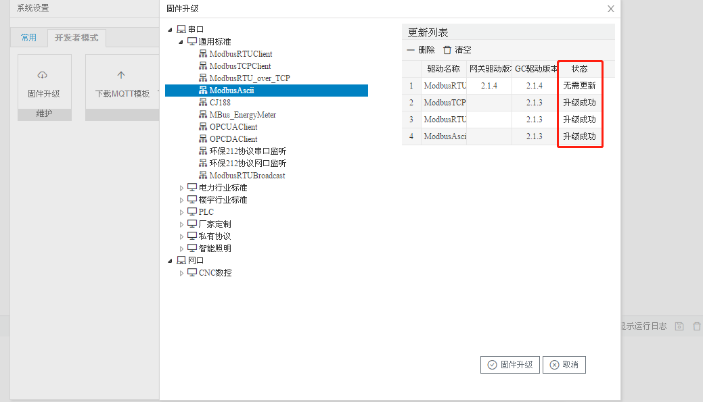

# 2.10 采集驱动更新

采集驱动更新示意图

## 2.10.1 配置工具采集驱动更新

　　配置工具运行时会检查云端是否有新版本的采集驱动，当有采集驱动更新时会弹出驱动更新窗口，在其中显示出新的采集驱动和版本信息，可以选择下载更新配置工具的采集驱动。

## 2.10.2 网关采集驱动更新

　　点击”网关管理“,再点”搜索网关“，然后选择需要升级采集驱动的网关IP，单击”系统设备“，在弹出的对话框中选择”开发者模式“，输入默认密码”luomi"后，点“确定”按钮。

　　在“系统设置”对话框中点“固件升级”，弹出固件升级窗口，在左边驱动中点击需要升级的驱动，点过的驱动会显示在更新列表中，选好需要更新的驱动后，单击“固件升级”按钮，开始升级。

　　升级完成后，更新列表中的状态会显示出更新的结果。

