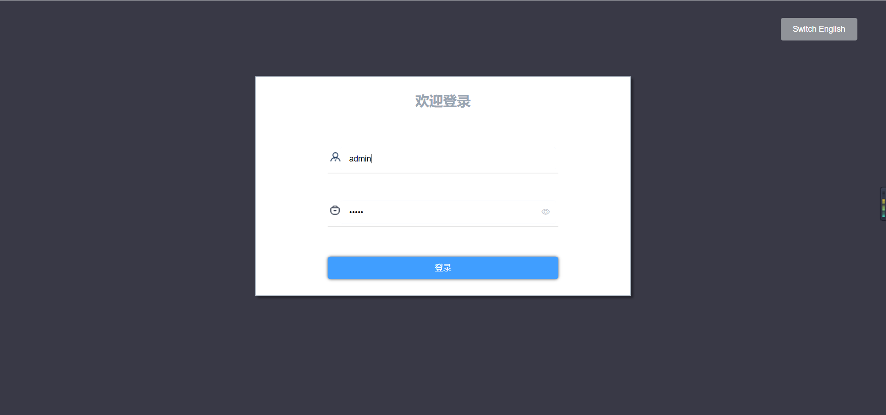

# 2.12 WEB服务器

网关自带 WEB 服务器，端口固定为 80。用户可以通过浏览器就登录到 WEB页面，在网页里可以修改查看实时数据、网关信息和重启网关。 （推荐使用谷歌浏览器）

## 2.12.1 网页登录

在浏览器中输入网关的 IP 地址，如图 2-17 所示。

图2-17 网页登录

密码初始默认为luomi，可通过配置工具中“更改密码”按钮进行修改。

## 2.12.2 实时数据

在浏览器网页登录成功之后，会自动显示当前网关的实时数据。如图2-18所示。

图2-18 实时数据

## 2.12.3 网关信息

用户可通过web页面设置网关IP。

图2-19 设置IP

## 2.12.4 网关重启

点击左侧“网关重启”菜单，在弹出的对话框中点击“确定”按钮，即可对当前网关进行重启操作。

图2-20 网关重启

