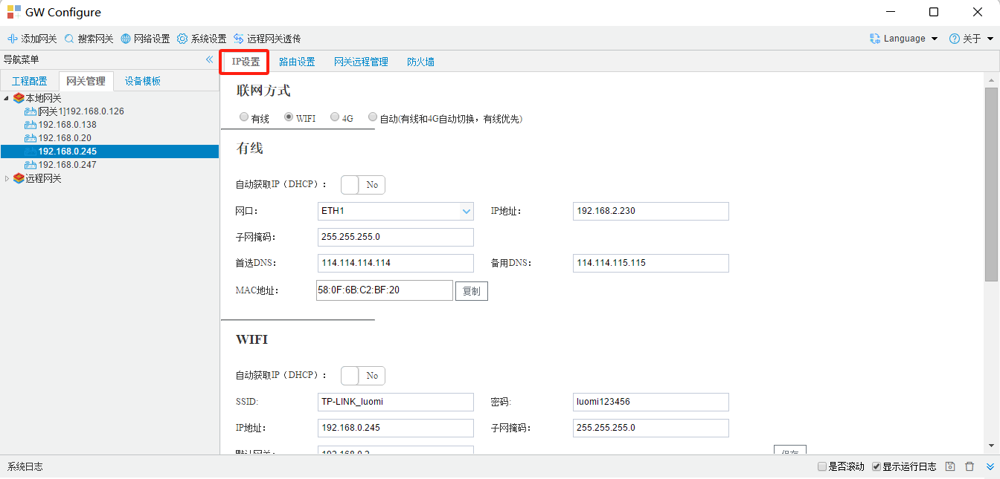

# 2.14 路由设置

路由设置是用于添加网络路由，将IP数据包从一个网络传递到另一个网络。

**IP地址**指需要添加路由的目的网络地址。

**子网掩码**指目的网络地址的子网掩码。

**默认网关**指要流向目的网络地址的默认网关。

路由设置

网关的IP设置中默认**网关的eth0为WAN口（跨网段通讯或连接Internet时使用），eth1为Lan口(同网段局域网通讯时使用)。**但实际应用场景中需要实现eth1跨网段使用时，可以添加路由设置，实现eth1跨网段访问。

IP设置

结合上述两张图，本实例中路由设置是给eth1设置路由，**默认网关**为eth1 IP地址的默认网关；**子网掩码**为目的网络"192.168.9"网段的子网掩码；**IP地址**为eth1需要跨网段访问的目的网络地址。以上配置就实现了，eth1从"192.168.2"网段访问"192.168.9"网段的跨网段操作。