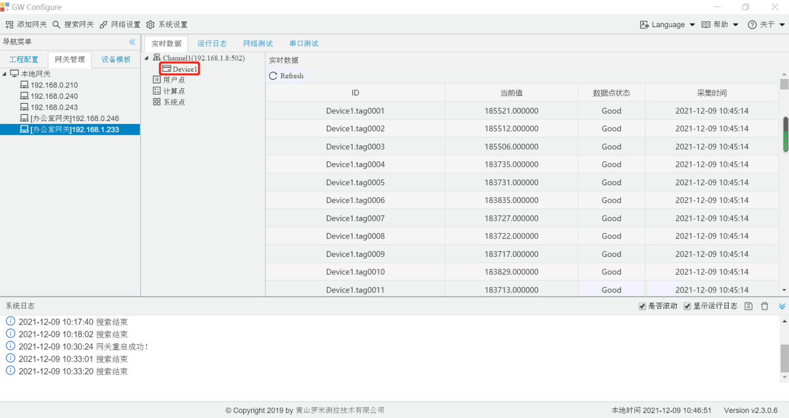
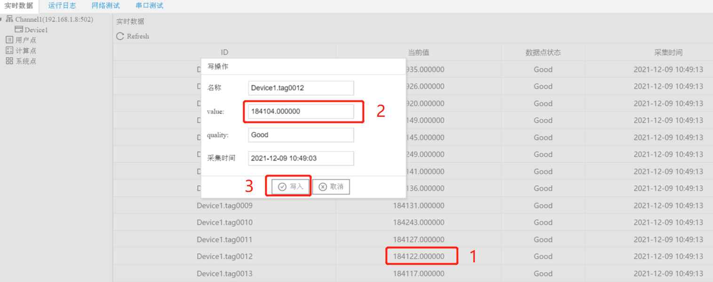

# 2.3 实时数据、设置Tag点值

**查看实时数据**

GC具有监控LMGateway数据的功能，单击网关IP，右侧显示通过 HTTP接口查询到的所有实时数据，可以通过单击左侧节点查看该节点下的数据。 

图2-6 实时数据

实时数据分为名称、value、quality、采集时间，分别如下：

- 名称：Tag点在当前LMGateway中的唯一标识。
- value：此时Tag点的实时值。
- quality：Tag点的质量戳，Good表示采集成功，此时value显示采集到的值；Error为采集失败，此时value显示为空。

**设置Tag点值**

GC可以对网关的数据点进行写操作。 

在实时数据页面，单击Tag点的value字段，在弹出的窗口中输入需要写入的值，点击“写入”按钮。

图2-7 设置Tag点值

