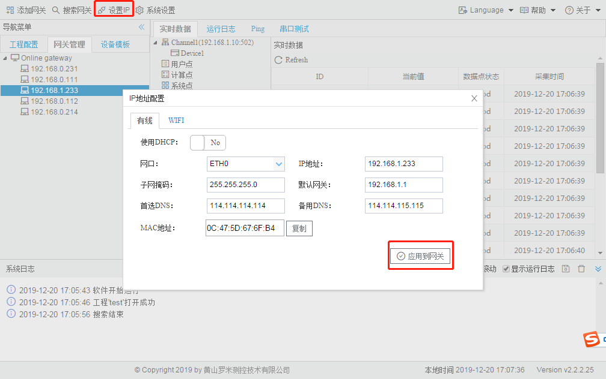
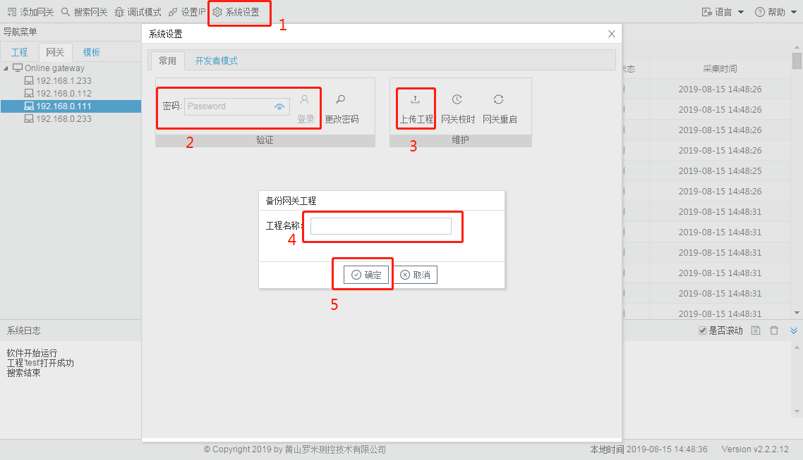

# 2.4 系统设置

## 2.4.1 设置IP

用户可以通过GC修改在线LMGateway网口的网络参数。 

点击“应用到网关”按钮，网关立即生效。（网口支持DHCP）

图2-8 设置IP

## 2.4.2 上传工程

GC可以将当前网关的配置文件上传到本地。 

点击“上传工程”，工程文件会上传至GC安装目录的Project文件夹下。

如果当前网关使用了密码，在上传工程时需要用户输入密码，才能进行上传工程的操作。

图2-9 上传工程

上传工程成功后GC会自动打开上传的工程。

## 2.4.3 密码设定

LMGateway出厂默认密码为空，即不使用密码。用户出于安全考虑可以给网关设置密码，用于工程的上传与下载。

图2-10 密码设定

## 2.4.4 网关校时

用户可将LMGateway与时间源同步时间，也可以将LMGateway作为一个NTP服务器，同步给其他设备。

- 网关根据同步周期与NTP服务器同步时间 
- 将网关设置为一个时间同步源，其他设备可以与这台网关同步时间

图2-11 网关校时

如果只需要将网关时间与电脑时间同步，只需要点击“与电脑时间同步”按钮； 

如果需要设置上图中的1、2，设置好之后需要点击“设置网关”按钮。 

## 2.4.5 重启网关

GC对网关进行重启。

图2-12 重启网关

## 2.4.6 网关升级

建议用户不要随意点击，需要进行网关升级时请先联系厂家。 

在升级过程中请不要操作GC和网关，在升级结束时会在系统日志中输出相应的信息。

图2-13 网关升级

