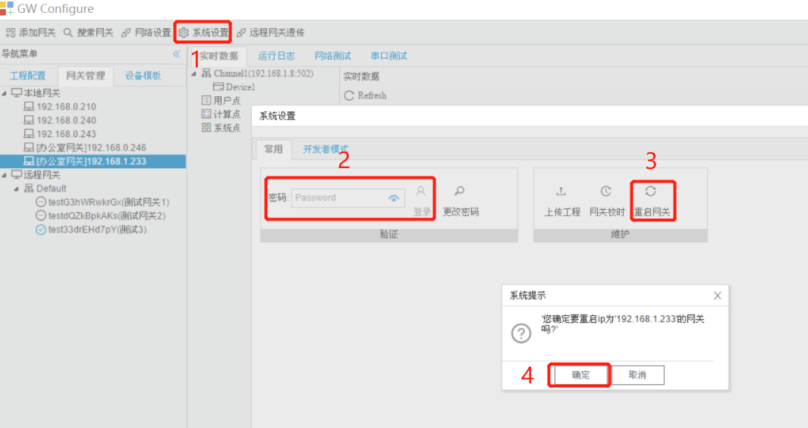

# 2.3 系统设置

点击“系统设置”按钮，在弹出的“系统设置”框中输入登录密码后点击“登录”按钮(出厂默认无密码，可直接点击“登录”按钮)。

## 2.3.1 设置IP

用户可以通过GC修改在线LMGateway网口的网络参数。 

点击“设置IP”按钮，弹出"IP地址配置"窗口。

**设置有线IP：**

图2-8 设置IP

点击“应用到网关”按钮，网关立即生效。（网口支持DHCP）

**设置WIFI：**

将SSID、密码、IP信息正确填写完成后，点击“保存”，将 usb 无线网卡插入到网关的 usb 端口，重新启动网关即可使用 usb 无线网卡。

## 2.3.2 网关备注

GC可以给LMGateway设置备注，在搜索网关时显示该备注，便于客户管理。

点击"系统设置"框中“网关备注”按钮进行备注设置。

网关备注

## 2.3.3 设置远程配置

GC可以通过远程部署系统，将工程远程下载到网关当中。

1. 通过浏览器登录www.iotddc.com:8081，登录注册一个用户，之后添加网关，“复制网关标识”

“网关标识”为远程部署系统中网关的唯一标识，每个网关的标识不能重复。

2. 点击GC的"系统设置"框中“设置远程配置”按钮，分别填写

​    网关管理平台：[www.iotddc.com](http://www.iotddc.com)

​    端口：1885

​    网关ID：复制的网关标识

3. 重启网关，网络正常时平台页面会显示“在线”

   

用户也可通过此页面管理所有LMGateway，查看最后上线时间、进行网关重启。

4. 显示在线时，说明网关与部署系统连接正常，此时可通过配置工具进行远程配置

   

   输入用户名和密码，点击“登录”按钮，在网关ID的下拉框中会显示该用户下所有的网关标识，选择需要将该工程下载到的网关标识，点击“远程下载”。
   
   

## 2.3.4 上传工程

GC可以将当前网关的配置文件上传到本地。 

点击"系统设置"框中“上传工程”按钮，工程文件会上传至GC安装目录的Project文件夹下。

图2-9 上传工程

上传工程成功后GC会自动打开上传的工程。

## 2.3.5 密码设定

点击"系统设置"框中“密码设定”按钮，弹出"密码设定"窗口。

LMGateway出厂默认密码为空，即不使用密码。用户出于安全考虑可以给网关设置密码，用于工程的上传与下载。

图2-10 密码设定

## 2.3.6 网关校时

点击"系统设置"框中“网关校时”按钮，弹出"网关校时"窗口。

用户可将LMGateway与时间源同步时间，也可以将LMGateway作为一个NTP服务器，同步给其他设备。

- 网关根据同步周期与NTP服务器同步时间 

图2-11 网关校时

如果只需要将网关时间与电脑时间同步，只需要点击“与电脑时间同步”按钮； 

如果需要设置上图中的4，设置好之后需要点击“设置网关”按钮。 

## 2.3.7 重启网关

点击"系统设置"框中“重启网关”按钮，弹出"重启网关"窗口。

GC对网关进行重启。

图2-12 重启网关

## 2.3.8 开发者模式

点击"系统设置"框中“开发者模式”选项卡，输入厂家密码。

建议用户不要随意点击，需要进行网关升级时请先联系厂家。 

在升级过程中请不要操作GC和网关，在升级结束时会在系统日志中输出相应的信息。

图2-13 网关升级

