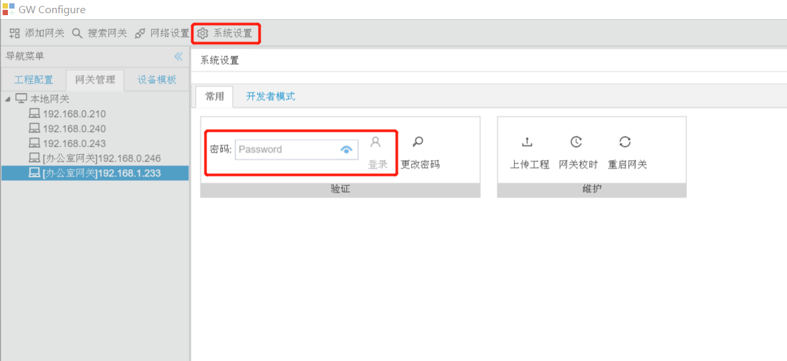
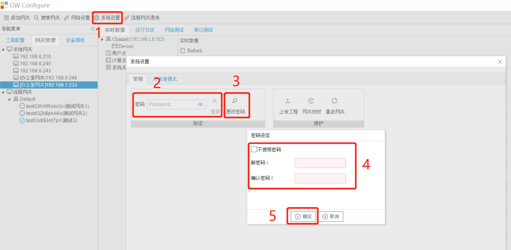
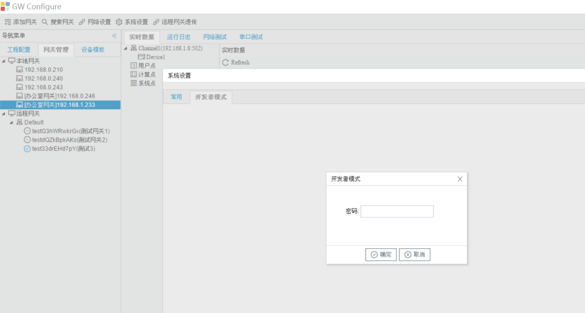

# 2.3 系统设置

点击“系统设置”按钮，在弹出的“系统设置”框中输入登录密码后点击“登录”按钮(出厂默认无密码，可直接点击“登录”按钮)。

## 2.3.1 上传工程

GC可以将当前网关的配置文件上传到本地。 

点击"系统设置"框中“上传工程”按钮，工程文件会上传至GC安装目录的Project文件夹下。

图2-9 上传工程

上传工程成功后GC会自动打开上传的工程。

## 2.3.2 密码设定

点击"系统设置"框中“密码设定”按钮，弹出"密码设定"窗口。

LMGateway出厂默认密码为空，即不使用密码。用户出于安全考虑可以给网关设置密码，用于工程的上传与下载。

图2-10 密码设定

## 2.3.3 网关校时

点击"系统设置"框中“网关校时”按钮，弹出"网关校时"窗口。

用户可将LMGateway与时间源同步时间，也可以将LMGateway作为一个NTP服务器，同步给其他设备。

- 网关根据同步周期与NTP服务器同步时间 

图2-11 网关校时

如果只需要将网关时间与电脑时间同步，只需要点击“与电脑时间同步”按钮； 

如果需要设置上图中的4，设置好之后需要点击“设置网关”按钮。 

## 2.3.4 重启网关

点击"系统设置"框中“重启网关”按钮，弹出"重启网关"窗口。

GC对网关进行重启。

图2-12 重启网关

## 2.3.5 开发者模式

点击"系统设置"框中“开发者模式”选项卡，输入厂家密码。

建议用户不要随意点击，需要进行网关升级时请先联系厂家。 

在升级过程中请不要操作GC和网关，在升级结束时会在系统日志中输出相应的信息。

图2-13 网关升级

