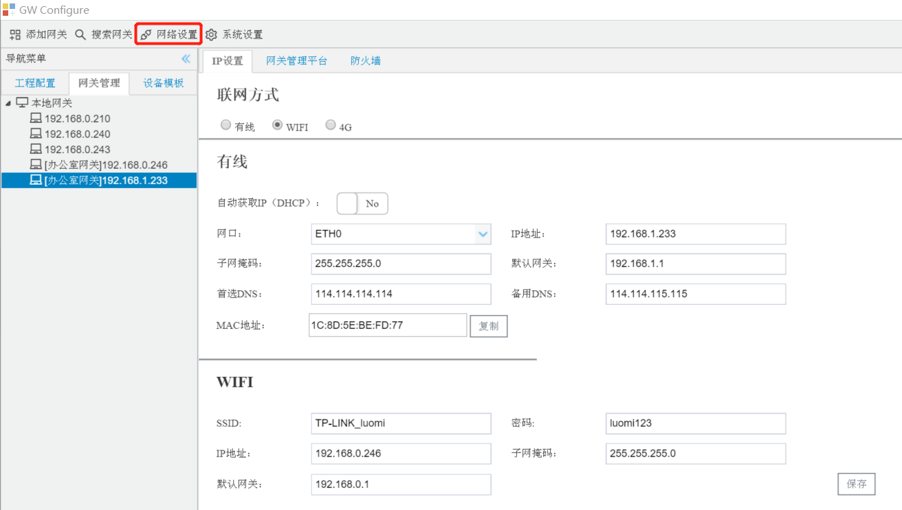
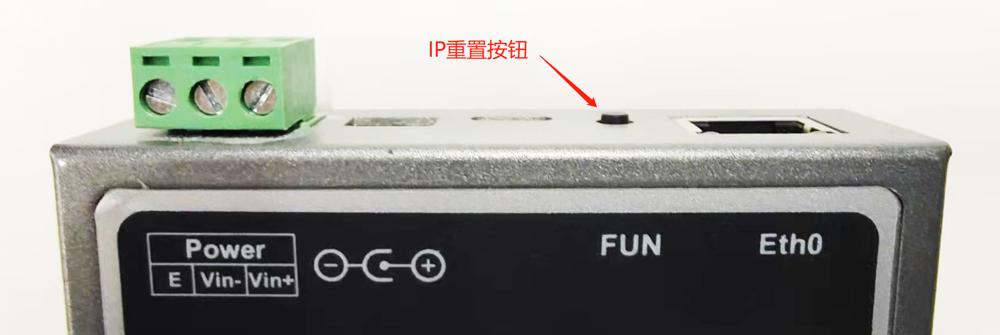

# 2.4 IP设置与重置

## 2.4.1 IP设置

GC可以将当前网关的配置文件上传到本地。 

用户可以通过GC修改在线LMGateway网口的网络参数。 

点击“网络设置”按钮，出现三个选项卡：IP设置、网关管理平台、防火墙，选中IP设置选项卡。

可以切换联网方式：有线、WIFI、4G，选择有线或WIFI时可以配置相关的网络参数。

图2-8 设置IP

点击“保存”按钮会更新配置。（网口支持DHCP）

WIFI配置：将SSID、密码、IP信息正确填写完成后，点击“保存”，将 usb 无线网卡插入到网关的 usb 端口，重新启动网关即可使用 usb 无线网卡。

**IP设置需要注意：**如果默认网关要和IP不在同网段，需要自行编辑子网掩码。

   **414和403网关IP设置需要注意：**

1. 网关的eth0为WAN口（跨网段通讯或连接Internet时使用），eth1为Lan口(同网段局域网通讯时使用)。

## 2.4.2 IP重置（不会改变原有工程）

网关通电响三声后启动正常的状态下，长按电源旁边的黑色小按钮3秒直到响三声，IP会临时重置成出厂IP（ 如果没有修改网关IP的情况下，重启网关之后IP会恢复成之前设置过的IP）

​	**单网口的网关**   

​	Eth0 默认IP：192.168.1.233

​	**双网口的网关**

​	Eth0 默认IP：192.168.1.230

​	Eth1 默认IP：192.168.0.230