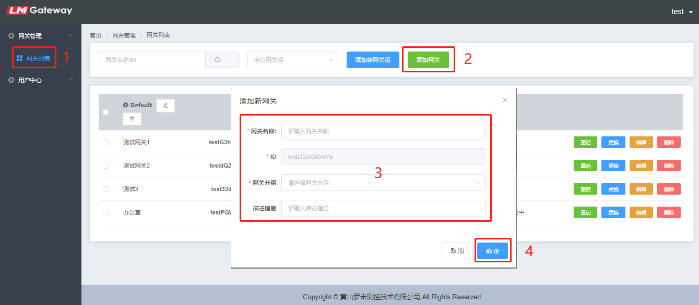
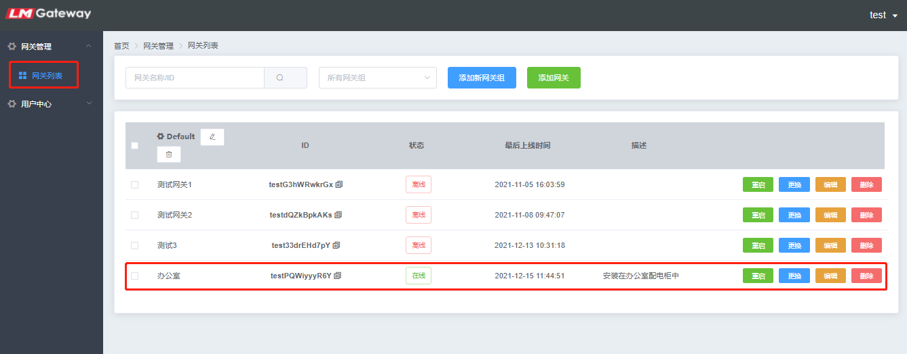
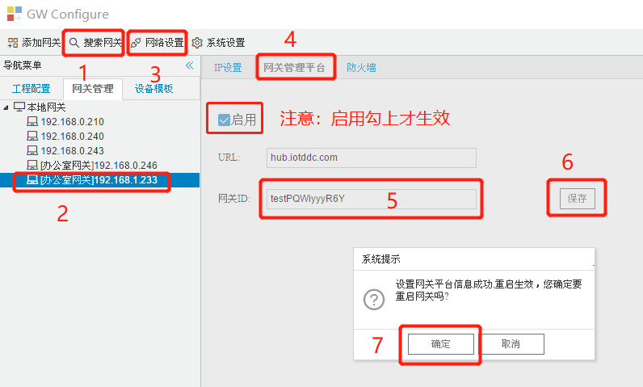
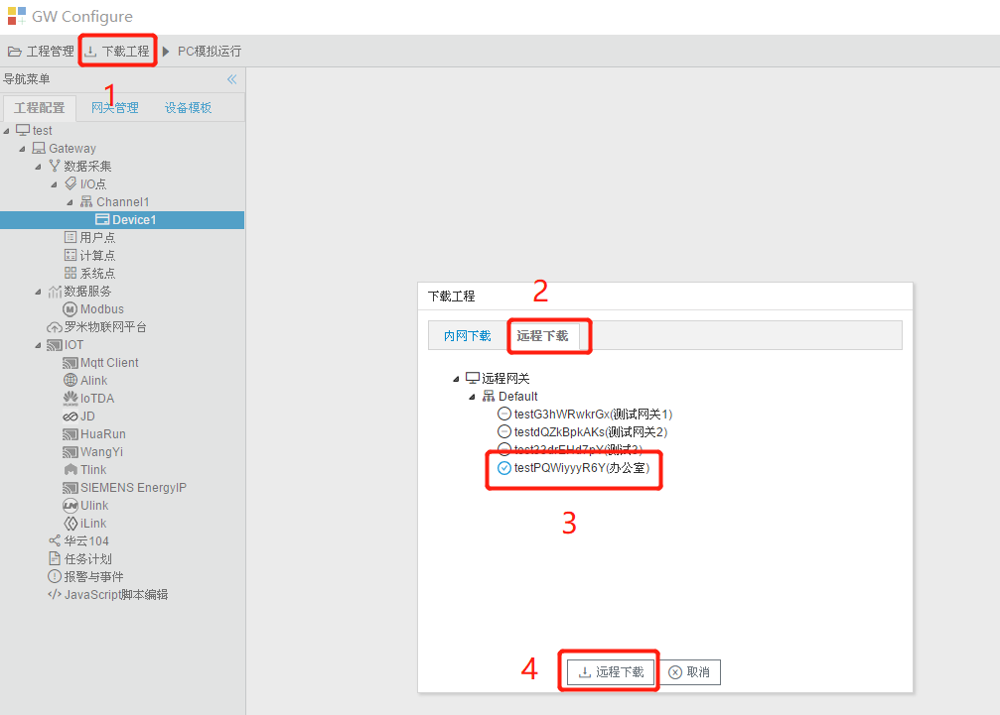

# 2.5 远程管理网关

## 2.3.1 网关管理平台

网关管理平台可以让GC实现远程管理网关，平台网址为：http://hub.iotddc.com。

首先需要在网关管理平台添加一个网关，添加完成后会获得一个网关的ID，操作步骤如下：

1.在网关管理平台注册一个帐号，然后登录平台。

2.在”网关管理“菜单中选择”添加网关“，在”基本信息“选项中输入一个合适的网关名称。

3.在“网关属性”中点击“添加网关”按钮。

4.在“网关管理”菜单点“网关列表”，可以对已添加的网关进行重启（给网关下发重启指令）、更换（切换网关的分组）、编辑（修改网关的名称）、删除（删除网关，删除后网关ID会失效）等操作，还可以管理网关分组、根据网关的名称、ID、分组进行查询。

5.我们回到GC配置工具中，在“网络设置”中选择”网关管理平台“选项卡，复制“网关管理平台”中的”网关ID“粘贴上，点”保存“按钮，在弹出的提示框中点”确定“按钮”。

网关管理平台操作视频：http://www.iotddc.com/download/filemanage/admin/2.3config.mp4

## 2.3.2 开始管理远程网关

重新启动GC，在登录窗口中输入“网关管理平台”的用户名和密码（也可以此点“注册”按钮，操作步骤和之前描述一样），点击“登陆”按钮。

远程下载工程：打开工程配置项目后，点“下载工程”，在弹出框中点击“远程下载”选项卡，会列出已在“网关管理平台”添加过的网关，根据网关名称找到对应的网关下载工程即可。

查看远程网关：

## 2.3.3 远程上传工程

GC可以远程将网关的配置文件上传到本地。 

在“网关管理”中选中一个远程的网关，点击"系统设置"，在弹出的对话框中点“登录”，然后点“上传工程”按钮，弹出“备份网关工程”对话框，输入工程名称，点击“确定”按钮，工程文件会上传至GC安装目录的Project文件夹下。上传工程成功后GC会自动打开上传的工程。

远程上传工程

## 2.3.4 远程网关校时

点击"系统设置"框中“网关校时”按钮，弹出"网关校时"窗口。

用户可将LMGateway与时间源同步时间，也可以将LMGateway作为一个NTP服务器，同步给其他设备。

- 网关根据同步周期与NTP服务器同步时间 。
- 如果只需要将网关时间与电脑时间同步，只需要点击“与电脑时间同步”按钮。

远程网关校时

## 2.3.5 远程重启网关

点击"系统设置"框中“重启网关”按钮，在弹出的系统提示框中点”确定“按钮。

远程重启网关

## 2.3.6 远程网关透传

远程网关透传，主要用于PLC透传，即使用PLC编程软件进行程序的在线监控、上传和下载等。

