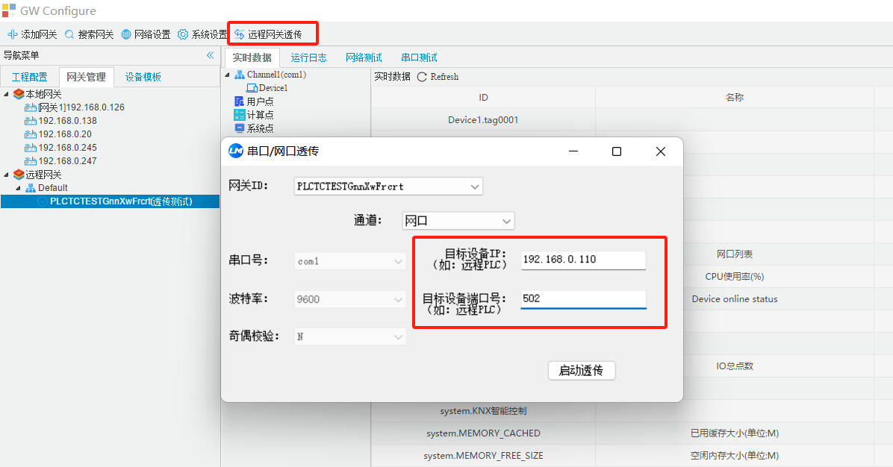
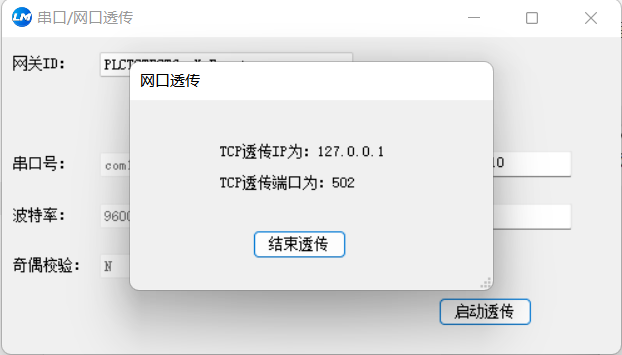
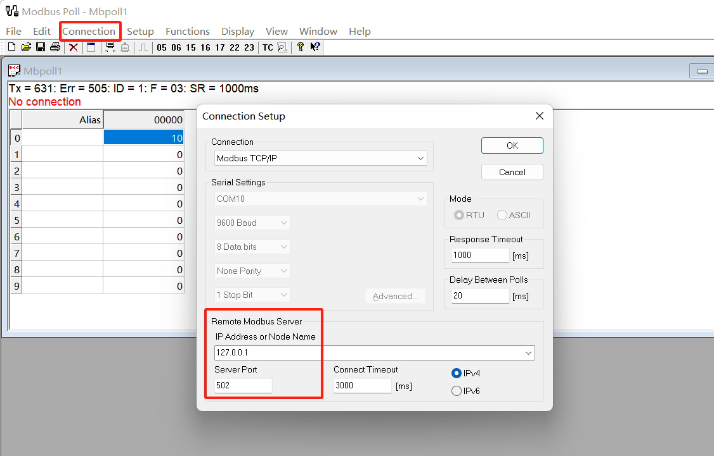
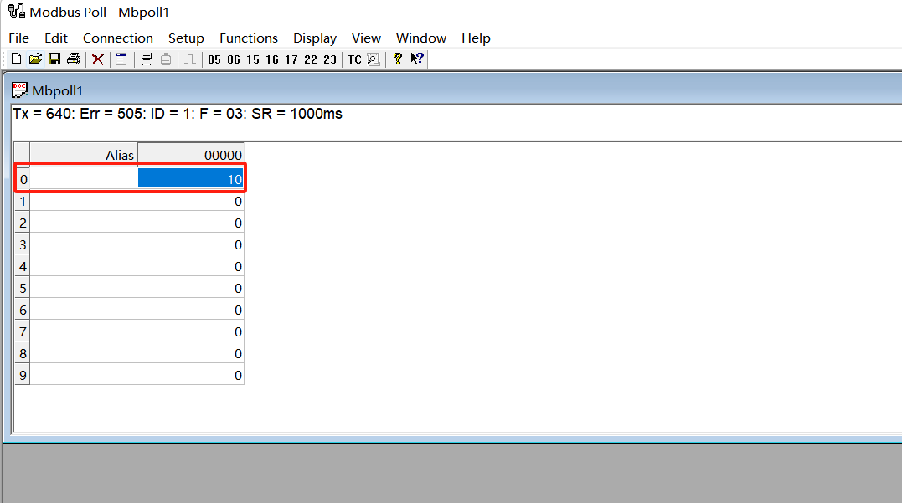
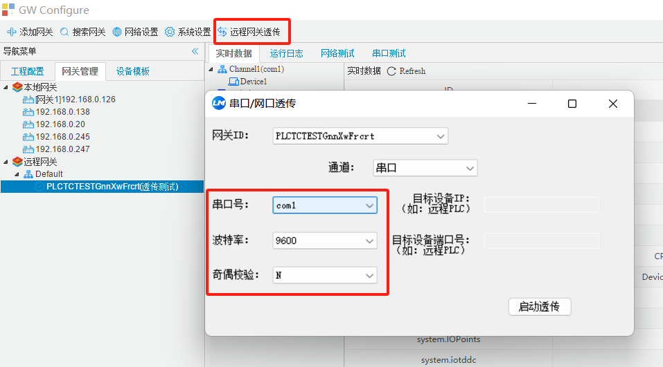
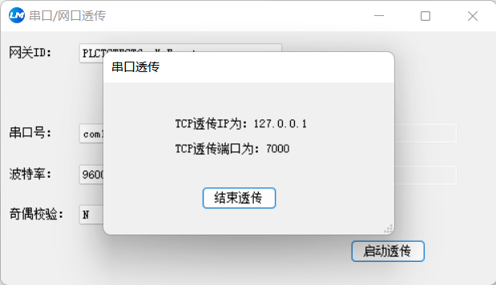
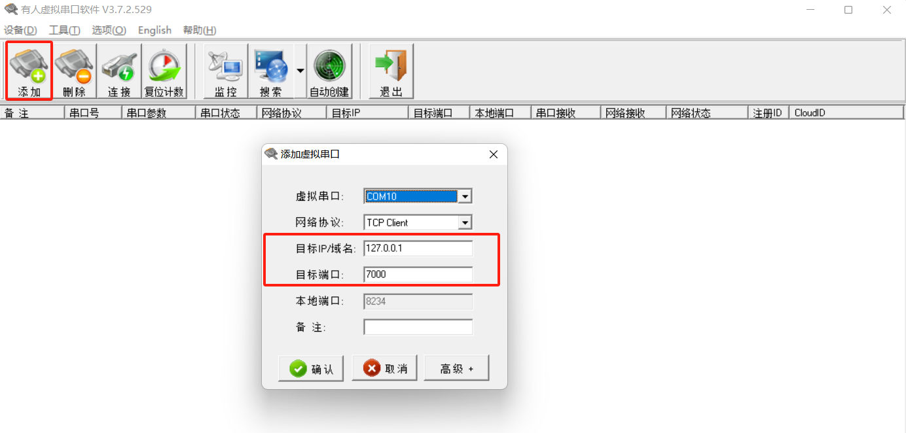
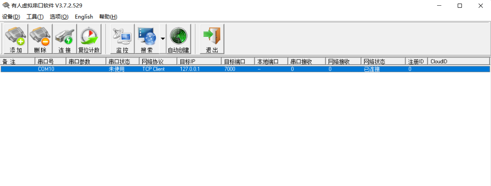
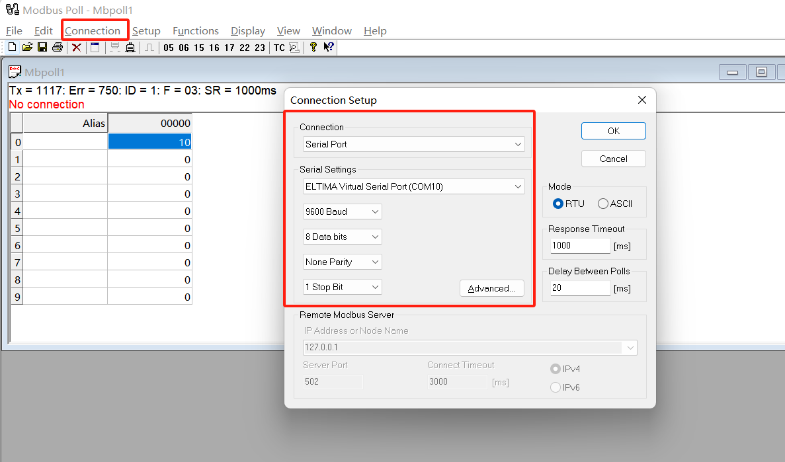
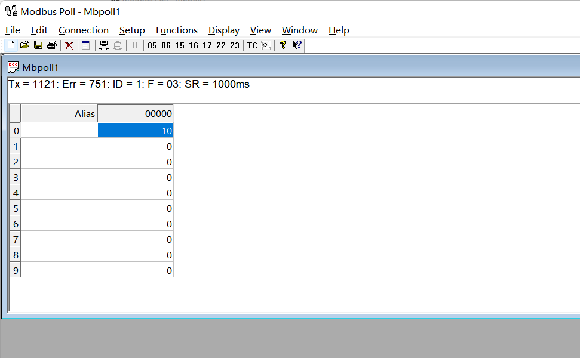

# 2.6 远程网关透传（PLC透传）

　　远程网关透传，主要用于PLC透传，使用PLC编程软件，通过网关建立无线链路，对PLC程序进行在线监控、上传和下载等。

​		只有2.3版本的网关和GC支持远程网关透传功能。

　　在网关管理页面，选中需要建立透传的网关，点“远程网关透传”，在弹出的页面中设置好PLC设备的IP和端口等参数后点击“启动透传”按钮，启动正常后会弹出提示框显示出透传的IP和端口，将IP和端口设置进PLC编程软件里就可以远程操作PLC设备。

**1.网口透传**

使用网关透传时，常用网口方式进行连接。IP和端口都是需要连接的目标PLC设备IP和端口。

点击启动透传后，会转到下图页面。表示已经开始启用透传功能。

本示例中，使用Modbus TCP协议来模拟PLC环境的连接链路，主要目的是测试网关透传功能。可以使用Modbus scan等工具来测试连接，本示例中使用Modbus Poll工具进行测试。下图中的IP和端口为网关透传的IP和端口。点击ok进行连接。

**注：**实际PLC环境下，应该在PLC编程软件中写入网关透传的IP和端口。正常连接后就可以远程操作PLC设备。

如下图所示，说明网关通过网口实现了透传功能。

**2.串口透传**

使用串口方式实现网关透传功能。

串口设置是网关采集PLC设备的接入串口对应设置。本实例中使用com1采集。

同样使用Mobuds RTU来模拟PLC环境，测试网关透传功能。配置完参数启动透传。

然后使用虚拟串口测试透传功能。本示例中使用USR-VCOM生成虚拟串口进行测试。

目标IP/域名**为上图中TCP透传IP；**目标端口**为上图中TCP透传端口。点击确认添加虚拟串口。

使用Modbus Poll连接测试。串口选择之前生成出来的虚拟串口COM10。

如下图所示，说明网关通过串口实现了透传功能。

