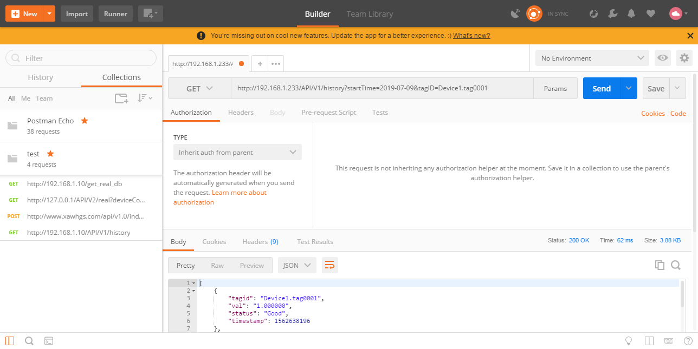

# 2.8 HTTP接口

网关开放以下HTTP接口，并且给出范例，具体范例在GC安装目录的Web Demo文件夹中。


## 2.8.1 实时数据

### 获取所有点的实时数据

##### 接口功能：

> 获取此时网关中所有数据点的实时数据

##### URL（获取实时数据地址）：

> http://192.168.1.233/API/V2/real  (192.168.1.233为需要查询的网关的ip地址)

##### HTTP请求方式：

> HTTP get

##### 请求参数:

> 无参数

##### 返回结果格式:

> JSON

##### 返回结果字段:

| 返回字段   | 字段类型  | 字段返回值 |           说明            |
| ---------- | :-------: | :--------: | :-----------------------: |
| deviceCode |  string   |    ALL     | 指明是所有tag点的实时数据 |
| val        |  string   |            |    所有tag点的实时数据    |
| id         |  string   |            |      tag点的唯一标识      |
| status     |  string   | Good/Error |      tag点的数据质量      |
| timestamp  | timestamp | 1537007573 |     tag点采集的时间戳     |
| val        |  string   |            |       tag点的实时值       |

##### 返回结果示例:

```json
{
    "deviceCode":"ALL",
    "val":[
        {
            "id":"system.mqtt",
            "status":"Good",
            "timestamp":1558312746,
            "val":"1"
        },
        {
            "id":"system.TIME_MINUTE",
            "status":"Good",
            "timestamp":1558312800,
            "val":"40"
        },
        {
            "id":"system.TIME_WDAY",
            "status":"Good",
            "timestamp":1558312748,
            "val":"1"
        },
        {
            "id":"Device1.tag0001",
            "status":"Error",
            "timestamp":1558312858,
            "val":"0"
        }
    ]
}
```


##### Postman截图：


### 获取单个设备的实时数据

##### 接口功能：

> 获取此时网关中单个设备的实时数据

##### URL（获取实时数据地址）：

> http://192.168.1.233/API/V2/real?deviceCode=Device1  (192.168.1.233为需要查询的网关的ip地址，Device1为需要获取数据的设备名称)

##### HTTP请求方式：

> HTTP get

##### 请求参数:

> deviceCode

##### 返回结果格式:

> JSON

##### 返回结果字段:

| 返回字段   | 字段类型  | 字段返回值 |           说明            |
| ---------- | :-------: | :--------: | :-----------------------: |
| deviceCode |  string   |            |  指明是此设备的所有数据   |
| val        |  string   |            | 设备中所有tag点的实时数据 |
| id         |  string   |            |      tag点的唯一标识      |
| status     |  string   | Good/Error |      tag点的数据质量      |
| timestamp  | timestamp | 1537007573 |     tag点采集的时间戳     |
| val        |  string   |            |       tag点的实时值       |

##### 返回结果示例：

```json
{
    "deviceCode":"Device1",
    "val":[
        {
            "id":"Device1.tag0001",
            "status":"Error",
            "timestamp":1558312858,
            "val":"0"
        },
        {
            "id":"Device1.tag0002",
            "status":"Error",
            "timestamp":1558312858,
            "val":"0"
        },
        {
            "id":"Device1.tag0003",
            "status":"Error",
            "timestamp":1558312858,
            "val":"0"
        }
    ]
}
```


##### Postman截图：


## 2.8.2 数据设定

##### 接口功能：

> 进行单个采集点的写操作

##### URL（进行写操作地址）：

> http://192.168.1.233/ctrlRequest  (192.168.1.233为需要进行写操作的网关的ip地址)

##### HTTP请求方式：

> HTTP post，form-data

##### 请求参数:

| 字段名称 | 字段类型 |      必填       |          说明          |
| -------- | :------: | :-------------: | :--------------------: |
| id       |  string  | Device1.tag0001 | 指明进行写操作的采集点 |
| val      |  string  |       10        |      需要写入的值      |

##### 返回结果格式:

> json

##### 返回结果:

```json
{
    "result":true
}
```

HTTP通讯成功返回结果都为true，指明网关接收到发送的写操作的数据。


##### Postman截图：


## 2.8.3 历史数据

##### 接口功能：

> 获取指定日期、指定Tag点的历史数据

##### URL（获取历史数据地址）：

> http://192.168.1.233/API/V1/history?startTime=2019-07-09&tagID=Device1.tag0001  (192.168.1.233为需要获取历史数据的网关的ip地址，startTime为需要获取历史数据的指定日期，tagID为需要获取历史数据的指定Tag点)

##### HTTP请求方式：

> HTTP get

##### 请求参数:

> startTime
>
> tagID

##### 返回结果格式:

> json

##### 返回结果:

```json
[
    {
        "tagid": "Device1.tag0001",
        "val": "1.000000",
        "status": "Good",
        "timestamp": 1562638196
    },
    {
        "tagid": "Device1.tag0001",
        "val": "1.000000",
        "status": "Good",
        "timestamp": 1562638224
    },
    {
        "tagid": "Device1.tag0001",
        "val": "1.000000",
        "status": "Good",
        "timestamp": 1562638253
    }
]
```


##### Postman截图：



