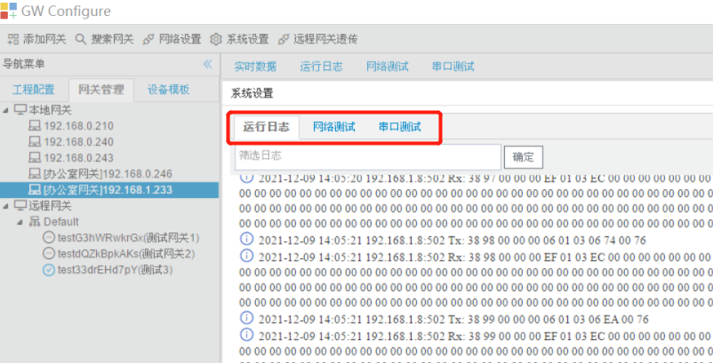

# 2.9 网关日志查询及测试

用户通过点击工具栏中的“调试模式”按钮进入网关调试。 

GC的调试模式分为三部分：网关数据采集日志和报文输出、网络测试、网关串口测试。 

## 2.9.1 网关数据采集日志和报文输出

用户可以查看网关运行日志及网关与设备交互的报文。

图2-14 网关数据采集日志和报文输出

## 2.9.2 网络测试

用户输入目标IP，点击“确定”按钮，网关对目标IP执行ping操作。(默认进行5次ping操作)。

点击“实时数据”选项卡、“运行日志”选项卡或者重启网关恢复正常采集、服务。

图2-15 网络测试

## 2.9.3 串口测试

用户可以通过串口测试，设置网关串口，发送下方文本框中编辑的16进制报文，验证串口参数设置，查看报文收发。

点击“实时数据”选项卡、“运行日志”选项卡或者重启网关恢复正常采集、服务。

图2-16 串口测试

