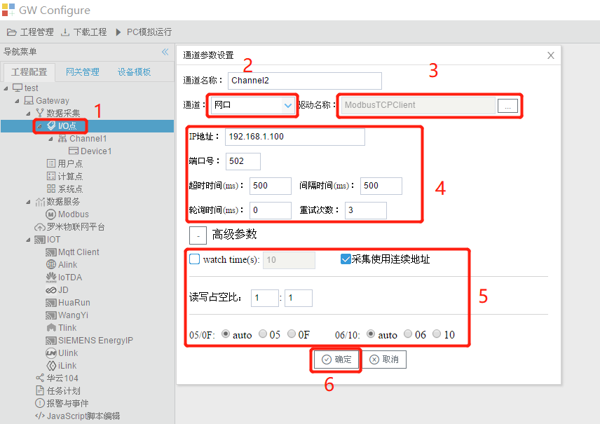
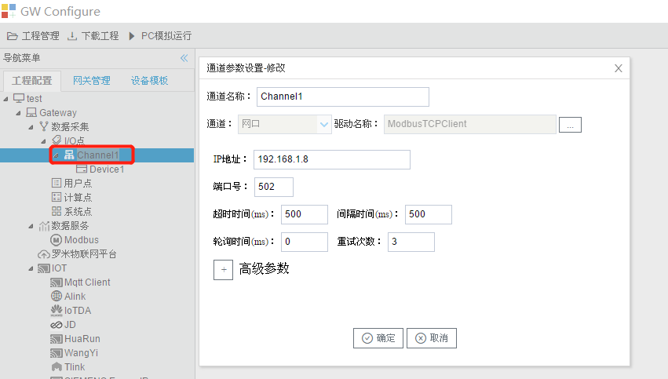

# 3.2 通道配置及协议选择

LMGateway网关支持串口、网口采集，可新增或修改通道参数。

## 3.2.1 新建通道

单击选中“I/O点”节点，右键单击选择“新建通道”，编辑通道参数，在此我们选择“ModbusTCPClient”协议作为范例进行演示，如图2-1所示。 

图3-1 新建通道

在通道参数设备的弹出框中，进行从上往下的顺序配置，根据上图的步骤进行配置： 

1. 编辑通道名称；
2. 选择驱动通道是串口、网口； 
3. 选择驱动名称； 
4. 配置驱动的基本参数； 
5. 配置驱动的高级参数； 
6. 点击“确定”完成配置。

在每个协议的基本参数中都会包含超时时间、间隔时间、轮询时间和重试次数四项，含义如下： 

- 超时时间：定义每一串报文发送后，等待被采集设备返回的时间。当通信正常的情况下，设置长一点不影响通信速度；假如设备响应速度比较慢，为了避免通信失败，建议设置长一点。 
- 间隔时间：可自定义，网关接收到被采集设备返回的报文后等待间隔时间之后再发送下一组报文。 
- 轮询时间：当前通道中完成所有采集任务后，等待轮询时间，再进入下一次采集周期。 
- 重试次数：通讯失败后重新发送当前报文的次数。

通道配置界面根据协议的不同会判断是否显示高级参数的按键。每种协议的高级参数也有所不同。

## 3.2.2 修改通道

双击需要修改的通道，进入编辑窗口，如图2-2所示。

图3-2 修改通道

