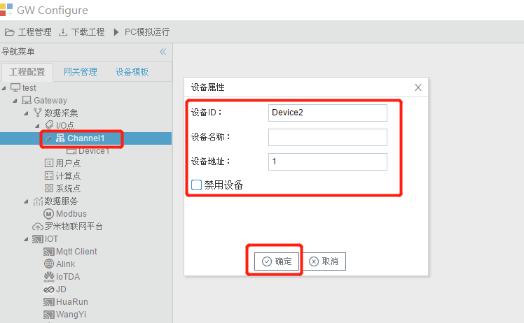
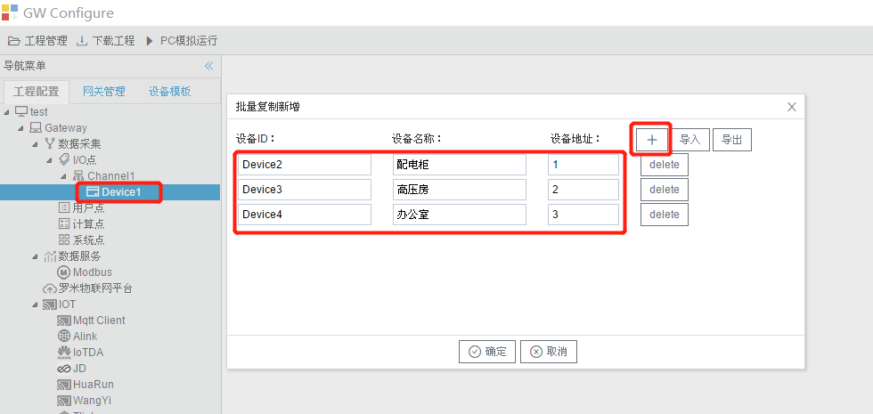
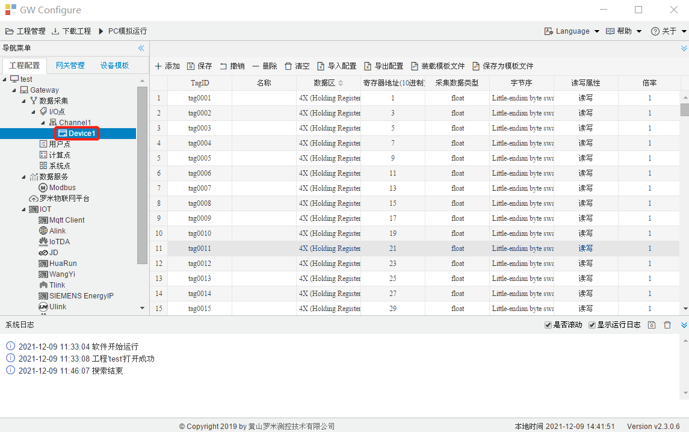

# 3.3 设备及点表编辑

## 3.3.1 新建设备

单击选中需要添加设备的通道，右键选择“新建设备”，如图2-3所示。

图3-3 新建设备

编辑设备属性，点击确定生效。 

- 设备名称：自定义，设备在该通道下的唯一标记，不可重复； 
- 设备地址：设备的通讯地址，如Modbus RTU从站设备的站号（slave ID）, 645电能表的表号，BACnet的设备ID等； 

## 3.3.2 批量复制新增

同一个通道下的设备具有相同的协议属性，可以选中已编辑好的设备，右键“批量复制新增”，在弹出框中点击“+”按钮，编辑新设备的设备名称，设备地址。这个操作可以快速编辑完成一个通道下的若干设备。如图3-4所示。

当设备特别多时，批量增加也比较费力，这时可以使用”导出“按钮，获得一个EXCEL文件，在EXCEL内进行批量操作后，再用”导入“按钮把内容导入进来即可。

图3-4 批量复制新增

## 3.3.3 编辑点表

单击左侧工程树中的设备，进入设备采集点表编辑页面。如下图所示。

modbusTag点示例

