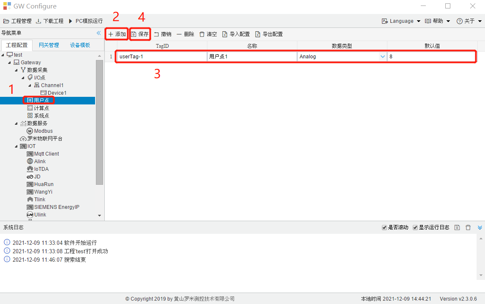

# 3.4 用户点

用户点属于可读可写的内部点。

可用于JavaScript编程、作为一个控制信号等。 

1. 单击工程树上的“用户点”节点。 
2. 点击“添加”按钮新增一个用户点。 
3. 输入配置页面中唯一的名称，选择点类型（模拟量和离散量），添加该点的默认值。 
4. 点击“保存”完成添加点。 

具体步骤如图3-5所示。

图3-5 添加用户点

表格中各字段说明如下：

- 名称：必填项，可修改。在此页面中不能重复，为该点的唯一标识，如上图中名称为tag0001，在工程中该点的标识为user.tag0001
- 描述：选填项，该点的描述信息
- 数据类型：分为Analog(模拟量)，Discrete(离散量)和String(字符串)
- 默认值：工程运行时该点的默认值，当数据类型为Analog时可填任意数，当数据类型为Discrete时只能填0或1