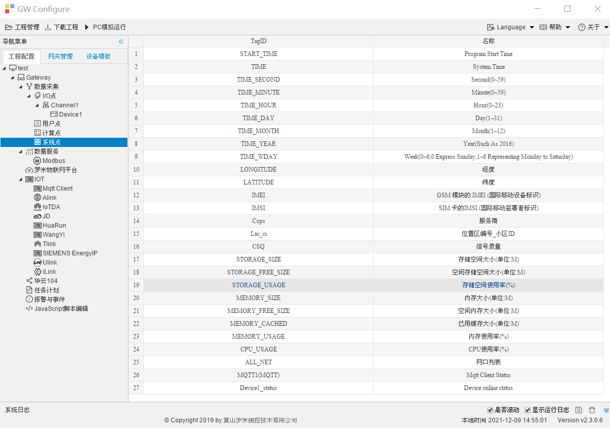

# 3.4 系统点

系统点是只读的内部点，提供了网关的时间信息、网关与设备的通讯状态。

在I/O点中新建设备后，系统点页面会自动添加该设备的状态点，如图3-8所示。 

图3-8 系统点

**默认拥有的系统点：**

TIME_SECOND：系统时间中的秒值，在工程中该点的标识为system.TIME_SECOND

TIME_MINUTE：系统时间中的分值，在工程中该点的标识为system.TIME_MINUTE

TIME_HOUR：系统时间中的小时值，在工程中该点的标识为system.TIME_HOUR

TIME_DAY：系统时间中几号，在工程中该点的标识为system.TIME_DAY

TIME_MONTH：系统时间中几月，在工程中该点的标识为system.TIME_MONTH

TIME_YEAR：系统时间中的年，在工程中该点的标识为system.TIME_YEAR

TIME_WDAY：系统时间中星期几，在工程中该点的标识为system.TIME_WDAY

**设备状态点**：

Device1_status：在I/O点中新建设备后，系统点页面会自动添加该设备的状态点。其中“Device1”为设备名称，该设备下的所有数据点中有任意一个采集成功，则该设备的状态点值为1 ；该设备下的所有数据点均采集失败，则该设备的状态点值为0。