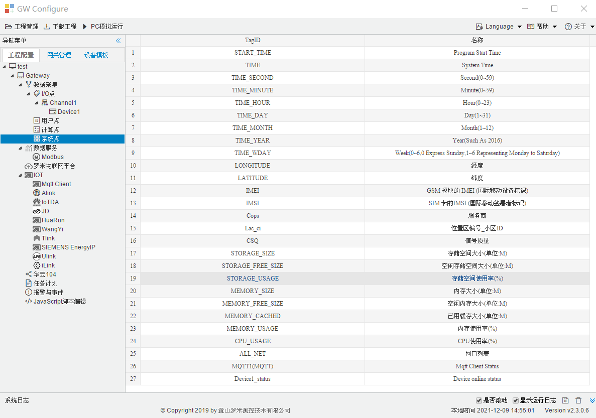

# 3.6 系统点

系统点是只读的内部点，提供了网关的时间信息、网关与设备的通讯状态。 

图3-8 系统点

**默认拥有的系统点：**

START_TIME：程序启动的时间

TIME：网关系统时间

TIME_SECOND：系统时间中的秒值，在工程中该点的标识为system.TIME_SECOND

TIME_MINUTE：系统时间中的分值，在工程中该点的标识为system.TIME_MINUTE

TIME_HOUR：系统时间中的小时值，在工程中该点的标识为system.TIME_HOUR

TIME_DAY：系统时间中几号，在工程中该点的标识为system.TIME_DAY

TIME_MONTH：系统时间中几月，在工程中该点的标识为system.TIME_MONTH

TIME_YEAR：系统时间中的年，在工程中该点的标识为system.TIME_YEAR

TIME_WDAY：系统时间中星期几，在工程中该点的标识为system.TIME_WDAY

LONGITUDE：4G网络获取到的经度

LATITUDE：4G网络获取到的纬度

IMEI：4G网络GSM 模块的 IMEI (国际移动设备标识)

IMSI：4G网络SIM 卡的IMSI (国际移动签署者标识)

Cops：4G网络服务商

Lac_ci：4G网络位置区编号_小区ID

CSQ：4G网络信号质量

STORAGE_SIZE：存储空间大小(单位:M)

STORAGE_FREE_SIZE：空闲存储空间大小(单位:M)

STORAGE_USAGE：存储空间使用率(%)

MEMORY_SIZE：内存大小(单位:M)

MEMORY_FREE_SIZE：空闲内存大小(单位:M)

MEMORY_CACHED：已用缓存大小(单位:M)

MEMORY_USAGE：内存使用率(%)

CPU_USAGE：CPU使用率(%)

ALL_NET：网口列表

MQTT1(MQTT)：Mqtt 客户端状态，值为1表示连接成功，值为0表示连接失败

**设备状态点**：

Device1_status：在I/O点中新建设备后，系统点页面会自动添加该设备的状态点。其中“Device1”为设备名称，该设备下的所有数据点中有任意一个采集成功，则该设备的状态点值为1 ；该设备下的所有数据点均采集失败，则该设备的状态点值为0。