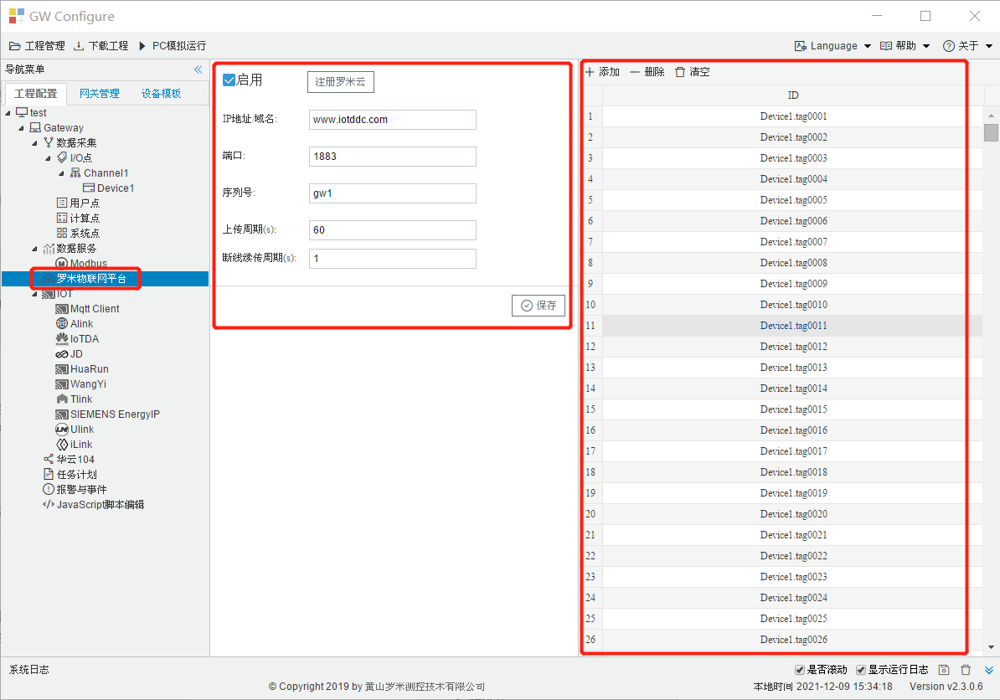
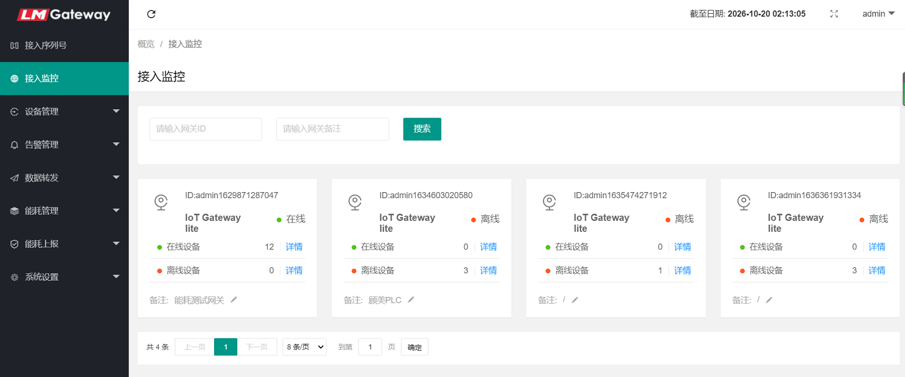
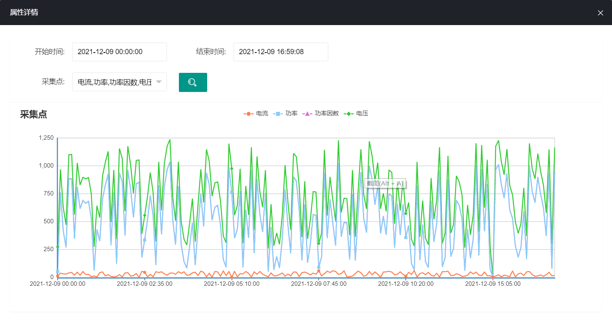
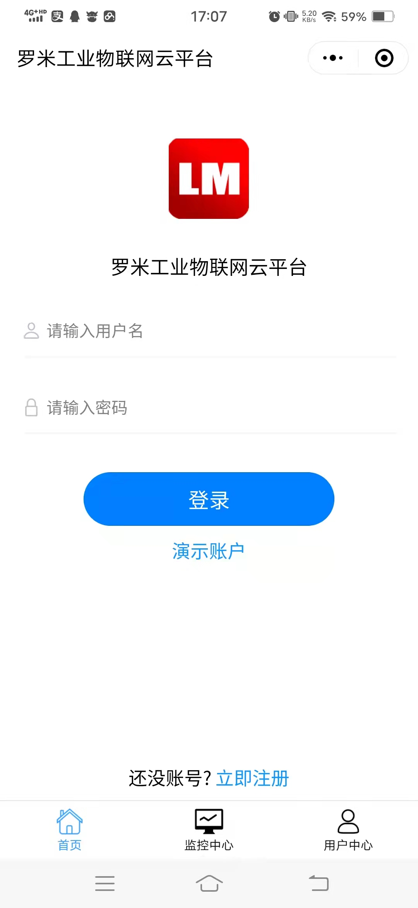
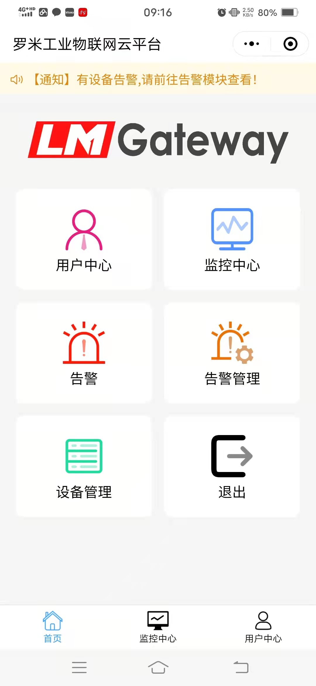
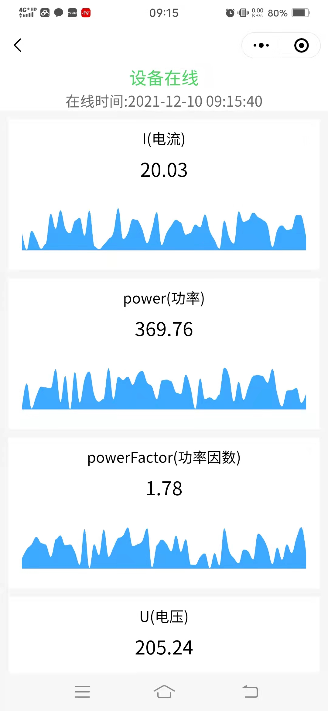
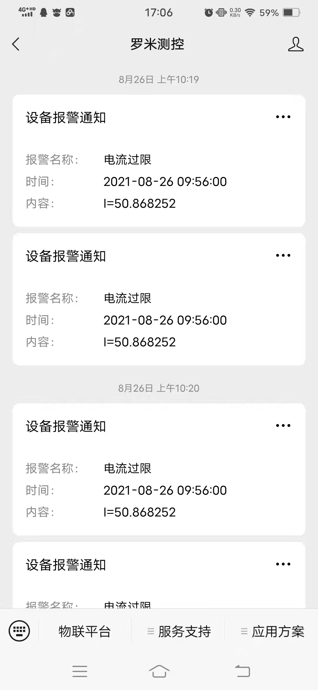

# 4.1 罗米物联网平台配置

单击”罗米物联网平台 “，填写相关参数，在右边的列中点”添加”，选择需要上传到平台的采集点。

如图4-1所示。

图4-1 罗米物联平台参数配置

**罗米物联网平台功能简介：**

　　**数据与监控：**同时支持PC端（网址：http://cloud.iotddc.com）和手机端（公众号：罗米测控）操作，可实时监控网关、设备、采集点的状态，查看实时和历史数据及生成图表。

　　**告警及通知：**可设置告警条件，生成**告警通知**并推送到**微信**或**邮箱**，及时掌握设备状运行状态。

　　**数据转发：**支持数据库转发、 webService转发、TCP转发等。

　　**高级功能：**能耗管理模块，功能有报表、图表、位置分组、倍率、公式计算、自定义报表等。

　　**详情请进：**http://cloud.iotddc.com

网关监控

实时数据

图表

　

     
     　　　
       

手机端登录和首页

     
    　　　
            

手机端实时数据和告警通知

