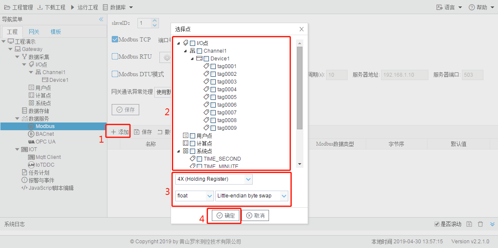

# 4.1 Modbus

Modbus服务器实现了Tag点到Modbus地址的映射，允许上位机Modbus Client通过Modbus TCP或者Modbus 

RTU的协议读写Tag点。 

Modbus TCP和Modbus RTU通用参数如下： 

- slaveID：网关Modbus服务的设备ID； 
- 网关通讯异常处理：在映射的Tag点出错时，相应的Modbus地址的点值会发生相应的改变，目前“网关通讯 异常处理”下拉框中有“使用默认值”（相应的Modbus地址的点值设置成表格中“默认值”列的值）、“使用最 后正常值”（相应的Modbus地址的点值不发生改变）

**Modbus TCP配置** 

通过使能Modbus TCP服务，即可允许上位机通过ModbusTCP协议经由网口连接来访问设备。 

端口号：设置Modbus TCP侦听端口号，默认值是502。 

**Modbus RTU配置** 

通过使能Modbus RTU服务，在点击“配置”按钮弹出的对话框中指定Modbus RTU服务的串口和相应的串口配 置，即可允许上位机通过Modbus RTU协议经由串口连接（RS-232/485)或者虚拟串口连接来访问设备。 

**Modbus DTU配置** 

通过使能Modbus DTU服务，即可允许网关先通过填写的服务器地址和端口连接服务器，然后向服务器提供 modbus服务功能，服务器能读写网关内的Tag点。 

**Modbus地址映射** 

为了Modbus客户端可以访问到设备上的Tag点，需要将Tag点映射到对应的Modbus地址上，配置步骤如下： 

1. 单击“添加”按钮； 
2. 在弹出的选择点窗口中勾选需要映射的点； 
3. 选择窗口中所有的点映射的数据区、数据类型和字节序； 
4. 点击”确定“按钮完成映射点的添加。 

重复上述操作可添加更多的点到地址列表。 

图4-1 Modbus地址映射

双击Tag点可修改Tag点映射到Modbus地址的详细设定，可配置项有： 

- 数据区：有0X (Coil Status),1X (Input Status),3X (Input Registers),4X (Holding Register)四种类型，分别 对应Modbus的0,1,3,4四个区； 
- Modbus寄存器地址：指定该Tag点在Modbus地址空间的起始地址，最小的地址为1。Modbus寄存器地址 和数据区配合使用，如数据区选择4X (Holding Register)，Modbus寄存器地址填写1，这该点的Modbus 地址为400001。
- Modbus数据类型：有bool、bit、uint16、int16、uint32、int32、flfloat、double、uint64、int64共10 种。 
- 字节序：有Null、Big-endian、Little-endian、Big-endian byte swap、Little-endian byte swap共5种， 其中Null用于比特数为16及16以下的数据类型当中； 
- 默认值：默认设为9999，可修改，在“网关通讯异常处理”中选择了“使用默认值”时起作用：在映射的Tag点 出错时，相应的Modbus地址的点值设置成该默认值。 