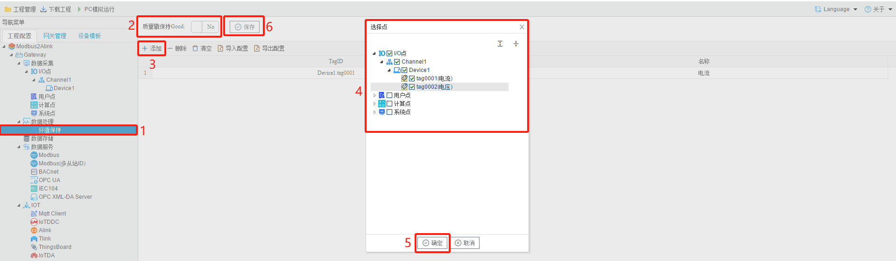

# 4.1 坏值保持

坏值保持是数据处理的一种。如果数据采集失败则保持最后一次采集到的数据值。

1.保持数据值，"质量戳保持Good"选择"No"。配置如下图所示。

通过Modbus Slave工具模拟modbusTCP数据采集，将采集点添加到坏值保持中，不选中"质量戳保持GOOD"查看MQTT订阅数据的值和状态。

 正常采集时，MQTT订阅到的数据值和状态值如下图

断开后，MQTT数据值和状态值如下图，数据值依旧保持最后一次采集到的数据。状态值显示**Error**。

2.保持数据值，"质量戳保持Good"选择"Yes"。配置如下图所示。

正常采集MQTT数据值和状态值如下图

断开后，MQTT数据值和状态值如下图，数据值依旧保持最后一次采集到的数据。状态值显示**Good**。

