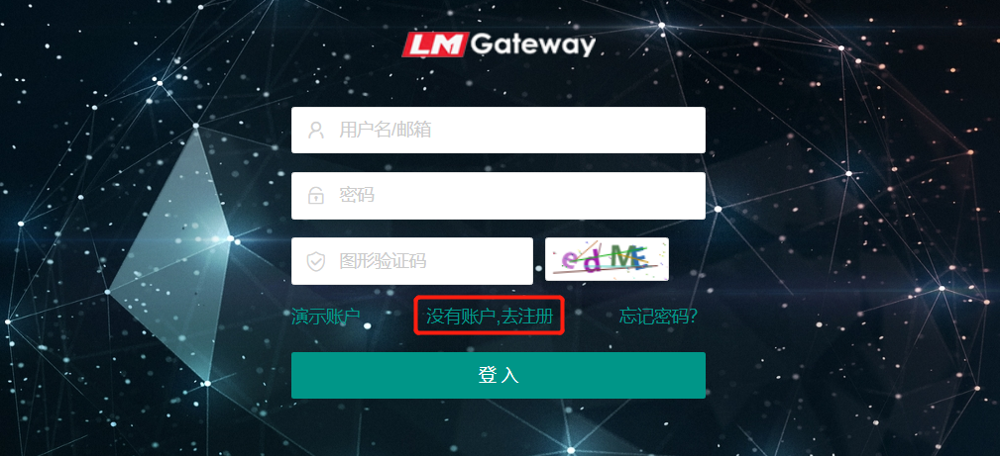
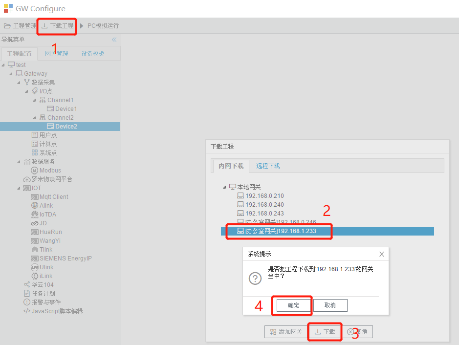
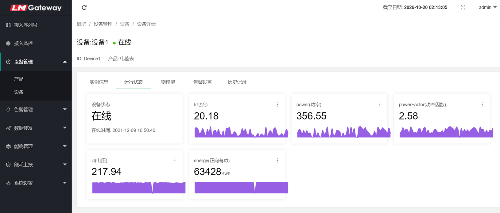

# 4.1 罗米物联网平台

网关连接“罗米物联网平台”，需要先在平台上注册一个帐号。

1.打开 http://cloud.iotddc.com 页面，在登录界面上点击“去注册",注册好后登陆平台。

2.给需要接入”平台“的每个网关创建一个”接入序列号“（注意：这个序列号会配置进GC网关工程中，不要将一个序列号给多个网关使用，否则数据会出现问题）。

在”接入序列号“页面中点”新增“按钮，会自动新生成一个序列号，点击列序号后的”修改“按钮，可以给序列号设置名称。

3.回到GC网关工程中，单击”罗米物联网平台 “，填写相关参数（此处序列号填写我们在平台上创建的接入序列号），在右边的列中点”添加”，选择需要上传到平台的采集点。如图4-1所示。

图4-1 罗米物联平台参数配置

4.将工程下载到网关中运行。

5.完成上述操作后，可以在“平台”的”接入监控”页面中查看网关的状态，在“设备监控”中查看设备的状态、实时数据、历史数据和图表。

#### **罗米物联网平台功能简介：**

　　**数据与监控：**同时支持PC端（网址：http://cloud.iotddc.com）和手机端（公众号：罗米测控）操作，可实时监控网关、设备、采集点的状态，查看实时和历史数据及生成图表。

　　**告警及通知：**可设置告警条件，生成**告警通知**并推送到**微信**或**邮箱**，及时掌握设备状运行状态。

　　**数据转发：**支持数据库转发、 webService转发、TCP转发等。

　　**高级功能：**能耗管理模块，功能有报表、图表、位置分组、倍率、公式计算、自定义报表等。

　　**详情请进：**http://cloud.iotddc.com

网关监控

实时数据

图表

　

     
     　　　
       

手机端登录和首页

     
    　　　
            

手机端实时数据和告警通知

