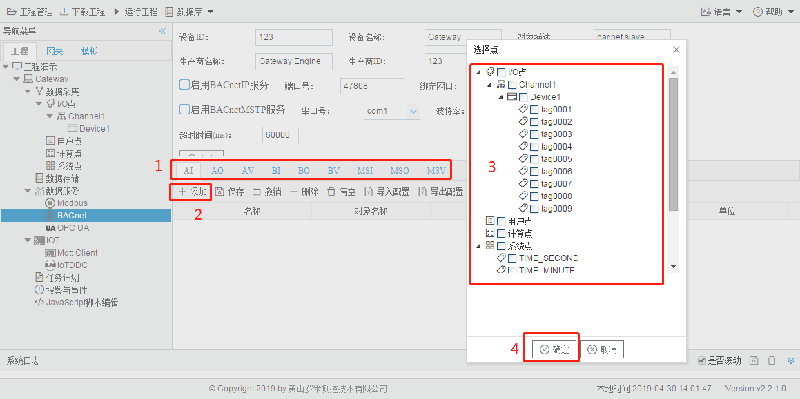

# 4.2 BACnet

用户通过勾选"启用BACnetIP服务"和"启用BACnetMSTP服务"选择需要启用的BACnet Service服务。 

BACnetIP服务默认端口为47808，通过绑定的网口进行数据交互。 

BACnetMSTP服务通过绑定的串口进行数据的交互。 

**BACnet地址映射** 

为了BACnet客户端可以访问到设备上的Tag点，需要将Tag点映射到对应的BACnet地址上，配置步骤如下： 

1. 选择需要映射的BaCnet上传表中的数据类型，目前的数据类型有AI,AO,AV,BI,BO,BV,MSI,MSO,MSV； 
2. 单击“添加”按钮； 
3. 在弹出的选择点窗口中勾选需要映射的点； 
4. 点击”确定“按钮完成映射点的添加。 

重复上述操作可添加更多的点到地址列表。 

图4-2 BACnet地址映射

双击Tag点可修改Tag点映射到BACnet地址的详细设定，可配置项有： 

- 对象名称：可编辑，BACnet数据点的对象名称。 
- 对象描述：可编辑，BACnet数据点的对象描述。 
- 对象索引号：必填项，与AI,AO,AV,BI,BO,BV组合为AI0，AI1，AI2等。 
- 单位：可编辑，通过下拉框选择。

MSI、MSO、MSV为多态，如果需要映射到BACnet的多态上，MSI、MSO、MSV的页面中“多态”列必须要有最少一个状态。 

