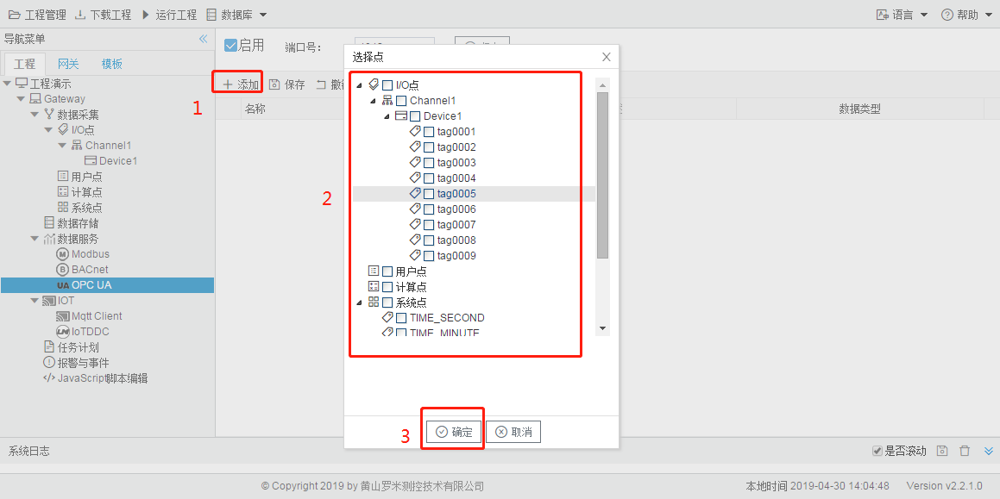

# 4.3 OPC UA

用户通过勾选"启用"和修改端口号来启动OPC UA服务。 

**OPC UA地址映射** 

为了OPC UA客户端可以访问到设备上的Tag点，需要将Tag点映射到对应的OPC UA地址上，配置步骤如下： 

1. 单击“添加”按钮； 
2. 在弹出的选择点窗口中勾选需要映射的点； 
3. 点击”确定“按钮完成映射点的添加。 

重复上述操作可添加更多的点到地址列表。 

图4-3 OPC UA地址映射

