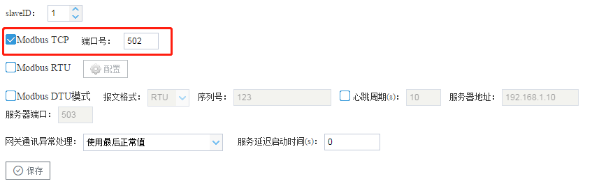
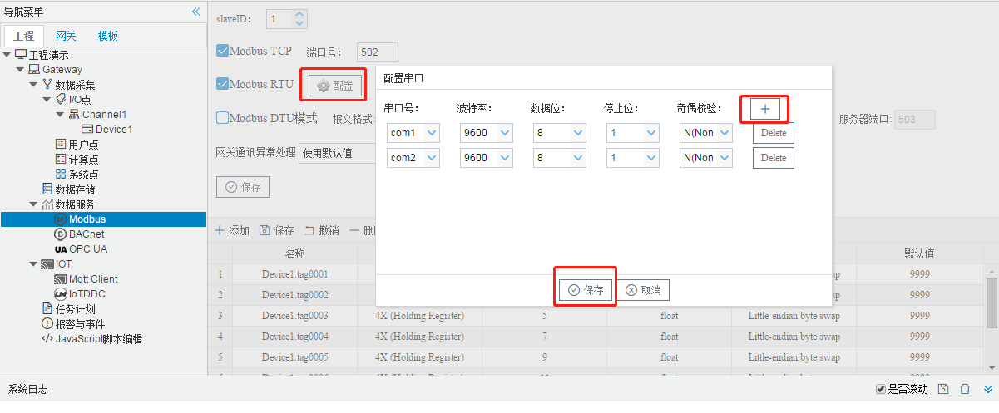
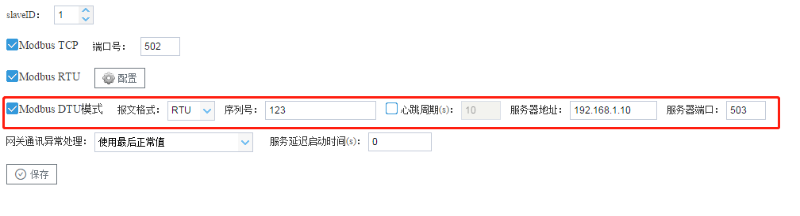
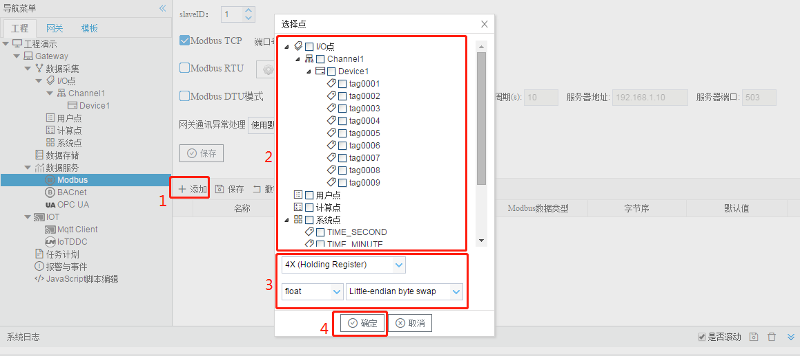
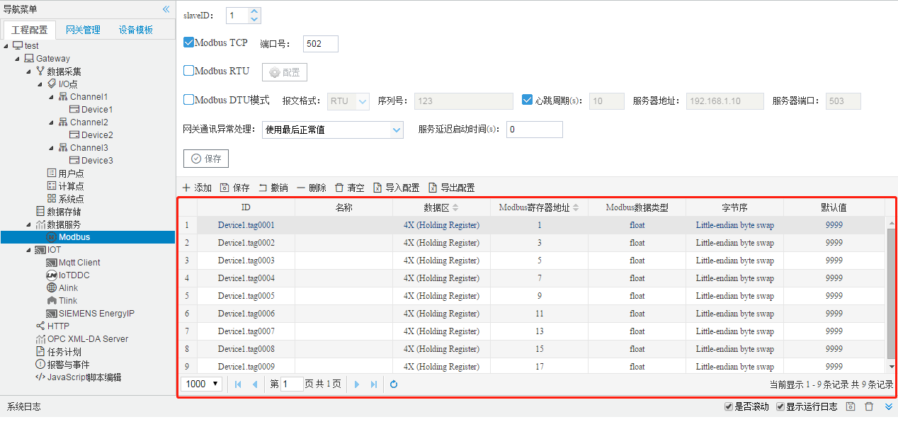
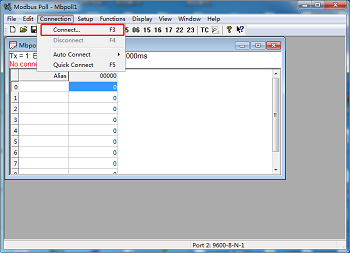
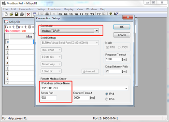
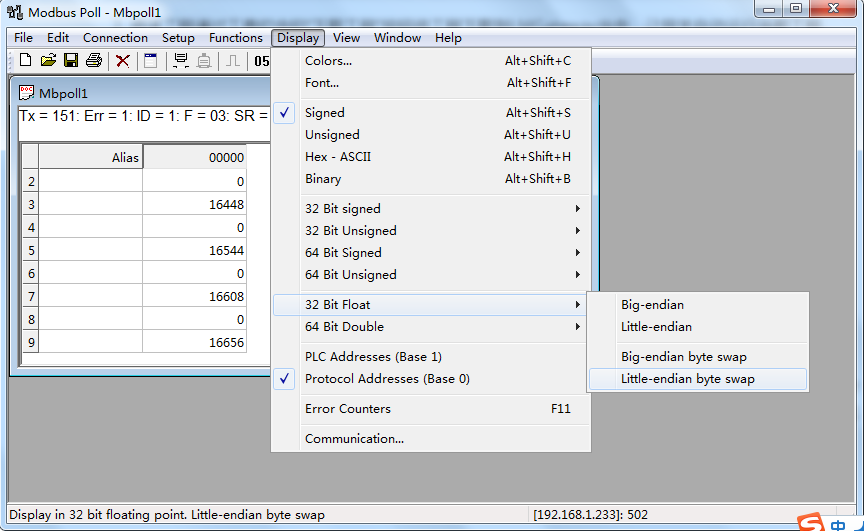

# 5.1 Modbus

Modbus服务器实现了Tag点到Modbus寄存器的映射，允许支持Modbus Client的上位机通过Modbus TCP或者Modbus RTU的协议读写Tag点。 

Modbus TCP和Modbus RTU通用参数如下： 

- slaveID：网关Modbus服务的从站ID； 

- 网关通讯异常处理：Tag点出错时，映射的Modbus寄存器点值会发生相应的改变。

  “网关通讯异常处理”下拉框中有：

  ​	使用默认值：相应的Modbus地址的点值置成表格中“默认值”列的值

  ​	使用最后正常值：相应的Modbus地址的点值最后一次采集正常的值
  
- 服务延迟启动时间：Modbus服务延时多少秒启动。

**Modbus TCP配置** 

使能Modbus TCP服务，允许上位机通过ModbusTCP协议经由网口连接访问网关。 

端口号：设置Modbus TCP侦听端口号，默认值是502。 

**Modbus RTU配置** 

使能Modbus RTU服务，点击“配置”按钮，在弹出对话框中添加指定串口，提供Modbus RTU服务。允许上位机通过Modbus RTU协议经由串口连接（RS-232/485)来访问网关。  

**Modbus DTU模式配置** 

使能Modbus DTU模式，网关上电时，通过填写的服务器地址和端口连接服务器，服务器通过心跳包辨识网关，获取网关公网IP。服务器在该TCP链路上通过modbus TCP或modbus RTU格式报文读写网关Tag点。 

报文格式：指定以modbus TCP或modbus RTU格式的报文进行交互。

心跳包格式：序列号文本框中填写的文本。

心跳周期：勾选则网关周期上传心跳包，不勾选则网关仅在上电时发送一次心跳包。

**Modbus地址映射** 

将Tag点映射到Modbus寄存器上，配置步骤如下： 

1. 单击“添加”按钮； 
2. 在弹出窗口中勾选需要映射的点； 
3. 选择modbus数据区、数据类型和字节序； 
4. 点击”确定“按钮完成映射点的添加。 

重复上述操作可添加更多的点到地址列表。 

图5-1 Modbus地址映射

Modbus服务点表

双击Tag点可修改映射到Modbus寄存器的详细设定，可配置项有： 

- 数据区：有0X (Coil Status),1X (Input Status),3X (Input Registers),4X (Holding Register)四个数据区。

- Modbus寄存器地址：指定该Tag点在Modbus地址空间的起始地址，最小的地址为1。Modbus寄存器地址和数据区配合使用，如数据区选择4X (Holding Register)，Modbus寄存器地址填写1，这该点的Modbus 地址为400001。

- Modbus数据类型：有bool、bit、uint16、int16、uint32、int32、float、double、uint64、int64共10 种。 

- 字节序：有Null、Big-endian、Little-endian、Big-endian byte swap、Little-endian byte swap共5种。 

  - Null：用于bool、bit、uint16、int16四种数据类型，表示无字节序； 
- Big-Endian：大端模式，是指数据的低位（就是权值较小的后面那几位）保存在内存的高地址中，而数据的高位，保存在内存的低地址中，这样的存储模式有点儿类似于把数据当作字符串顺序处理：地址由小向大增加，而数据从高位往低位放； 有些软件中描述成 4 3 2 1
  - Little-Endian：小端模式，是指数据的低位保存在内存的低地址中，而数据的高位保存在内存的高地址中，这种存储模式将地址的高低和数据位权有效地结合起来，高地址部分权值高，低地址部分权值低，和我们的逻辑方法一致。有些软件中描述成 1 2 3 4
  - Big-Endian byte swap：大端反转，有些软件中描述成 2 1 4 3
  - Little-Endian byte swap：小端反转，有些软件中描述成 3 4 1 2

- 默认值：默认设为9999，可修改，在“网关通讯异常处理”中选择了“使用默认值”，Tag点出错时，相应的Modbus寄存器的点值置成该默认值。 

**示例**

用Modbus poll软件读取ModbusTCP服务示例，步骤如下：

1. 使能Modbus TCP服务，地址映射如下：

2. 将该工程通过工具栏中的“下载工程”按钮下载到LMGateway当中。

3. 打开Modbus Poll软件，点击上方工具栏中“Connection”下的“Connect...”，在弹出框中选择“Modbus TCP/IP”,输入LMGateway的IP地址和端口号，点击“OK”完成连接配置。

   

4. 根据GC中Modbus服务页面的映射地址、数据类型和字节序修改Modbus Poll软件工具栏中“Display”，查看寄存器数据。

   

如果此时页面上显示“No connection”，说明没有连接上LMGateway的ModbusTCP服务，请检查通讯配置。