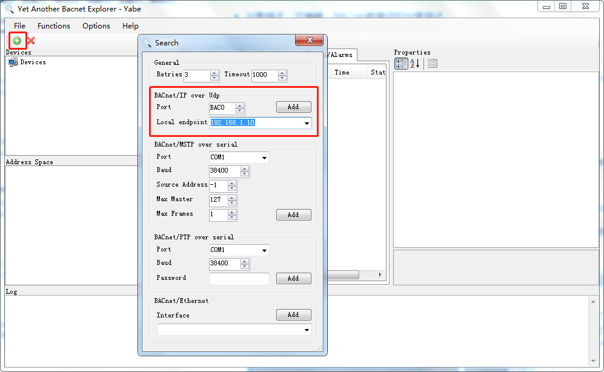

# 5.2 BACnet

BACnet服务器实现了Tag点到BACnet对象的映射，允许支持BACnet的上位机通过BACnet IP或者BACnet MSTP协议读写Tag点。 

上图为BACnet服务的设备属性，包含设备ID、设备名称、设备描述、生产商名称、生产商ID、位置和BACnet字符编码。

转成 BACnet 协议时，注意 BACnet 字符编码选择，默认为 UTF-8，若上位机需要中文显示，（例如江森 Metasys 系统）需要勾选为 Unicode。 

UTF-8：Insight、Delta 、etc. 

Unicode：Metasys、Niagara 、etc. 

**BACnet IP配置** 

使能BACnet IP服务，允许上位机通过BACnet IP协议经由网口连接访问设备。 

端口号：设置BACnet IP侦听端口号，默认值是47808。 

绑定端口：指定BACnet IP服务绑定的网卡（PC运行需设置成网卡对应的IP，下载工程时需设置成网关上实际使用的网口eth0或eth1）。

BBMD： 勾选BBMD，设置为 BACnet 跨网段时使用，注册为外部设备，在“配置”对话框中填写注册为外部设备的上位机的 IP 地址。在对应的上位机处需要设置对应 BBMD 设备的 IP 地址为当前网关的 IP 地址。

**BACnet MSTP配置** 

使能BACnet MSTP服务，允许上位机通过BACnet MSTP协议经由串口连接访问设备。 

MAC地址：BACnet MSTP服务的MAC地址。

超时时间：APDU的超时时间。

 

**BACnet地址映射** 

将Tag点映射到BACnet的九种对象当中，配置步骤如下： 

1. 选择需要映射的BaCnet上传表中的对象类型，支持的对象类型有AI,AO,AV,BI,BO,BV,MSI,MSO,MSV； 
2. 单击“添加”按钮； 
3. 在弹出的选择点窗口中勾选需要映射的点； 
4. 点击”确定“按钮完成映射点的添加。 

重复上述操作可添加更多的点到地址列表。 

图5-2 BACnet对象类型与点的映射

图5-2 BACnet服务点表

双击Tag点可修改Tag点映射到BACnet地址的详细设定，可配置项有： 

- 对象名称：可编辑，BACnet数据点的对象名称。 
- 对象描述：可编辑，BACnet数据点的对象描述。 
- 对象索引号：必填项，与AI,AO,AV,BI,BO,BV,MSI,MSO,MSV组合为AI0，AI1，AI2等。 
- 单位：可编辑，通过下拉框选择。

MSI、MSO、MSV为多态，如果需要映射到BACnet的多态上，MSI、MSO、MSV的页面中“多态”列必须要有最少一个状态。 

**BACnet字符编码** 

- MBCS：Insight、Delta 、etc.
- UCS-2：EBI、etc
- UTF-8：Metasys、Niagara 、WEBControl、etc.

注意：BACnet 字符编码选择，默认为UTF-8，若上位机需要中文显示（例如 EBI系统：需要勾选为UCS-2）。

**用工具软件测试网关的BACnet服务**

用Yabe软件读取BACnetIP服务示例，步骤如下：

下载地址：http://www.lmgateway.com/Yabe.zip

1. 使能BACnet IP服务，具体映射如下：

2. 将该工程通过工具栏中的“下载工程”按钮下载到LMGateway当中。

3. 打开Yabe软件，点击上方工具栏的绿色“+”号按钮，在弹出框中上图中的端口号(BAC0为上图中47808的16进制)、选择PC的IP地址，点击“Add”完成软件连接配置。

   

4. 在Udp:47808节点下有GC中BACnet页面设备ID的设备，说明已经连接上LMGateway的BACnet IP服务，单击此设备节点，就会在左侧中部显示搜索到的所有此设备映射出的BACnet设备和对象。

   

5. 点击每一个对象，就会显示该对象的所有属性。

   