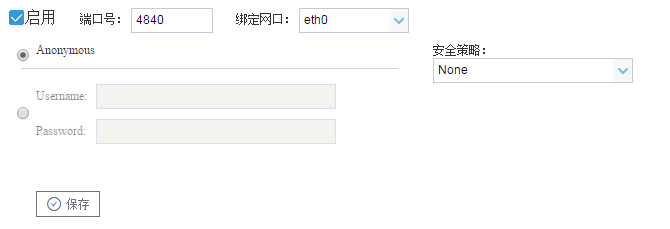
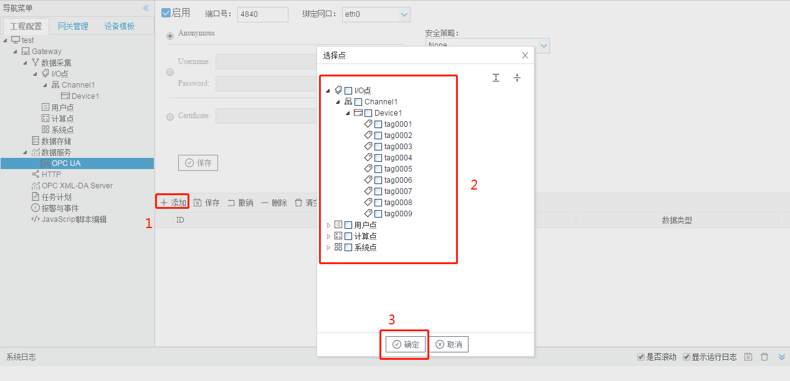

# 5.3 OPC UA

OPC UA服务器实现了Tag点到对象属性的映射，允许上位机通过 OPC UA协议读写Tag点。 

端口号：设置OPC UA侦听端口号，默认值是4840。 

Anonymous：选中之后，启用匿名的方式连接 OPCUAServer。 

Username、Password：选中之后，在“Username”填入 用户名，“Password”填入密码。启用户名密码的 

方式连接 OPCUAServer。 

Certificate：选中之后，点击“Load”，导入证书的路径。启用交换证书的方式连接OPCUAServer。 

安全策略：None，Basic256，Basic128Rsa15，Basic256Sha256

1. 当 选中为 None时，，OPCClient 和OPCServer 之间的通信将不会有加密和签名；
2. 当 “安全策略”选中为 Basic256，Basic128Rsa15，Basic256Sha256中的任意一个时，OPCClient和OPCServer 之间的通信将会有签名或者签名和加密，提高客户端和服务器的通信安全。 

**OPC UA对象属性映射** 

将Tag点映射到OPC UA对象属性上，配置步骤如下： 

1. 单击“添加”按钮； 
2. 在弹出的选择点窗口中勾选需要映射的点； 
3. 点击”确定“按钮完成映射点的添加。 

重复上述操作可添加更多的点到地址列表。 

图5-3 OPC UA地址映射

将工程文件中的I/O、用户、计算、系统映射成为OPC UA中DeviceFolder文件夹下的对象，网关中的Tag点会映射成为对象中的属性。

描述：对象或属性的描述信息。

数据类型：支持Boolean,UInt16,Int16,UInt32,Int32,Float六种。

**用工具软件测试网关的OPCUA服务**

用UaExpert软件读取OPC UA服务示例，步骤如下：

1. 使能OPC UA服务，对象属性映射如下：

2. 将该工程通过工具栏中的“下载工程”按钮下载到LMGateway当中。

3. 打开UaExpert软件，点击上方工具栏中蓝色“+”号按钮，在标题为"Add Server"弹出框中双击“Double click to Add Server...”，输入LMGateway的IP地址和上图中的端口号，点击“OK”。

   

   双击上图添加的opc://192.168.1.233:4840节点下的子节点，在弹出框中点击"yes"。

   

   双击下图中的不加密的连接方式。

   

4. 此时在Servers下就会添加一个LM Gateway OPC UA节点，右键选择"Connect"。

   

5. 连接成功之后，会在左侧显示所有的映射点，单击每个点会在右侧显示该点的所有属性。

   