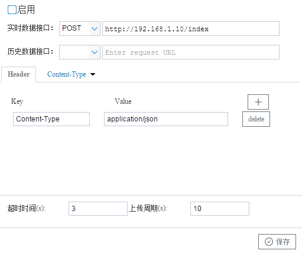
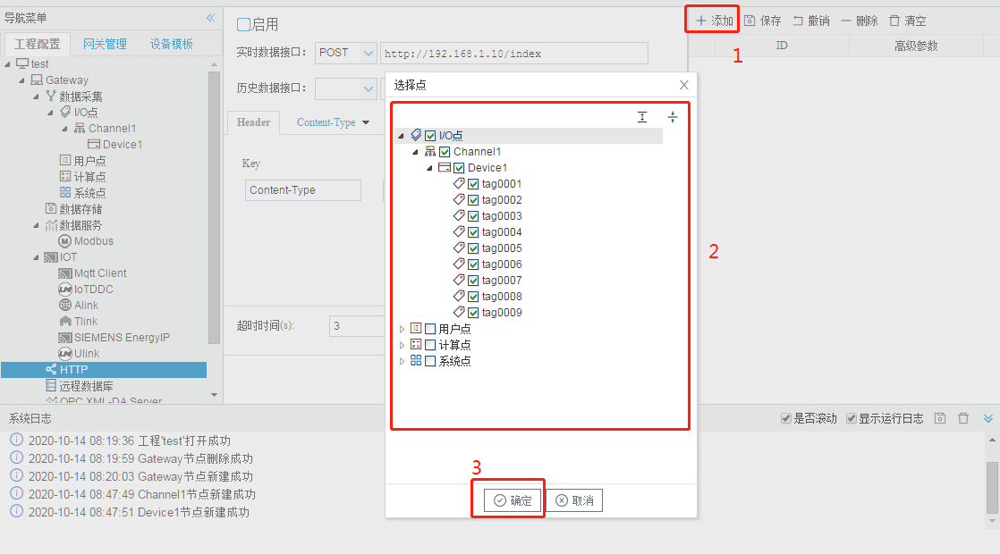
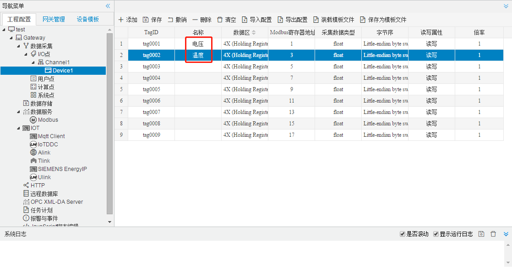

# 5.4 HTTP

网关作为HTTP客户端，将添加的需要数据的数据点，转换成相应的json格式的数据上传。

HTTP参数如下： 

- 实时数据推送方法：POST/GET；实时数据推送的URL；
- 历史数据推送方法：POST/GET；历史数据推送的URL；
- HTTP的消息头（Header）;
- 超时时间：定义每一条数据发送后，等待服务端响应的时间；
- 上传周期： 网关每隔周期时间进行数据上传（上传周期需要大于超时时间）。




**上传点添加** 

配置步骤如下： 

1. 单击“添加”按钮； 
2. 在弹出窗口中勾选需要上传的数据点； 
4. 点击”确定“按钮完成映射点的添加。 

重复上述操作可添加更多的点到上传列表。 




**高级参数** 

如果需要在mqtt上传的数据点添加额外的属性字段，可以添加“高级参数”（JSON对象格式）。

在Mqtt Client页面点击“添加”按钮，选择需要上传的Tag点，双击Tag点，在“高级参数”字段中添加所需要的json对象，如{"unit":"摄氏度"}。

该操作需要配合模板使用。


HTTP上传的json格式默认如下：

```json
{
    "温度":35.4,
    "电压":212,
    "time":1602637080
}
```

其中“温度”和“电压”分别为Device1.tag0001和Device1.tag0002的名称




如果客户需要修改上传的json格式，可以有如下方式：

1. 自行修改GC安装目录下mqtt/http/default.js，并下载到网关当中；

   1. 参照default.js：

      ```js
      (function() {
          var timestamp = Math.round(new Date().getTime() / 1000);
          result = { "time": timestamp };
          data.forEach(function(tag) {
              if (result[tagExt[tag.Id].description] != "") {
                  if (isNaN(tag["Val"]))
                      result[tagExt[tag.Id].description] = tag["Val"];
                  else {
                      if (tag["Status"] == "Good") {
                          result[tagExt[tag.Id].description] = parseFloat(tag["Val"])
                      }
                  }
              }
          });
          return JSON.stringify(result);
      })();
      ```

      其中  (function() {

      ​			......

      ​    })();

      为主体，js需要写在其中；

      data为经过过滤后的数据，格式为

      ```json
      [
          {
              "Id":"Device1.tag0001",
              "Status":"Good",
              "Timestamp":1574926563,
              "Val":"1.000000"
          },
          {
              "Id":"Device1.tag0002",
              "Status":"Good",
              "Timestamp":1574926563,
              "Val":"3.000000"
          }
      ]
      ```

       

      tagExt为tag点的额外属性，包括采集页面中的名称（description）、tag点所在的设备名称、读写类型、tagID，还可以包含“高级参数”中填写的数据（“高级参数”需要填写json格式的数据）

      ```json
      {
          "Device1.tag0001":{
              "description":"",
              "deviceCode":"Device1",
              "objectType":"AV",
              "tagCode":"tag0001"
          },
          "Device1.tag0002":{
              "description":"",
              "deviceCode":"Device1",
              "objectType":"AV",
              "tagCode":"tag0002"
          }
      }
      ```

      模板最后返回主题需要上传的字符串；

      

   2. 模板编写完成之后，需要将模板名称改为default.js；

   3. 可以先用配置工具“PC端运行工程”测试模板能否正确运行；

   4. 需要下载模板到网关：在“系统设置”中选择“开发者模式”，密码为“luomi”，选择“下载MQTT模板”，之后下载工程，网关就会根据新建的模板上传数据。

      

2. 联系我们并提供需要的json格式

