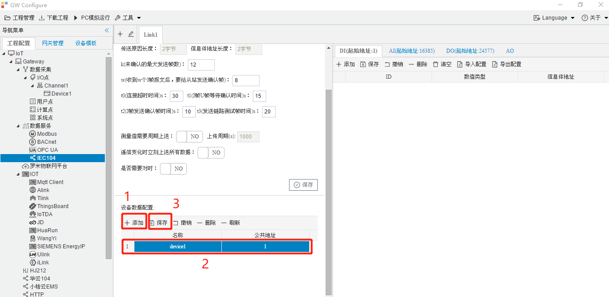
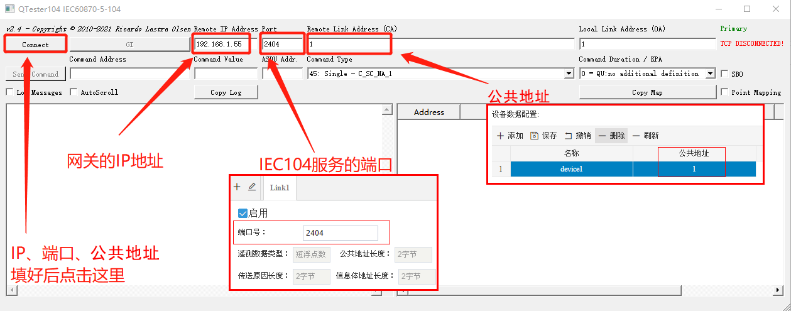

# 5.4 IEC104

IEC104服务器实现了Tag点到IEC104的映射，允许支持IEC104 Client通过IEC104协议读写Tag点。

端口号：IEC104服务的端口号，可以自定义，默认为2404。其他参数配置如下图所示，配置完成后点“保存”按钮。

 

添加设备数据配置，如下图所示：

添加数据点（DI：遥信， AI：遥测，DO：遥控，AO：遥调），如下图所示：

可以添加多个IEC104服务，如下图所示：

**用工具软件测试网关的IEC104服务**

用QTester104软件测试网关IEC104服务示例，步骤如下：

在QTester104软件里填上网关的IP地址、IEC104服务的端口号和设备的公共地址后，点击Connect按钮。

把Point Maping勾选上后，可以看到数据点，证明网关IEC104服务正常。

