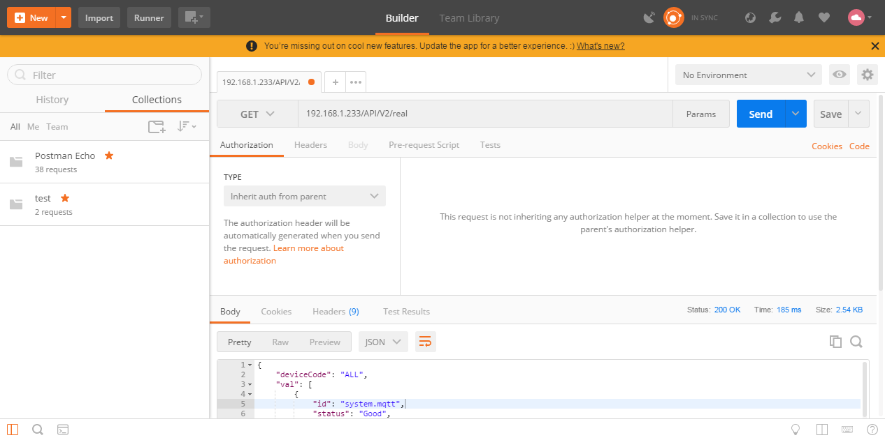

# 5.5 HTTP服务端和客户端


## 5.5.1 HTTP服务端开放接口

网关开放以下HTTP接口，并且给出范例，具体范例在GC安装目录的Web Demo文件夹中。

## 5.5.1.1 实时数据

### 获取所有点的实时数据

##### 接口功能：

> 获取此时网关中所有数据点的实时数据

##### URL（获取实时数据地址）：

> http://192.168.1.233/API/V2/real  (192.168.1.233为需要查询的网关的ip地址)

##### HTTP请求方式：

> HTTP get

##### 请求参数:

> 无参数

##### 返回结果格式:

> JSON

##### 返回结果字段:

| 返回字段   | 字段类型  | 字段返回值 |           说明            |
| ---------- | :-------: | :--------: | :-----------------------: |
| deviceCode |  string   |    ALL     | 指明是所有tag点的实时数据 |
| val        |  string   |            |    所有tag点的实时数据    |
| id         |  string   |            |      tag点的唯一标识      |
| status     |  string   | Good/Error |      tag点的数据质量      |
| timestamp  | timestamp | 1537007573 |     tag点采集的时间戳     |
| val        |  string   |            |       tag点的实时值       |

##### 返回结果示例:

```json
{
    "deviceCode":"ALL",
    "val":[
        {
            "id":"system.mqtt",
            "status":"Good",
            "timestamp":1558312746,
            "val":"1"
        },
        {
            "id":"system.TIME_MINUTE",
            "status":"Good",
            "timestamp":1558312800,
            "val":"40"
        },
        {
            "id":"system.TIME_WDAY",
            "status":"Good",
            "timestamp":1558312748,
            "val":"1"
        },
        {
            "id":"Device1.tag0001",
            "status":"Error",
            "timestamp":1558312858,
            "val":"0"
        }
    ]
}
```


##### Postman截图：




### 获取单个设备的实时数据

##### 接口功能：

> 获取此时网关中单个设备的实时数据

##### URL（获取实时数据地址）：

> http://192.168.1.233/API/V2/real?deviceCode=Device1  (192.168.1.233为需要查询的网关的ip地址，Device1为需要获取数据的设备名称)

##### HTTP请求方式：

> HTTP get

##### 请求参数:

> deviceCode

##### 返回结果格式:

> JSON

##### 返回结果字段:

| 返回字段   | 字段类型  | 字段返回值 |           说明            |
| ---------- | :-------: | :--------: | :-----------------------: |
| deviceCode |  string   |            |  指明是此设备的所有数据   |
| val        |  string   |            | 设备中所有tag点的实时数据 |
| id         |  string   |            |      tag点的唯一标识      |
| status     |  string   | Good/Error |      tag点的数据质量      |
| timestamp  | timestamp | 1537007573 |     tag点采集的时间戳     |
| val        |  string   |            |       tag点的实时值       |

##### 返回结果示例：

```json
{
    "deviceCode":"Device1",
    "val":[
        {
            "id":"Device1.tag0001",
            "status":"Error",
            "timestamp":1558312858,
            "val":"0"
        },
        {
            "id":"Device1.tag0002",
            "status":"Error",
            "timestamp":1558312858,
            "val":"0"
        },
        {
            "id":"Device1.tag0003",
            "status":"Error",
            "timestamp":1558312858,
            "val":"0"
        }
    ]
}
```


##### Postman截图：


## 5.5.1.2 历史数据

### 获取单个设备的历史数据

##### 接口功能：

> 获取单个设备的历史数据

##### URL（获取实时数据地址）：

> http://192.168.1.233:8070/queryDB  (192.168.1.233为需要查询的网关的ip地址)

##### HTTP请求方式：

> POST

##### 请求参数:

| 字段       | 字段类型 |      说明       |
| ---------- | :------: | :-------------: |
| deviceCode |  string  |     设备ID      |
| tagCode    |  string  |    采集点ID     |
| startTime  |  string  | tag点的唯一标识 |
| stopTime   |  string  |   tag点的名称   |

##### 返回结果格式:

> JSON

##### 返回结果字段:

| 返回字段    | 字段类型 |    字段返回值    |      说明       |
| ----------- | :------: | :--------------: | :-------------: |
| code        |   int    | 200成功，400失败 |     状态码      |
| device2tag  |   arry   |                  |    历史数据     |
| time        |  string  |                  | tag点的唯一标识 |
| description |  string  |                  |    采集点值     |

##### 返回结果示例:

```json
{
    "code":200,
    "data":[
        {
            "time":"2023-08-03 16:36:02",
            "val":"0.000000"
        },
        {
            "time":"2023-08-03 16:36:12",
            "val":"0.000000"
        }
    ]
}
```

##### Postman截图：


## 5.5.1.3 获取网关工程I/O点

### 获取网关工程所有I/O点

##### 接口功能：

> 获取此时网关工程中所有I/O点

##### URL（获取实时数据地址）：

> http://192.168.1.233/get_configV2  (192.168.1.233为需要查询的网关的ip地址)

##### HTTP请求方式：

> GET

##### 请求参数:

> 无参数

##### 返回结果格式:

> JSON

##### 返回结果字段:

| 返回字段    | 字段类型 | 字段返回值 |       说明       |
| ----------- | :------: | :--------: | :--------------: |
| io          |  string  |            | 工程树的IO点信息 |
| device2tag  |  string  |            | 工程中的设备和点 |
| ID          |  string  |            | tag点的唯一标识  |
| description |  string  |            |   tag点的名称    |

##### 返回结果示例:

```json
{
    "device2tag": {
        "Device2": [
            {
                "ID": "Device2.tag10",
                "description": null
            },
            {
                "ID": "Device2.tag11",
                "description": null
            },
            {
                "ID": "Device2.tag12",
                "description": null
            },
            {
                "ID": "Device2.tag16",
                "description": null
            },
            {
                "ID": "Device2.tag5",
                "description": null
            },
            {
                "ID": "Device2.tag9",
                "description": null
            }
        ],
        "system": [
            {
                "ID": "system.IOPoints",
                "description": "IO总点数"
            },
            {
                "ID": "system.LATITUDE",
                "description": "基站定位纬度"
            },
            {
                "ID": "system.LONGITUDE",
                "description": "基站定位经度"
            },
            {
                "ID": "system.Lac_ci",
                "description": "位置区编号_小区ID"
            },
            {
                "ID": "system.MEMORY_CACHED",
                "description": "已用缓存大小(单位:M)"
            },
            {
                "ID": "system.MEMORY_FREE_SIZE",
                "description": "空闲内存大小(单位:M)"
            },
            {
                "ID": "system.MEMORY_SIZE",
                "description": "内存大小(单位:M)"
            },
            {
                "ID": "system.MEMORY_USAGE",
                "description": "内存使用率(%)"
            },
            {
                "ID": "system.START_TIME",
                "description": "Program Start Time"
            },
            {
                "ID": "system.STORAGE_FREE_SIZE",
                "description": "空闲存储空间大小(单位:M)"
            },
            {
                "ID": "system.STORAGE_SIZE",
                "description": "存储空间大小(单位:M)"
            },
            {
                "ID": "system.STORAGE_USAGE",
                "description": "存储空间使用率(%)"
            },
            {
                "ID": "system.TIME",
                "description": "System Time"
            },
            {
                "ID": "system.TIME_DAY",
                "description": "Day(1~31)"
            },
            {
                "ID": "system.TIME_HOUR",
                "description": "Hour(0~23)"
            },
            {
                "ID": "system.TIME_MINUTE",
                "description": "Minute(0~59)"
            },
            {
                "ID": "system.TIME_MONTH",
                "description": "Month(1~12)"
            },
            {
                "ID": "system.TIME_SECOND",
                "description": "Second(0~59)"
            },
            {
                "ID": "system.TIME_WDAY",
                "description": "Week(0~6,0 Express Sunday,1~6 Representing Monday to Saturday)"
            },
            {
                "ID": "system.TIME_YEAR",
                "description": "Year(Such As 2016)"
            }
        ]
    },
    "io": [
        {
            "channelName": "Channel1",
            "aisle": "192.168.0.131:502",
            "children": [
                {
                    "deviceCode": "Device1",
                    "description": null
                }
            ]
        },
        {
            "channelName": "Channel2",
            "aisle": "192.168.0.206:2404",
            "children": [
                {
                    "deviceCode": "Device2",
                    "description": null
                }
            ]
        }
    ]
}
```


##### Postman截图：


## 5.5.1.4 数据设定

##### 接口功能：

> 进行单个采集点的写操作

##### URL（进行写操作地址）：

> http://192.168.1.233/ctrlRequest  (192.168.1.233为需要进行写操作的网关的ip地址)

##### HTTP请求方式：

> HTTP post，form-data

##### 请求参数:

| 字段名称 | 字段类型 |      必填       |          说明          |
| -------- | :------: | :-------------: | :--------------------: |
| id       |  string  | Device1.tag0001 | 指明进行写操作的采集点 |
| val      |  string  |       10        |      需要写入的值      |

##### 返回结果格式:

> json

##### 返回结果:

```json
{
    "result":true
}
```

HTTP通讯成功返回结果都为true，指明网关接收到发送的写操作的数据。


##### Postman截图：


## 5.5.2 HTTP客户端

网关作为HTTP客户端，将添加的需要数据的数据点，转换成相应的json格式的数据上传。

HTTP参数如下： 

- 实时数据推送方法：POST/GET；实时数据推送的URL；
- 历史数据推送方法：POST/GET；历史数据推送的URL；
- HTTP的消息头（Header）;
- 超时时间：定义每一条数据发送后，等待服务端响应的时间；
- 上传周期： 网关每隔周期时间进行数据上传（上传周期需要大于超时时间）。


**上传点添加** 

配置步骤如下： 

1. 单击“添加”按钮； 
2. 在弹出窗口中勾选需要上传的数据点； 
4. 点击”确定“按钮完成映射点的添加。 

重复上述操作可添加更多的点到上传列表。 


**高级参数** 

如果需要在mqtt上传的数据点添加额外的属性字段，可以添加“高级参数”（JSON对象格式）。

在Mqtt Client页面点击“添加”按钮，选择需要上传的Tag点，双击Tag点，在“高级参数”字段中添加所需要的json对象，如{"unit":"摄氏度"}。

该操作需要配合模板使用。


HTTP上传的json格式默认如下：

```json
{
    "温度":35.4,
    "电压":212,
    "time":1602637080
}
```

其中“温度”和“电压”分别为Device1.tag0001和Device1.tag0002的名称


如果客户需要修改上传的json格式，可以有如下方式：

1. 自行修改GC安装目录下mqtt/http/default.js，并下载到网关当中；

   1. 参照default.js：

      ```js
      (function() {
          var timestamp = Math.round(new Date().getTime() / 1000);
          result = { "time": timestamp };
          data.forEach(function(tag) {
              if (result[tagExt[tag.Id].description] != "") {
                  if (isNaN(tag["Val"]))
                      result[tagExt[tag.Id].description] = tag["Val"];
                  else {
                      if (tag["Status"] == "Good") {
                          result[tagExt[tag.Id].description] = parseFloat(tag["Val"])
                      }
                  }
              }
          });
          return JSON.stringify(result);
      })();
      ```

      其中  (function() {

      ​			......

      ​    })();

      为主体，js需要写在其中；

      data为经过过滤后的数据，格式为

      ```json
      [
          {
              "Id":"Device1.tag0001",
              "Status":"Good",
              "Timestamp":1574926563,
              "Val":"1.000000"
          },
          {
              "Id":"Device1.tag0002",
              "Status":"Good",
              "Timestamp":1574926563,
              "Val":"3.000000"
          }
      ]
      ```

       

      tagExt为tag点的额外属性，包括采集页面中的名称（description）、tag点所在的设备名称、读写类型、tagID，还可以包含“高级参数”中填写的数据（“高级参数”需要填写json格式的数据）

      ```json
      {
          "Device1.tag0001":{
              "description":"",
              "deviceCode":"Device1",
              "objectType":"AV",
              "tagCode":"tag0001"
          },
          "Device1.tag0002":{
              "description":"",
              "deviceCode":"Device1",
              "objectType":"AV",
              "tagCode":"tag0002"
          }
      }
      ```

      模板最后返回主题需要上传的字符串；

      

   2. 模板编写完成之后，需要将模板名称改为default.js；

   3. 可以先用配置工具“PC端运行工程”测试模板能否正确运行；

   4. 需要下载模板到网关：在“系统设置”中选择“开发者模式”，密码为“luomi”，选择“下载MQTT模板”，之后下载工程，网关就会根据新建的模板上传数据。

      

2. 联系我们并提供需要的json格式

