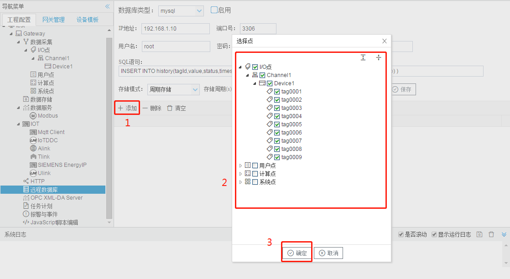

# 5.5 远程数据库

目前仅支持mysql远程数据库。

mysql远程数据库参数如下： 

- mysql远程数据库的IP地址和端口号；
- mysql远程数据库的用户名、密码和数据库名称；
- SQL语句：需要编写具体插入数据的sql语句；
- 存储模式：周期存储（需要设置存储周期）和准点存储（需要添加每天存储的整点时间）； 

**上传点添加** 

配置步骤如下： 

1. 单击“添加”按钮； 
2. 在弹出窗口中勾选需要上传的数据点； 
4. 点击”确定“按钮完成映射点的添加。 

重复上述操作可添加更多的点到上传列表。 

下面给出两种数据库中的建表方式及sql语句

1. 实时数据表（数据点ID为主键，有新数据点时新增，已有数据点就直接更新）

   

   SQL语句：

   REPLACE INTO real (tagId,value,status,timestamp) VALUES( $Id, $Value, $Status, from_unixtime($Timestamp) )

   

2. 历史数据表（有自增id，数据会不断存储在这一张表当中）

   

   

   SQL语句：

   INSERT INTO history(tagId,value,status,timestamp) VALUES($Id, $Value, $Status, from_unixtime($Timestamp) )

   