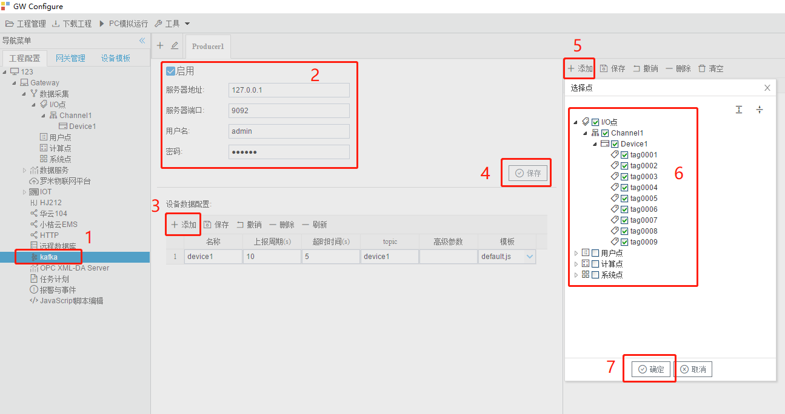

# 5.8 kafka客户端

网关作为kafka客户端，将添加的需要数据的数据点，转换成kafka格式上传数据。

kafka参数如下： 

- 服务器地址：kafka服务器IP地址；
- 服务器端口：kafka服务器端口号；
- 用户名：连接服务端用户名；
- 密码：连接服务端密码；

配置步骤如下： 

1. 设备数据配置处单击“添加”按钮，添加一个设备（参数有：名称-设备ID，上报周期，超时时间，topic-主题，高级参数，模板），设备好参数后点保存按钮； 
2. 单击已添加的设备，然后在右侧单击"添加"，在弹出窗口中勾选需要上传的数据点； 
3. 点击”确定“按钮完成映射点的添加。 

重复上述操作可添加更多的设备。 

