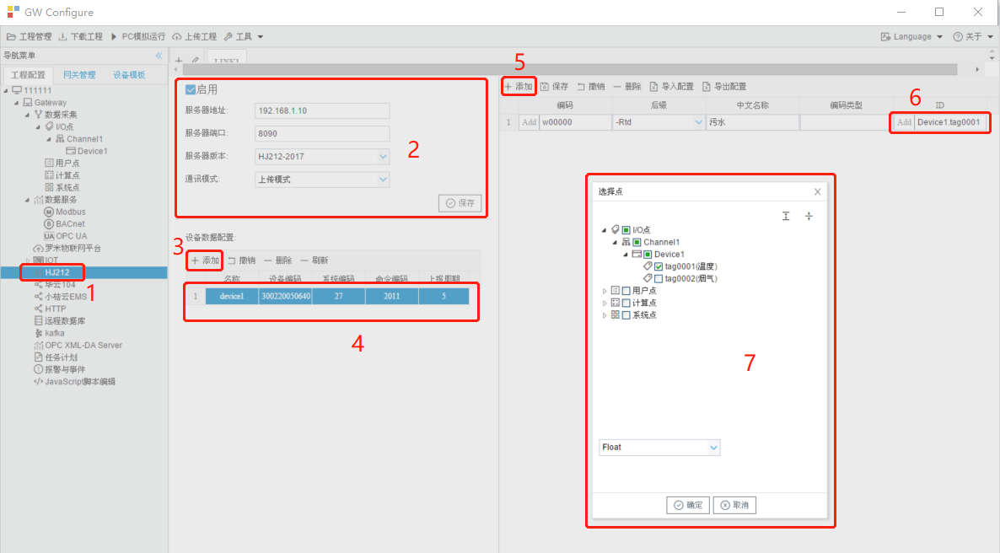

# 5.9 环保212客户端

网关作为环保212客户端，将添加的需要数据的数据点，转换成环保212格式上传数据。

环保212参数如下： 

- 服务器地址：环保212服务器IP地址；
- 服务器端口：环保212服务器端口号；
- 服务器版本：默认为“HJ212-2017”，不需要改动；
- 通讯模式：默认为“上传模式”，不需要改动；

配置步骤如下： 

1. 设备数据配置处单击“添加”按钮，添加一个设备（参数有：名称，设备编码，命令编码，标志位，请求编码，系统编码，上报周期，访问密码，使用数据标记），设置好参数后点保存按钮； 
2. 单击已添加的设备，然后在右侧单击"添加"，就会增加一行，配置好相关参数，ID设置点“ADD”按钮，在弹出的对话框中选择对应的采集点，然后点保存； 
3. 点击”确定“按钮完成映射点的添加。 

重复上述操作可添加更多的设备和采集点。 

**后缀含义：**

-Rtd ：污染物实时采样数据

-Min：污染物指定时间内最小值

-Avg：污染物指定时间内平均值

-Max：污染物指定时间内最大值

-Info：现场端信息

-Cou：污染物指定时间内累计值