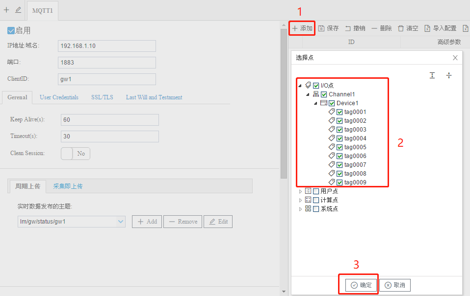
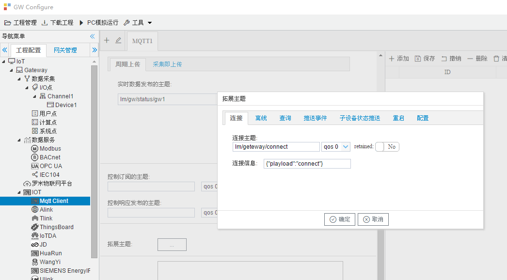

# 6.1 Mqtt Client

用于配置Mqtt连接属性、发布订阅的主题、需要上传的tag点等。  

## 6.1.1 基础连接属性

- 勾选“启用”框，网关开启MQTT客户端； 
- IP地址/域名、端口：MQTT broker的IP/域名、端口号（默认1883）； 
- ClientID：客户端唯一标识，不可重复。broker和Mqtt客户端通过 ClientID 保持唯一的 TCP 连接，如出现重复ClientID，则broker会踢掉前一个。 


<center>图6-1 mqtt基础连接属性</center>


## 6.1.2 进阶连接属性

1. 基本配置（Gerenal） 

   - Keep Alive(s)：心跳，客户端在Connect的时候设置 Keep Alive 时长。如果服务端在 1.5 * KeepAlive 时间内没有收到客户端的报文，它必须断开客户端的网络连接，默认为60秒。 

   - Timeout(s)：定义客户端发送信息到云端响应的最大时间间隔，客户端超过时间没有得到相应后会主动中断连接，默认为30秒。 

   - Clean Session： 

     NO——开启会话重用机制。网络断开重连后，恢复之前的Session信息。需要客户端和服务器有 相关Session持久化机制。 

     YES——关闭会话重用机制。每次Connect都是一个新Session，会话仅持续和网络连接同样长的 时间。  


<center>图6-2 mqtt Gerenal </center>

2. 登录凭证（User Credentials）

   用户名、密码：根据broker的配置，确定mqtt连接时是否需要用户名、密码的验证。

   

   <center>图6-3 mqtt User Credentials </center>

3. 通信加密（SST/TLS）

   SSL有两种连接方式，默认不启用SSL安全连接： 

   - 单向验证——需要上传CA文件到网关，当网关与broker连接时，网关作为客户端提供证书供broker验证。CA文件由云服务商提供。 

   - 双向验证——需要上传CA文件、Cert文件、KEY文件到网关，当网关与broker连接时，网关与broker均向对方提供证书。CA文件、Cert文件、KEY文件均由云服务商提供。 


<center>图6-4 mqtt User SSL/TLS </center>

4. 遗嘱配置（Last Will and Testament）

   遗嘱是当网络连接断开时，客户端根据主题发布消息。启用遗嘱时需要设置遗嘱主题和遗嘱消息。

   默认不启用遗嘱。

   

<center>图6-5 mqtt User Last Will and Testament </center>


## 6.1.3 发布、订阅主题配置

**实时数据发布主题：多主题、多频率、不同格式上传** 

可通过增删改按钮对实时数据主题进行操作，每个主题可以使用不同的主题配置、不同的上传频率、不同的数据过滤方式、不同的数据格式模板等。

添加的主题会显示到实时主题下拉列表中。选择下拉列表中一个主题，点击右侧“添加”按钮，选择该主题上传的Tag点。


<center>图6-6 mqtt实时数据发布主题 </center>

实时数据主题窗口包括以下配置项：

- QoS：传输消息等级，默认为qos0 
  - qos0：最多一次的传输。也就是发出去就删掉。（速度快） 
  - qos1：至少一次的传输。发出去之后必须等待ack，没有ack，就要找时机重发  
  - qos2： 只有一次的传输。消息id将拥有一个简单的生命周期。（可靠性高）

- retained：默认为No
  - Yes：表示发送的消息需要一直持久保存（不受服务器重启影响），不但要发送给当前的订阅者，并且以后新来的订阅了此Topic name的订阅者会马上得到推送。
    备注：当订阅该Topic的客户端上线后，只会接收到最新的一条消息。
  - No：仅仅为当前订阅者推送此消息。

- 上传周期：mqtt发布消息的频率。
- 数据过滤：以Tag点的值改变、是否采集成功（质量戳）和时间戳改变作为上传条件。
- 模板：数据上传的格式，用户可以通过下拉框选择已有的模板。可根据用户需求定制模板。



<center>添加上传点 </center>

**拓展主题**

- 连接主题：mqtt连接成功时，将填写的字符串发布到相应的主题。

  

- 离线数据发布：网关在mqtt断线时，实时数据会根据上传周期将数据缓存在网关中。在mqtt恢复连接时，网关会在离线主题依次发布缓存数据。

  - 网关设备缓存离线数据的容量为20M，当离线数据大于20M时，网关就会缓存新的一条离线数据时，删除最早的一条离线数据。 
- 查询数据主题：在配置界面中“查询数据订阅的主题”一项输入需要订阅的主题，当选中default.js时，网关订阅到如下格式的数据，就进行数据查询的操作，网关会在“查询数据发布的主题”发布此次查询到的结果。


```json
{"operate":"read","devices":[
  {"deviceCode":"Device_1","tags":null}, 
  {"deviceCode":"Device_2",
  "tags":[
        {"tagCode":"tag0008"}
      ]
    }
  ]
} 
```


- 推送事件主题：如果在“报警与事件”(8.1章节)当中配置了报警事件，当报警事件触发或者解除时，网关通过推送事件的主题将该事件发布到Broker。 
- 子设备状态推送主题：子设备为网关通讯的设备，在子设备上线和下线时会将状态推送到配置主题。
- 写操作主题：在配置界面中“写操作订阅的主题”一项输入需要订阅的主题，当选中default.js时，发布如下格式的数据，网关进行相应的写操作。  

```json
 [
   {
     "operate":"write",//操作类型
     "deviceCode":"Device1",//采集协议页面中的设备名称
     "tagCode":"tag0001",//数据点的名称
     "val":"10"//需要写入的数值，字符串类型
   }
 ] 

```

在网关写操作结束，网关会在“控制响应发布的主题”发布此次查询到的结果。以default.js为例。

```json
{
    "deviceCode":"Device1",  //采集协议页面中的设备名称
    "message":"写操作返回信息",
    "status":true, // true表示写操作成功，false表示写操作失败
    "tagCode":"tag0001", //数据点的名称
    "value":"10" //写入的数值，字符串类型
}
```


- 重启网关主题：在配置界面中“重启网关订阅的主题”一项输入需要订阅的主题，订阅到如下所示的格式的数据，重启网关。 

```json
   {"operate":"reboot"}
```


- 配置网关主题：GC配置生成的数据库文件发布到配置网关的主题当中，远程配置网关。 


<center>图6-7 mqtt拓展主题 </center>

**高级参数** 

如果需要在mqtt上传的数据点添加额外的属性字段，可以添加“高级参数”（JSON对象格式）。

在Mqtt Client页面点击“添加”按钮，选择需要上传的Tag点，双击Tag点，在“高级参数”字段中添加所需要的json对象，如{"unit":"摄氏度"}。

该操作需要配合模板使用。 


<center>图6-8 mqtt高级参数 </center>


## 6.1.4 模板说明

Mqtt Client页面的主题中，实时数据、查询、控制、控制返回、重启的主题具有模板功能。

**实时数据**

目前支持8种模板。

1. default.js：因为生成的json格式中不包含质量戳，所以需要在“数据过滤”中勾选“采集成功”，生成的json格式如下：

```json
{
    "Device1":{
        "tag0001":2,
        "tag0002":3,
        "tag0003":1.23,
        "tag0004":0,
        "tag0005":0,
        "tag0006":0,
        "tag0007":0,
        "tag0008":0,
        "tag0009":0
    },
    "clientid":"gw1",
    "system":{
        "TIME_DAY":19,
        "TIME_HOUR":17,
        "TIME_MINUTE":38,
        "TIME_MONTH":6,
        "TIME_SECOND":55,
        "TIME_WDAY":3,
        "TIME_YEAR":2019
    },
    "time":"1560937137"
}
```

2. DCC.js：生成的json格式如下：

```json
{
    "Device1":[
        {
            "description":"",
            "deviceCode":"Device1",
            "id":"Device1.tag0001",
            "objectType":"AV",
            "status":"Good",
            "tagCode":"tag0001",
            "timestamp":1560937562,
            "val":"2.000000"
        },
        {
            "description":"",
            "deviceCode":"Device1",
            "id":"Device1.tag0002",
            "objectType":"AV",
            "status":"Good",
            "tagCode":"tag0002",
            "timestamp":1560937562,
            "val":"3.000000"
        },
        {
            "description":"",
            "deviceCode":"Device1",
            "id":"Device1.tag0003",
            "objectType":"AV",
            "status":"Good",
            "tagCode":"tag0003",
            "timestamp":1560937562,
            "val":"1.230000"
        },
        {
            "description":"",
            "deviceCode":"Device1",
            "id":"Device1.tag0004",
            "objectType":"AV",
            "status":"Good",
            "tagCode":"tag0004",
            "timestamp":1560937562,
            "val":"0.000000"
        },
        {
            "description":"",
            "deviceCode":"Device1",
            "id":"Device1.tag0005",
            "objectType":"AV",
            "status":"Good",
            "tagCode":"tag0005",
            "timestamp":1560937562,
            "val":"0.000000"
        },
        {
            "description":"",
            "deviceCode":"Device1",
            "id":"Device1.tag0006",
            "objectType":"AV",
            "status":"Good",
            "tagCode":"tag0006",
            "timestamp":1560937562,
            "val":"0.000000"
        },
        {
            "description":"",
            "deviceCode":"Device1",
            "id":"Device1.tag0007",
            "objectType":"AV",
            "status":"Good",
            "tagCode":"tag0007",
            "timestamp":1560937562,
            "val":"0.000000"
        },
        {
            "description":"",
            "deviceCode":"Device1",
            "id":"Device1.tag0008",
            "objectType":"AV",
            "status":"Good",
            "tagCode":"tag0008",
            "timestamp":1560937562,
            "val":"0.000000"
        },
        {
            "description":"",
            "deviceCode":"Device1",
            "id":"Device1.tag0009",
            "objectType":"AV",
            "status":"Good",
            "tagCode":"tag0009",
            "timestamp":1560937562,
            "val":"0.000000"
        }
    ],
    "clientid":"gw1",
    "time":"1560937563"
}
```

3. Alink.js：因为生成的json格式中不包含质量戳，所以需要在“数据过滤”中勾选“采集成功”，生成的json格式如下：

```json
{
    "id":"1",
    "method":"thing.event.property.post",
    "params":{
        "Device1_tag0001":2,
        "Device1_tag0002":3,
        "Device1_tag0003":1.23,
        "Device1_tag0004":0,
        "Device1_tag0005":0,
        "Device1_tag0006":0,
        "Device1_tag0007":0,
        "Device1_tag0008":0,
        "Device1_tag0009":0,
        "system_TIME_DAY":19,
        "system_TIME_HOUR":17,
        "system_TIME_MINUTE":43,
        "system_TIME_MONTH":6,
        "system_TIME_SECOND":43,
        "system_TIME_WDAY":3,
        "system_TIME_YEAR":2019
    },
    "version":"1.0"
}
```

4. HuaYuan.js：生成的json格式如下：

```json
{
    "ClientId":"gw1",
    "Devices":[
        {
            "DeviceName":"Device1",
            "Tags":[
                {
                    "PickTime":"2019-06-19 17:46:52",
                    "Status":"Good",
                    "TagCode":"tag0001",
                    "Val":"2.000000"
                },
                {
                    "PickTime":"2019-06-19 17:46:52",
                    "Status":"Good",
                    "TagCode":"tag0002",
                    "Val":"3.000000"
                },
                {
                    "PickTime":"2019-06-19 17:46:52",
                    "Status":"Good",
                    "TagCode":"tag0003",
                    "Val":"1.230000"
                },
                {
                    "PickTime":"2019-06-19 17:46:52",
                    "Status":"Good",
                    "TagCode":"tag0004",
                    "Val":"0.000000"
                },
                {
                    "PickTime":"2019-06-19 17:46:52",
                    "Status":"Good",
                    "TagCode":"tag0005",
                    "Val":"0.000000"
                },
                {
                    "PickTime":"2019-06-19 17:46:52",
                    "Status":"Good",
                    "TagCode":"tag0006",
                    "Val":"0.000000"
                },
                {
                    "PickTime":"2019-06-19 17:46:52",
                    "Status":"Good",
                    "TagCode":"tag0007",
                    "Val":"0.000000"
                },
                {
                    "PickTime":"2019-06-19 17:46:52",
                    "Status":"Good",
                    "TagCode":"tag0008",
                    "Val":"0.000000"
                },
                {
                    "PickTime":"2019-06-19 17:46:52",
                    "Status":"Good",
                    "TagCode":"tag0009",
                    "Val":"0.000000"
                }
            ]
        }
    ],
    "UploadTime":"2019-06-19 17:46:53"
}
```

5. InfluxDB.js：生成的json格式如下：

```json
[
    {
        "description":"",
        "id":"gw1.Device1.tag0001",
        "objectType":"AV",
        "status":"Good",
        "time":"1560966486",
        "val":2
    },
    {
        "description":"",
        "id":"gw1.Device1.tag0002",
        "objectType":"AV",
        "status":"Good",
        "time":"1560966486",
        "val":3
    },
    {
        "description":"",
        "id":"gw1.Device1.tag0003",
        "objectType":"AV",
        "status":"Good",
        "time":"1560966486",
        "val":1.23
    },
    {
        "description":"",
        "id":"gw1.Device1.tag0004",
        "objectType":"AV",
        "status":"Good",
        "time":"1560966486",
        "val":0
    },
    {
        "description":"",
        "id":"gw1.Device1.tag0005",
        "objectType":"AV",
        "status":"Good",
        "time":"1560966486",
        "val":0
    },
    {
        "description":"",
        "id":"gw1.Device1.tag0006",
        "objectType":"AV",
        "status":"Good",
        "time":"1560966486",
        "val":0
    },
    {
        "description":"",
        "id":"gw1.Device1.tag0007",
        "objectType":"AV",
        "status":"Good",
        "time":"1560966486",
        "val":0
    },
    {
        "description":"",
        "id":"gw1.Device1.tag0008",
        "objectType":"AV",
        "status":"Good",
        "time":"1560966486",
        "val":0
    },
    {
        "description":"",
        "id":"gw1.Device1.tag0009",
        "objectType":"AV",
        "status":"Good",
        "time":"1560966486",
        "val":0
    }
]
```

6. JinHe.js：因为生成的json格式中不包含质量戳，所以需要在“数据过滤”中勾选“采集成功”，生成的json格式如下：

```json
{
    "Device1":[
        {
            "id":"Device1.tag0001",
            "tsp":"2019-06-19 17:48:50",
            "val":"2.000000"
        },
        {
            "id":"Device1.tag0002",
            "tsp":"2019-06-19 17:48:50",
            "val":"3.000000"
        },
        {
            "id":"Device1.tag0003",
            "tsp":"2019-06-19 17:48:50",
            "val":"1.230000"
        },
        {
            "id":"Device1.tag0004",
            "tsp":"2019-06-19 17:48:50",
            "val":"0.000000"
        },
        {
            "id":"Device1.tag0005",
            "tsp":"2019-06-19 17:48:50",
            "val":"0.000000"
        },
        {
            "id":"Device1.tag0006",
            "tsp":"2019-06-19 17:48:50",
            "val":"0.000000"
        },
        {
            "id":"Device1.tag0007",
            "tsp":"2019-06-19 17:48:50",
            "val":"0.000000"
        },
        {
            "id":"Device1.tag0008",
            "tsp":"2019-06-19 17:48:50",
            "val":"0.000000"
        },
        {
            "id":"Device1.tag0009",
            "tsp":"2019-06-19 17:48:50",
            "val":"0.000000"
        }
    ],
    "clientid":"gw1",
    "time":"2019-06-19 17:48:51"
}
```

7. LMIoT.js：因为生成的json格式中不包含质量戳，所以需要在“数据过滤”中勾选“采集成功”，生成的json格式如下：

```json
{
    "clientid":"gw1",
    "devices":[
        {
            "deviceid":"Device1",
            "status":"1",
            "tags":{
                "tag0001":"2.000000",
                "tag0002":"3.000000",
                "tag0003":"1.230000",
                "tag0004":"0.000000",
                "tag0005":"0.000000",
                "tag0006":"0.000000",
                "tag0007":"0.000000",
                "tag0008":"0.000000",
                "tag0009":"0.000000"
            }
        }
    ],
    "seq":"3",
    "system":{
        "deviceid":"system",
        "tags":{
            "TIME_DAY":"19",
            "TIME_HOUR":"17",
            "TIME_MINUTE":"50",
            "TIME_MONTH":"6",
            "TIME_SECOND":"3",
            "TIME_WDAY":"3",
            "TIME_YEAR":"2019"
        }
    },
    "time":"1560937804",
    "type":"data"
}
```

8. Tlink.js：因为生成的json格式中不包含质量戳，所以需要在“数据过滤”中勾选“采集成功”，生成的json格式如下：

```json
{
    "sensorDatas":[
        {
            "addTime":"2019-06-19 17:51:15",
            "flag":"Device1.tag0001"
        },
        {
            "addTime":"2019-06-19 17:51:15",
            "flag":"Device1.tag0002"
        },
        {
            "addTime":"2019-06-19 17:51:15",
            "flag":"Device1.tag0003"
        },
        {
            "addTime":"2019-06-19 17:51:15",
            "flag":"Device1.tag0004"
        },
        {
            "addTime":"2019-06-19 17:51:15",
            "flag":"Device1.tag0005"
        },
        {
            "addTime":"2019-06-19 17:51:15",
            "flag":"Device1.tag0006"
        },
        {
            "addTime":"2019-06-19 17:51:15",
            "flag":"Device1.tag0007"
        },
        {
            "addTime":"2019-06-19 17:51:15",
            "flag":"Device1.tag0008"
        },
        {
            "addTime":"2019-06-19 17:51:15",
            "flag":"Device1.tag0009"
        }
    ]
}
```


**查询**

1. default.js：只解析向查询主题发送如下json格式的数据，可以进行仪表下所有数据点的查询和指定数据点的查询。

```json
{"operate":"read","devices":[
  {"deviceCode":"Device1","tags":null}, 
  {"deviceCode":"Device2",
  "tags":[
        {"tagCode":"tag0008"}
      ]
    }
  ]
} 
```

2. LMIoT.js：只解析向查询主题发送如下json格式的数据，可以进行仪表下所有数据点的查询。

```js
{ 
    "type": "inquire",
    "time": "1557136546",
"seq": "230",
"clientid": "gw1",
    "devices": [
            "Device1",
            "Device2"
    ]
}
```


**查询返回**

1. default.js：查询结束后通过“查询数据发布的主题”发布如下json格式的数据：

```json
{
    "Device1":{
        "tag0001":2,
        "tag0002":3,
        "tag0003":1.23,
        "tag0004":0,
        "tag0005":0,
        "tag0006":0,
        "tag0007":0,
        "tag0008":0,
        "tag0009":0
    },
    "clientid":"gw1",
    "time":"1560938379"
}
```


2. LMIoT.js：查询结束后通过“查询数据发布的主题”发布如下json格式的数据：

```json
{
    "clientid":"gw1",
    "devices":[
        {
            "deviceid":"Device1",
            "status":"1",
            "tags":{
                "tag0001":"2.000000",
                "tag0002":"3.000000",
                "tag0003":"1.230000",
                "tag0004":"0.000000",
                "tag0005":"0.000000",
                "tag0006":"0.000000",
                "tag0007":"0.000000",
                "tag0008":"0.000000",
                "tag0009":"0.000000"
            }
        },
        {
            "deviceid":"Device2",
            "status":"0",
            "tags":{

            }
        }
    ],
    "seq":"0",
    "time":"1560938617",
    "type":"inquireResp"
}
```


**控制**

1. Alink.js：只解析向控制主题发送如下json格式的数据，可以同时下发多个数据点的控制。

```json
{
    "method":"thing.service.property.set",
    "id":"763382906",
    "params":{
        "Device1_tag0001":0
    },
    "version":"1.0.0"
}
```

2. default.js：只解析向控制主题发送如下json格式的数据，可以同时下发多个数据点的控制。

```json
[
    {
        "operate":"write",
        "deviceCode":"Device1",
        "tagCode":"tag0001",
        "val":"10"
    },
    {
        "operate":"write",
        "deviceCode":"Device2",
        "tagCode":"tag0002",
        "val":"20"
    }
]
```

3. defaultEx.js：和default.js的区别在于解析的json中每个数据点都包含顺序号seq，有于控制返回相应的顺序号，如下所示。

```json
[
    {
        "operate":"write",
        "seq":1,
        "deviceCode":"Device1",
        "tagCode":"tag0001",
        "val":"10"
    },
    {
        "operate":"write",
        "seq":1,
        "deviceCode":"Device2",
        "tagCode":"tag0002",
        "val":"20"
    }
]
```

4. LMIoT.js：只解析向控制主题发送如下json格式的数据，包含顺序号，对clientid进行验证判断是否进行数据点的控制。可以同时下发多个数据点的控制。

```json
{
    "type":"write",
    "time":"1557136546",
    "seq":"230",
    "clientid":"gw1",
    "devices":{
        "deviceid":"Device1",
        "tagcode":"tag0001",
        "value":"63"
    }
}
```

5. Tlink.js：只解析向控制主题发送如下json格式的数据，可以同时下发多个数据点的控制。其中flag即为GC中的数据点ID。

```json
{
    "sensorDatas":[
        {
            "sensorsId":200302860,
            "value":"1111",
            "flag":"D1.tag0002"
        }
    ],
    "down":"down"
}
```


**控制返回**

1. default.js：和上述控制主题中default.js配合使用，每操作结束一个数据点，通过控制响应发布的主题发布如下如下json格式数据。

```json
{
    "deviceCode":"Device1",
    "message":"写操作返回信息",
    "status":true/false,
    "tagCode":"tag0001",
    "value":"10"
}
```

2. defaultEx.js：和上述控制主题中defaultEx.js配合使用，每操作结束一个数据点，通过控制响应发布的主题发布如下如下json格式数据。

```json
{
    "deviceCode":"Device1",
    "message":"写操作返回信息",
    "seq":1,
    "status":true/false,
    "tagCode":"tag0001",
    "value":"10"
}
```

3. LMIoT.js：和上述控制主题中LMIoT.js配合使用，每操作结束一个数据点，通过控制响应发布的主题发布如下如下json格式数据。

```json
{
    "type":"write",
    "time":"1557136546",
    "seq":"230",
    "clientid":"gw1",
    "devices":{
        "deviceid":"Device1",
        "tagcode":"tag0001",
        "value":"63",
        "status":"true/false"
    }
}
```


**重启**

1. default.js：向重启主题发布如下json格式是网关重启（GC运行工程时订阅到消息不会重启电脑）。

```json
{
    "operate":"reboot"
}
```

2. LMIoT.js：向重启主题发布如下json格式，网关对clientid进行验证判断是否重启网关（GC运行工程时订阅到消息不会重启电脑）。

```json
{
    "type":"reboot",
    "time":"1557136546",
    "seq":"230",
    "clientid":"gw1"
}
```


## 6.1.5 自定义模板

GC支持用户自定义模板，用于生成不同格式的实时数据、控制主题、重启主题等订阅到的数据的解析。在此以实时数据主题的模板为例，介绍如何新建自定义模板。具体操作如下：

1. Mqtt模板在配置工具安装目录下mqtt文件夹下，其中realtime文件夹为实时数据的模板目录；

2. 在realtime文件夹下新建一个js，在其中进行模板的编写；

3. 参照其他模板，如default.js：

   ```js
   (function() {
       var timestamp = Math.round(new Date().getTime() / 1000)
       result = { "clientid": base["Clientid"], "time": timestamp.toString() };
       data.forEach(function(tag) {
           if (!result[tagExt[tag.Id].deviceCode]) {
               result[tagExt[tag.Id].deviceCode] = {};
           }
           result[tagExt[tag.Id].deviceCode][tagExt[tag.Id].tagCode] = parseFloat(tag["Val"])
       });
       return JSON.stringify(result);
   })();
   ```

   其中  (function() {

   ​			......

   ​    })();

   为主体，js需要写在其中；

   data为经过过滤后的数据，格式为

   ```json
   [
       {
           "Id":"Device1.tag0001",
           "Status":"Good",
           "Timestamp":1574926563,
           "Val":"1.000000"
       },
       {
           "Id":"Device1.tag0002",
           "Status":"Good",
           "Timestamp":1574926563,
           "Val":"3.000000"
       }
   ]
   ```

   base为mqtt配置填写的参数；

    

   tagExt为tag点的额外属性，包括采集页面中的名称（description）、tag点所在的设备名称、读写类型、tagID，还可以包含“高级参数”中填写的数据（“高级参数”需要填写json格式的数据）

   ```json
   {
       "Device1.tag0001":{
           "description":"",
           "deviceCode":"Device1",
           "objectType":"AV",
           "tagCode":"tag0001"
       },
       "Device1.tag0002":{
           "description":"",
           "deviceCode":"Device1",
           "objectType":"AV",
           "tagCode":"tag0002"
       }
   }
   ```

   模板最后返回主题需要上传的字符串；

   

4. 模板编写完成之后，需要在配置工具中选择新建的模板；

5. 可以先用配置工具“PC端运行工程”测试模板能否正确运行；

6. 需要下载模板到网关：在“系统设置”中选择“开发者模式”，密码为“luomi”，选择“下载MQTT模板”，之后下载工程，网关就会根据新建的模板上传数据。

   