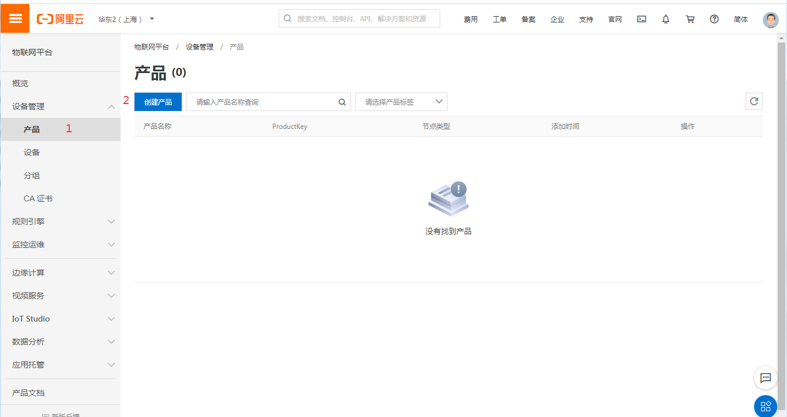
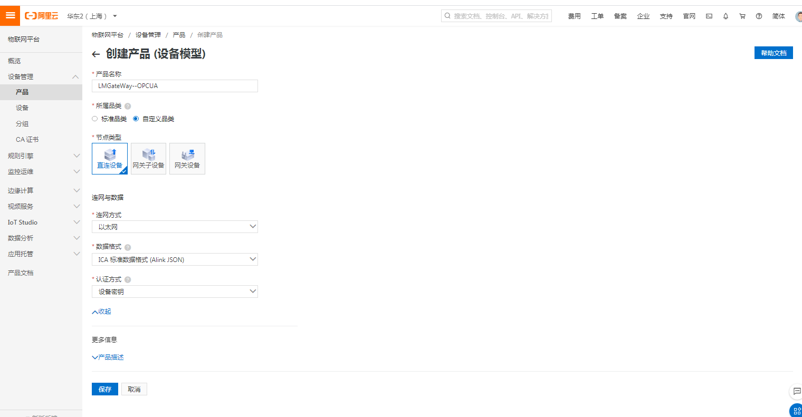
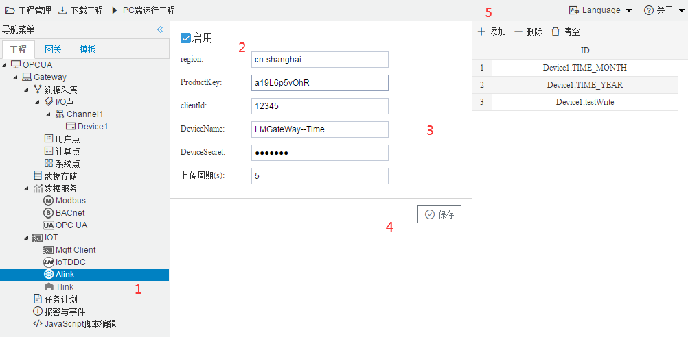

# 6.2 Alink

Alink是阿里云定义的设备与云端之间的通信协议。Alink协议是针对物联网开发领域设计的一种数据交换规范，数据格式是JSON，用于设备端和物联网平台的双向通信，更便捷地实现和规范了设备端和物联网平台之间的业务数据交互。

在配置GC中Alink页面之前，需要在阿里云的物联网平台中进行以下步骤：

1.先在阿里云的物联网平台中创建产品。

图6-11 产品

点击"设备管理" ——"产品"——"创建产品"，出现以下画面。

创建产品

产品名称:自定义，本实例中填写的是"LMGateWay--OPCUA"

所属品类：选择"自定义品类"

节点类型：选择"直连设备"   

联网方式：根据需求选择"WiFI"、"蜂窝（2G\3G\4G\5G）"、"以太网"中的一个；本实例中选择是"以太网"

数据格式：选择 "ICA标准数据格式（Alink json）"

产品描述：自定义，可不填

点击"保存"，即可完成创建。

2.创建产品下属的设备。

图6-13 添加设备

DeviceName：自定义，本实例中填写的是"OPCUA--TIME"

备注名称：自定义，本实例中填写的是"网关时间"

点击"确认"后，出现以下弹框

图6-13 设备证书

上图为该设备的“三元组”：ProductKey、DeviceName和DeviceSecret，三元组和实际的一个物理设备(网关)一一对应。 万一现实中出现几个三元组一样的设备，那么后上网的设备，会让前一个设备下线。同时仅有一个这样的设备在线。

可以点击“一键复制”按钮将三元组自定义保存，也可点击设备列表中相应的设备查看三元组。

在阿里云中进行了上述步骤之后，在GC中进行Alink页面的配置，具体步骤如下：

1.勾选“启用”按钮；

填写地域（[地域和可用区](https://help.aliyun.com/document_detail/40654.html?spm=a2c4g.11186623.2.19.2e949ff5r8r1N8)）和三元组；

clientid可默认为12345，不需要修改；

上传周期自定义。

点击“保存”按钮即可完成Alink的连接配置；

2.点击“添加”按钮，完成需要上传的数据点的添加。 

图6-15 Alink连接配置

网关配置完成之后，接下来配置阿里云物联网。回到浏览器页面。

功能定义

依次点击"产品"---"LMGateWay--OPCUA"(根据实际创建名称)---"功能定义"---"自定义功能"---最后点击“编辑草稿”。(确定右上角不处于发布状态，否则无法显示"编辑草稿"这一功能)

点击"自定义功能"-----"添加自定义功能"

配置tag点

功能名称：自定义填写

数据类型：根据采集值的类型进行选择，实例中选择 float

取值范围：根据实际填写

步长：可默认为1.(例如 数组中{1，2，3，4}，步长为1，{1，3，5，7}步长为2)

单位：根据实际填写

读写类型：根据实际填写

**标识符**：属性唯一标识符，在产品中具有唯一性。需要设置为："设备名称" + "_" + "tagID",如下图中（节选图2-2添加tag点）所示  ，只需将"Device1.TIME_MONTH"更改为"Device1_TIME_MONTH"即可。

**因为Alink中 设备与tag点之间的连接为 "_",而网关中则为"."**

网关tag点显示

添加完成后，点击"发布更新"---输入“版本后”（自定义）---点击"确定"

下图即为配置完成的样子。

Alink配置完成

