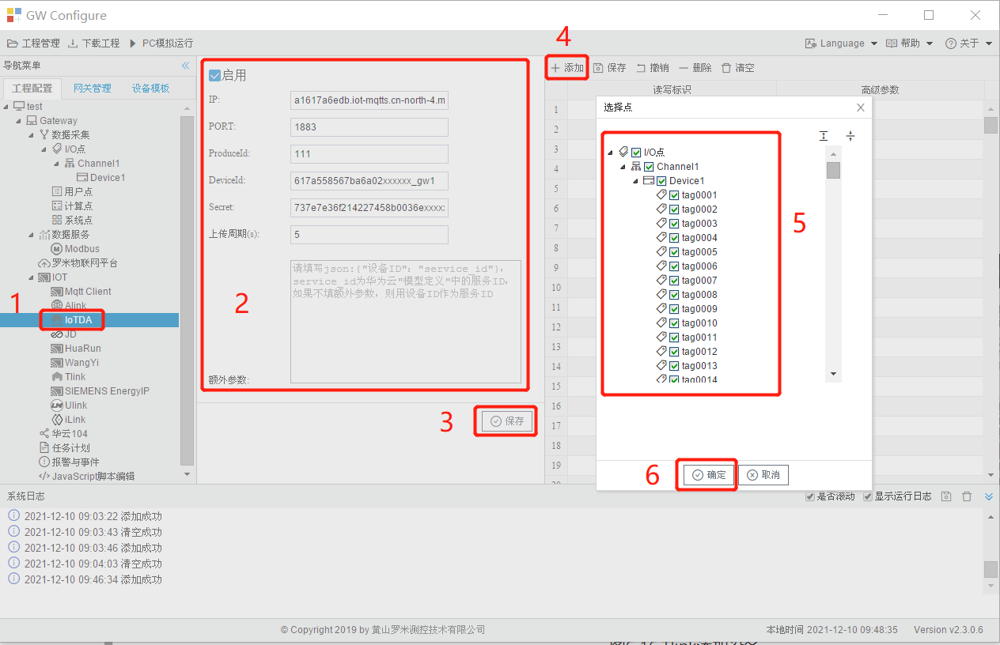

# 6.4 华为云IoTDA

IoTDA（IoT Device Access）是华为云的物联网平台，提供海量设备连接上云、设备和云端双向消息通信、批量设备管理、远程控制和监控、OTA升级、设备联动规则等能力，并可将设备数据灵活流转到华为云其他服务，帮助物联网行业用户快速完成设备联网及行业应用集成。

在配置GC中IoTDA页面之前，需要在华为云的物联网平台配置获取连接参数（详细请参阅华为云相关说明）

华为云（IoTDA）配置页面

