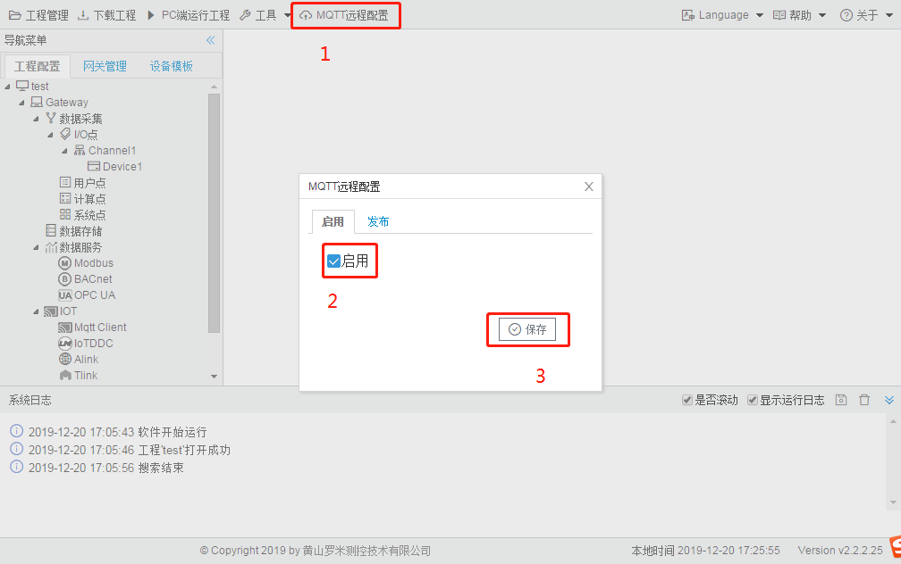
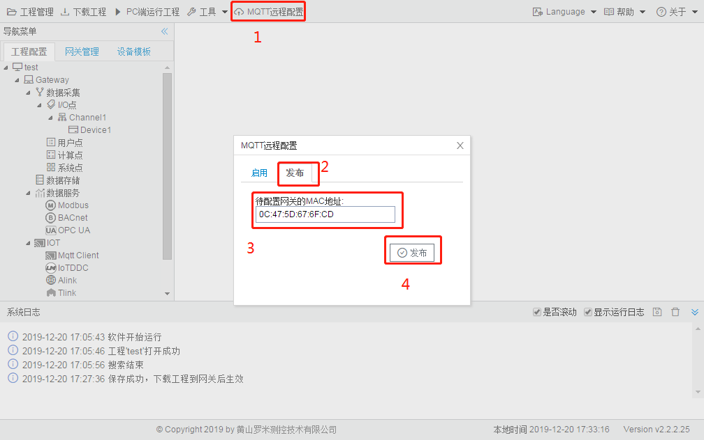

# 6.5 MQTT远程配置

用户可以在网关连接Internet的时候，通过我司的MQTT配置服务器进行网关工程的远程配置。

新建工程后，默认不连接到MQTT配置服务器，需要在GC中点击“启用”，操作如下图：

图6-20 启用MQTT远程配置

保存之后，将工程下载到网关后生效。

在“发布”选项卡中，通过输入网关MAC地址（eth0的MAC地址），点击“发布”将当前打开的工程发布到服务器上，根据图6-21已经启用MQTT远程配置，并且eth0的MAC地址为输入的MAC地址的网关就会根据此工程重新运行。

图6-21 发布工程
