## **6.5 Alink**

Alink是阿里云定义的设备与云端之间的通信协议。Alink协议是针对物联网开发领域设计的一种数据交换规范，数据格式是JSON，用于设备端和物联网平台的双向通信，更便捷地实现和规范了设备端和物联网平台之间的业务数据交互。

在配置GC中Alink页面之前，需要在阿里云的物联网平台中进行以下步骤：

1.先在阿里云的物联网平台中创建产品。

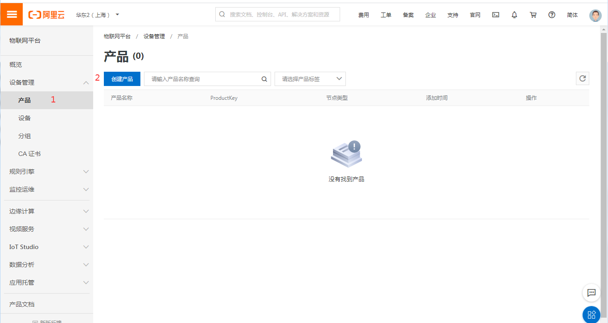

图6-11 产品

点击"设备管理" ——"产品"——"创建产品"，出现以下画面。

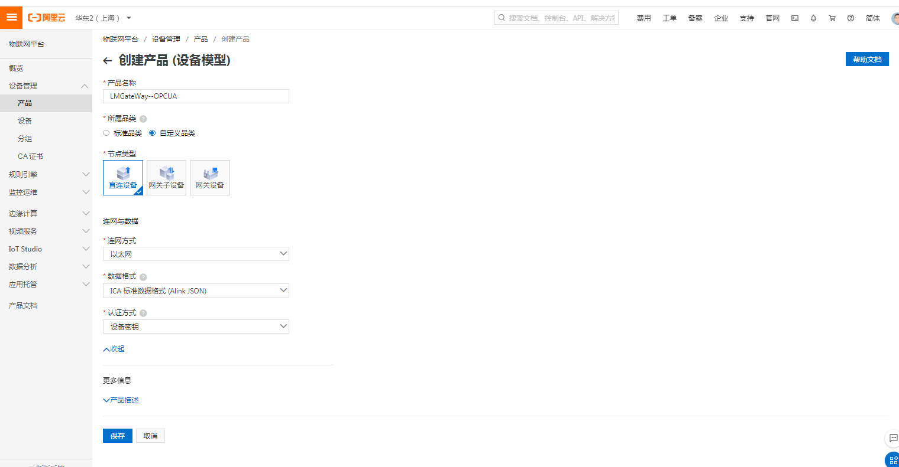

创建产品

产品名称:自定义，本实例中填写的是"LMGateWay--OPCUA"

所属品类：选择"自定义品类"

节点类型：选择"直连设备"   

联网方式：根据需求选择"WiFI"、"蜂窝（2G\3G\4G\5G）"、"以太网"中的一个；本实例中选择是"以太网"

数据格式：选择 "ICA标准数据格式（Alink json）"

产品描述：自定义，可不填

点击"保存"，即可完成创建。

2.创建产品下属的设备。

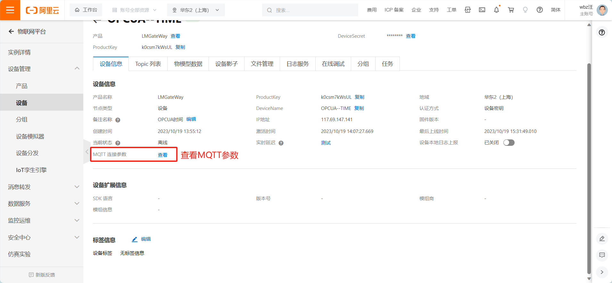

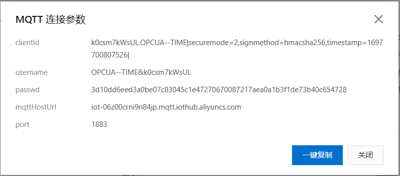

上图为连接参数：mqttHostUrl、port、clientId、username和passwd和实际的一个物理设备(网关)一一对应。 

在阿里云中进行了上述步骤之后，在GC中进行Alink页面的配置，具体步骤如下：

3.打开配置工具中配置好的工程。勾选"启用"按钮。将MQTT连接参数填写入对应的配置栏中,点击保存按钮，保存设置。

上传周期自定义。

点击“保存”按钮即可完成Alink的连接配置； 

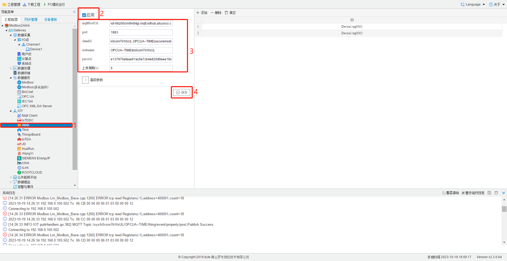

4.点击"添加"按钮，完成需要上传的数据点的添加。

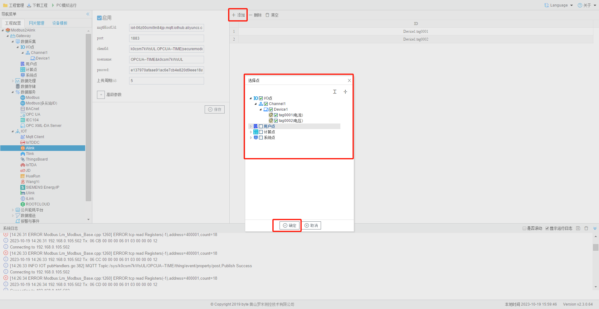

5.网关配置完成之后，接下来配置阿里云物联网。回到浏览器页面。 依次点击"产品"---"LMGateWay"(根据实际创建名称)---"功能定义"，进入以下画面。

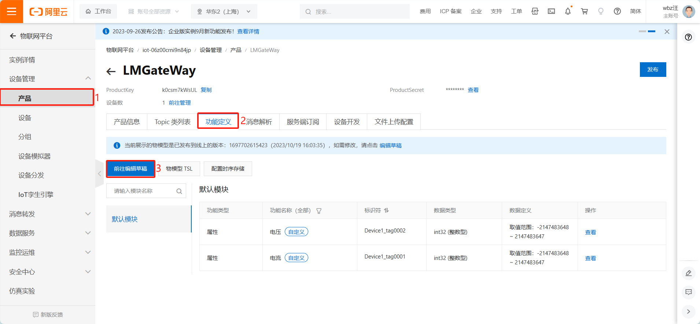

6.点击"自定义功能"-----"添加自定义功能"

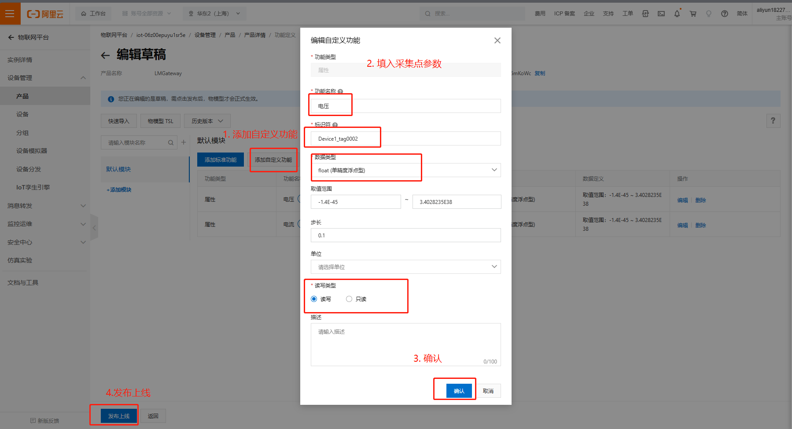

功能名称：自定义填写

数据类型：根据采集值的类型进行选择，实例中选择 float

取值范围：根据实际填写

步长：可默认为1.(例如 数组中{1，2，3，4}，步长为1，{1，3，5，7}步长为2)

单位：根据实际填写

读写类型：根据实际填写

**标识符**：属性唯一标识符，在产品中具有唯一性。需要设置为："设备名称" + "_" + "tagID",如下图所示  ，只需将"Device1.tag0001"更改为"Device1_tag0001"即可。

**因为Alink中 设备与tag点之间的连接为 "_",而网关中则为"."**

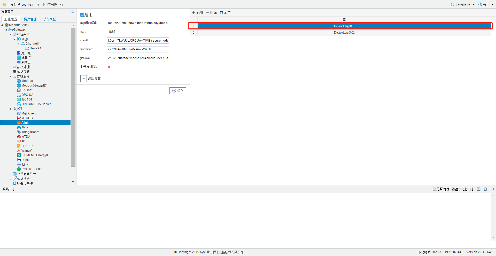

下图即为配置完成的样子。

# **配置结果**

如下图所示  点击"设备"----"LMGateWay"（创建完成的设备名称）---"运行状态"

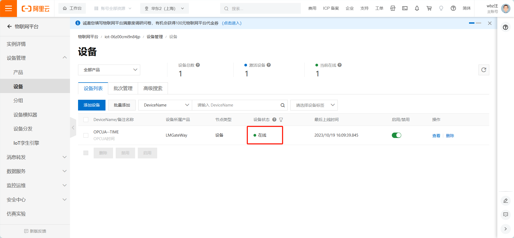

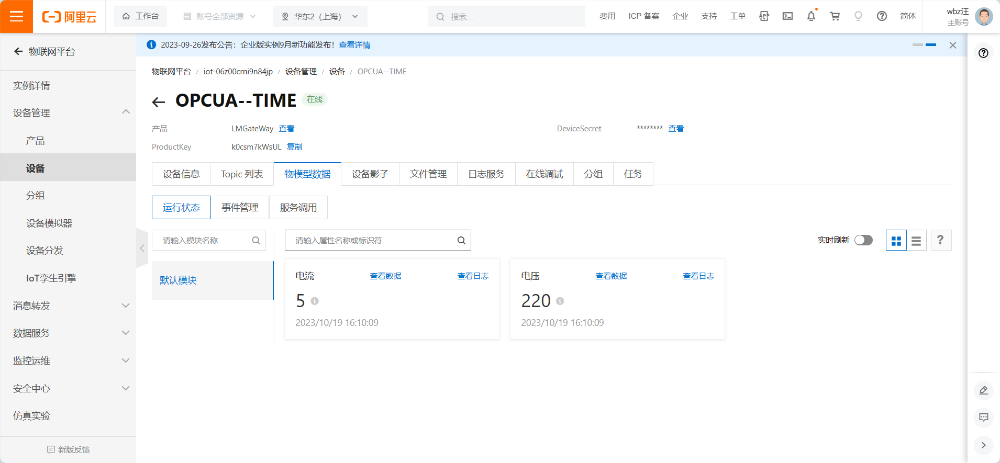

页面上显示配置两个上传点。配置成功！！！

## **注意：请保证网关存在网络连接，否则数据无法上传；**