# 6.6 华为云IoTDA

​        IoTDA（IoT Device Access）是华为云的物联网平台，提供海量设备连接上云、设备和云端双向消息通信、批量设备管理、远程控制和监控、OTA升级、设备联动规则等能力，并可将设备数据灵活流转到华为云其他服务，帮助物联网行业用户快速完成设备联网及行业应用集成。

​        在配置GC中IoTDA页面之前，需要在华为云的物联网平台中进行以下步骤：

​        1.先在华为云的物联网平台中创建产品。

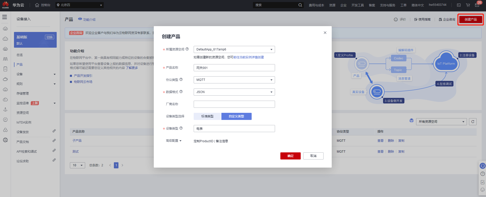

​        2.创建好产品后，这里可以看到产品ID。

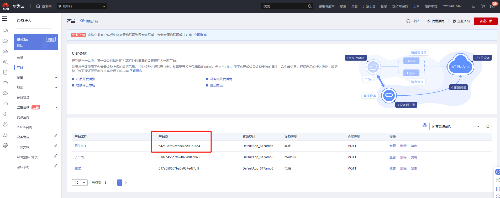

​        3.点击“查看”进行下一步操作。

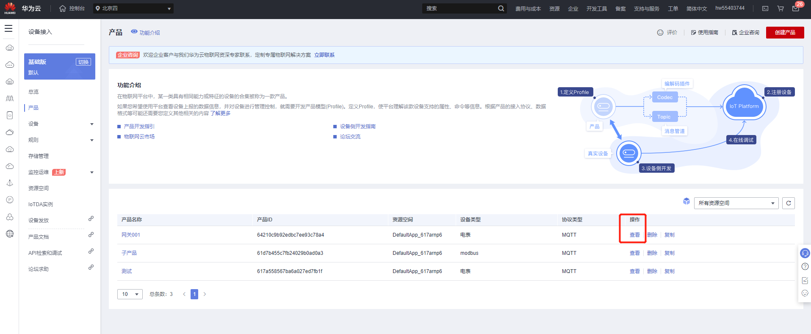

​        4.添加服务

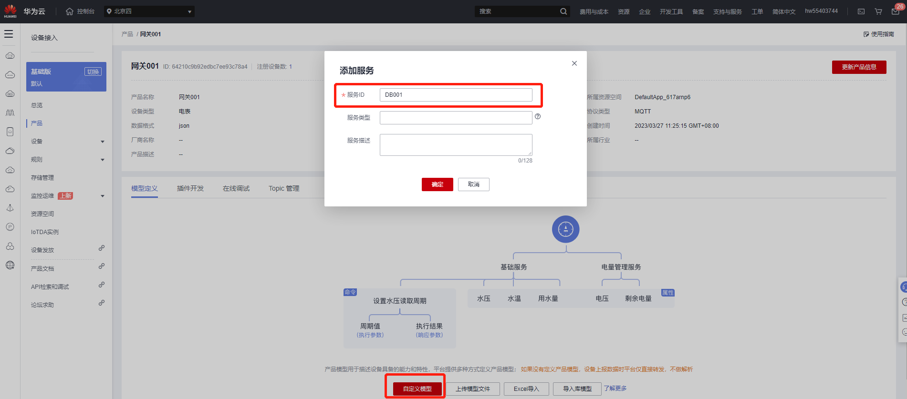

​        5.在服务上添加属性。

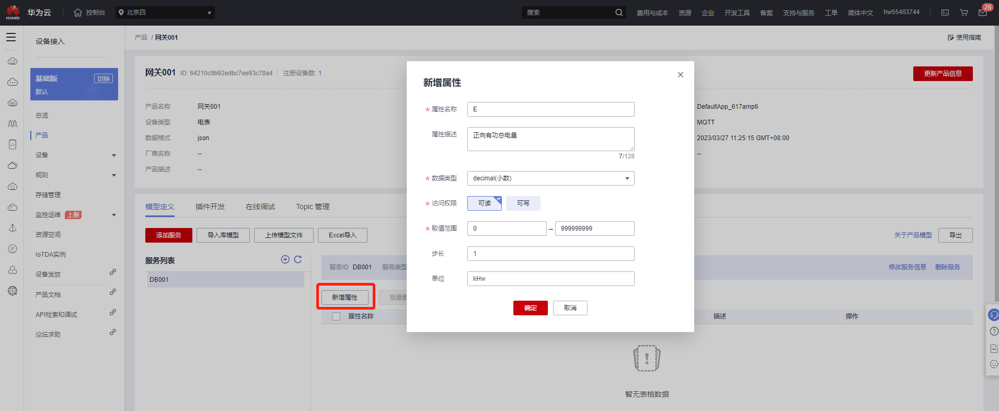

​        6、设备注册，添加一个网关设备。

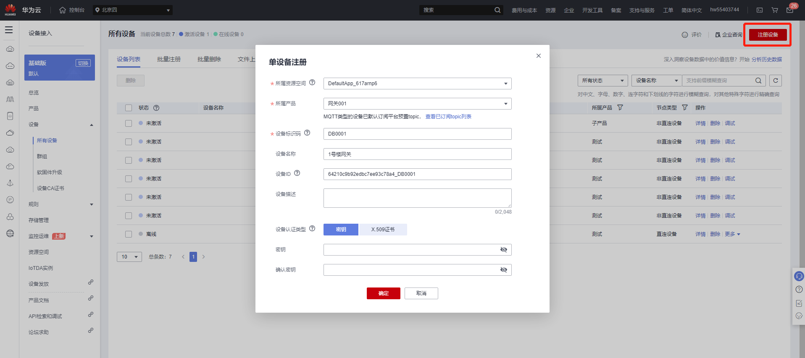

​        7、注册完成后，会看到设备ID和密钥。

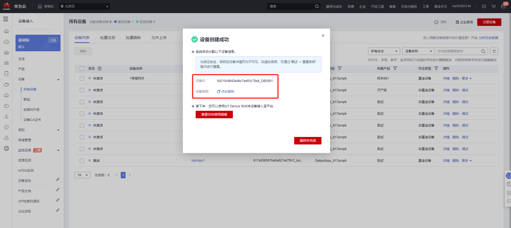

​        8、在注册的设备上点“详情”。

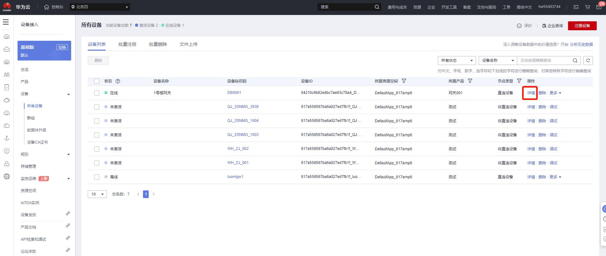

​        9、添加子设备。

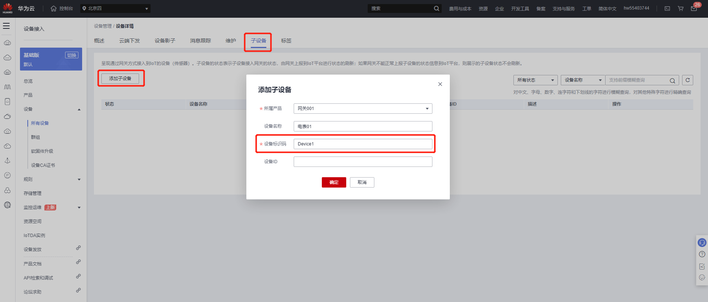

​        10、配置工程，在这里填上华为云上的产品ID,设备ID和密钥，在额外参数里，把设备名和服务器做绑定。

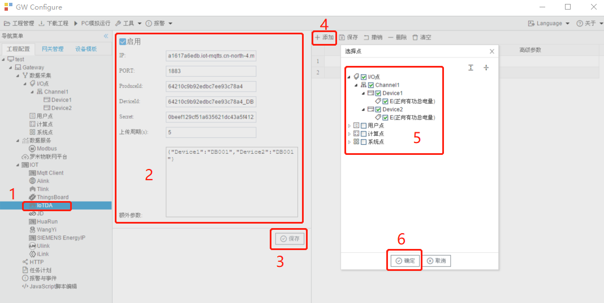

​        11、在设备详情里能看到网关推送上来的数据，配置完成。

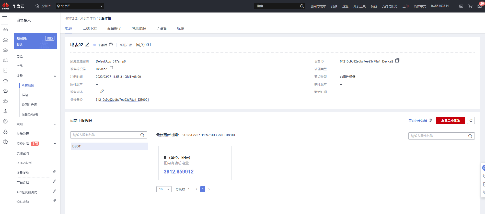

